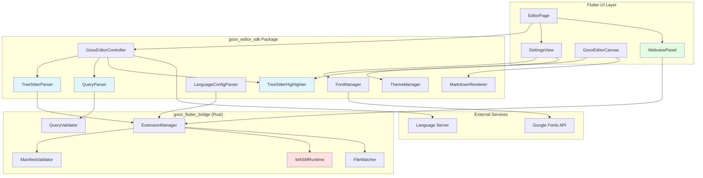

# Design Document: Editor Extension Enhancements

## Overview

This design restructures the Goox Desktop editor extension system to use Tree-sitter for syntax highlighting and support a more flexible extension architecture inspired by Zed editor. The new system moves away from TextMate grammars to Tree-sitter queries, adds WASM-based extension logic, and supports dual-mode extensions (language + webview).

Currently, the editor uses hardcoded syntax highlighting, displays plain text tooltips from language servers, and supports only basic font size/weight configuration. This design introduces:

1. **Tree-sitter based syntax highlighting**: Extensions provide .scm query files for accurate, incremental parsing
2. **WASM extension logic**: Extensions can include Rust-compiled WASM modules for custom functionality
3. **Webview rendering**: Extensions can provide HTML/CSS/JS for custom UI (image viewer, markdown preview, etc.)
4. **Dual-mode support**: Extensions can support both code editing with syntax highlighting and preview rendering
5. **Rich markdown rendering**: LSP hover tooltips with syntax-highlighted code blocks
6. **Font management**: User-configurable fonts with Google Fonts integration
7. **Theme support**: Extensions can provide custom color themes

The implementation will be split across three main packages:
- `goox_editor_sdk`: Core parsing and rendering logic (Dart)
- `goox_flutter_bridge`: Rust-side extension validation, WASM execution, and file watching
- `goox_desktop`: UI integration and settings management (Flutter)

## Architecture

### High-Level Component Diagram



### Data Flow

**Syntax Highlighting Flow:**
1. Extension provides Tree-sitter grammar reference and .scm query files in `languages/{lang}/` directory
2. `ExtensionManager` (Rust) validates manifest and query files
3. `TreeSitterParser` loads grammar and parses code into syntax tree
4. `QueryParser` (Dart) parses .scm files and applies queries to syntax tree
5. `TreeSitterHighlighter` maps captures to theme colors and generates styled spans
6. `EditorCanvas` renders highlighted text with theme-aware colors

**Webview Rendering Flow:**
1. Extension provides `webview/index.html` and related assets
2. User opens file associated with webview extension
3. `ExtensionManager` loads webview in sandboxed environment
4. `WebviewPanel` displays HTML/CSS/JS with file content passed via message API
5. Webview can request file updates and send UI events back to editor

**WASM Extension Flow:**
1. Extension provides `extension.wasm` compiled from Rust
2. `WASMRuntime` (Rust) loads and initializes WASM module
3. WASM module registers event handlers for file operations
4. Editor sends events to WASM via message passing
5. WASM processes events and sends responses/UI updates back

**Markdown Tooltip Flow:**
1. User hovers over code symbol
2. `EditorController` requests hover info from LSP
3. LSP returns markdown content in hover response
4. `MarkdownRenderer` parses and formats markdown
5. For code blocks, `TreeSitterHighlighter` applies syntax highlighting
6. `EditorCanvas` displays formatted tooltip

**Font Management Flow:**
1. User opens Settings and browses available fonts
2. `FontManager` fetches monospace fonts from Google Fonts API
3. User selects font, `FontManager` downloads and caches font files
4. `AppSettings` persists font family selection
5. `EditorCanvas` applies font to all code editing areas

## Components and Interfaces

### 1. Tree-sitter Parser

**Location:** `packages/goox_editor_sdk/lib/src/syntax/tree_sitter_parser.dart`

**Purpose:** Parse code using Tree-sitter grammars and generate syntax trees.

```dart
class TreeSitterParser {
  /// Load a Tree-sitter grammar by name
  Future<Grammar> loadGrammar(String grammarName);
  
  /// Parse code into a syntax tree
  SyntaxTree parse(String code, Grammar grammar);
  
  /// Incrementally update syntax tree after edit
  SyntaxTree updateTree(SyntaxTree oldTree, Edit edit, String newCode);
  
  /// Query syntax tree with Tree-sitter query
  List<QueryMatch> query(SyntaxTree tree, Query query);
}

class SyntaxTree {
  final Node rootNode;
  final String language;
  
  SyntaxTree({required this.rootNode, required this.language});
  
  /// Get node at specific position
  Node? nodeAt(int byteOffset);
  
  /// Walk tree with visitor pattern
  void walk(TreeVisitor visitor);
}

class Node {
  final String type;
  final int startByte;
  final int endByte;
  final List<Node> children;
  final Node? parent;
  
  Node({
    required this.type,
    required this.startByte,
    required this.endByte,
    required this.children,
    this.parent,
  });
}

class Edit {
  final int startByte;
  final int oldEndByte;
  final int newEndByte;
  
  Edit({
    required this.startByte,
    required this.oldEndByte,
    required this.newEndByte,
  });
}
```

### 2. Query Parser

**Location:** `packages/goox_editor_sdk/lib/src/syntax/query_parser.dart`

**Purpose:** Parse Tree-sitter query files (.scm) and apply them to syntax trees.

```dart
class QueryParser {
  /// Parse a .scm query file
  Query parse(String scmContent);
  
  /// Validate query syntax
  ValidationResult validate(String scmContent);
  
  /// Apply query to syntax tree
  List<QueryMatch> execute(Query query, SyntaxTree tree);
}

class Query {
  final List<Pattern> patterns;
  final Map<String, int> captureNames;
  final List<Predicate> predicates;
  
  Query({
    required this.patterns,
    required this.captureNames,
    required this.predicates,
  });
}

class QueryMatch {
  final int patternIndex;
  final Map<String, Node> captures;
  
  QueryMatch({
    required this.patternIndex,
    required this.captures,
  });
}

class Predicate {
  final String operator; // #match?, #eq?, #any-of?, etc.
  final List<String> arguments;
  
  Predicate({required this.operator, required this.arguments});
  
  bool evaluate(Map<String, Node> captures, String sourceCode);
}
```

### 3. Language Configuration Parser

**Location:** `packages/goox_editor_sdk/lib/src/syntax/language_config_parser.dart`

**Purpose:** Parse config.toml files for language-specific editor behavior.

```dart
class LanguageConfigParser {
  /// Parse config.toml file
  LanguageConfig parse(String tomlContent);
  
  /// Validate configuration
  ValidationResult validate(String tomlContent);
}

class LanguageConfig {
  final String name;
  final String grammar;
  final List<String> pathSuffixes;
  final List<String> lineComments;
  final List<String>? blockComment;
  final String autocloseBefore;
  final List<BracketPair> brackets;
  final String? collapsedPlaceholder;
  final String? increaseIndentPattern;
  final String? decreaseIndentPattern;
  
  LanguageConfig({
    required this.name,
    required this.grammar,
    required this.pathSuffixes,
    required this.lineComments,
    this.blockComment,
    required this.autocloseBefore,
    required this.brackets,
    this.collapsedPlaceholder,
    this.increaseIndentPattern,
    this.decreaseIndentPattern,
  });
}

class BracketPair {
  final String start;
  final String end;
  final bool close;
  final bool newline;
  final List<String>? notIn;
  
  BracketPair({
    required this.start,
    required this.end,
    required this.close,
    required this.newline,
    this.notIn,
  });
}
```

### 4. Tree-sitter Syntax Highlighter

**Location:** `packages/goox_editor_sdk/lib/src/syntax/tree_sitter_highlighter.dart`

**Purpose:** Apply Tree-sitter queries to generate syntax highlighting.

```dart
class TreeSitterHighlighter {
  final TreeSitterParser parser;
  final Query highlightQuery;
  final ThemeColorMap colorMap;
  
  TreeSitterHighlighter({
    required this.parser,
    required this.highlightQuery,
    required this.colorMap,
  });
  
  /// Highlight visible range of code
  List<HighlightSpan> highlight(
    String code,
    SyntaxTree tree,
    int startByte,
    int endByte,
  );
  
  /// Incrementally update highlighting after edit
  List<HighlightSpan> updateHighlighting(
    String code,
    SyntaxTree oldTree,
    SyntaxTree newTree,
    Edit edit,
  );
  
  /// Clear cached highlighting state
  void clearCache();
}

class HighlightSpan {
  final int start;
  final int end;
  final String captureName; // @keyword, @function, etc.
  final Color color;
  
  HighlightSpan({
    required this.start,
    required this.end,
    required this.captureName,
    required this.color,
  });
}

class ThemeColorMap {
  final Map<String, Color> lightTheme;
  final Map<String, Color> darkTheme;
  
  ThemeColorMap({
    required this.lightTheme,
    required this.darkTheme,
  });
  
  Color getColor(String captureName, bool isDark);
}
```

### 5. Markdown Renderer

**Location:** `packages/goox_editor_sdk/lib/src/markdown/markdown_renderer.dart`

**Purpose:** Convert markdown text to Flutter rich text widgets.

```dart
class MarkdownRenderer {
  final SyntaxHighlighter? codeHighlighter;
  final TextStyle baseStyle;
  
  MarkdownRenderer({
    this.codeHighlighter,
    required this.baseStyle,
  });
  
  /// Render markdown string to Flutter InlineSpan
  InlineSpan render(String markdown);
  
  /// Render code block with optional syntax highlighting
  InlineSpan renderCodeBlock(String code, String? language);
  
  /// Render inline code
  InlineSpan renderInlineCode(String code);
}

class MarkdownNode {
  final MarkdownNodeType type;
  final String? text;
  final List<MarkdownNode>? children;
  final Map<String, String>? attributes;
  
  MarkdownNode({
    required this.type,
    this.text,
    this.children,
    this.attributes,
  });
}

enum MarkdownNodeType {
  paragraph,
  bold,
  italic,
  code,
  codeBlock,
  link,
  text,
}
```

### 6. Font Manager

**Location:** `packages/goox_editor_sdk/lib/src/fonts/font_manager.dart`

**Purpose:** Manage font downloads, caching, and application.

```dart
class FontManager {
  final String cacheDirectory;
  
  FontManager({required this.cacheDirectory});
  
  /// Fetch available monospace fonts from Google Fonts
  Future<List<FontInfo>> fetchAvailableFonts();
  
  /// Download and cache a font family
  Future<void> downloadFont(String fontFamily, List<FontWeight> weights);
  
  /// Check if font is cached locally
  bool isFontCached(String fontFamily);
  
  /// Load cached font into Flutter
  Future<void> loadCachedFont(String fontFamily);
  
  /// Get list of locally cached fonts
  List<String> getCachedFonts();
}

class FontInfo {
  final String family;
  final List<FontWeight> availableWeights;
  final String category;
  final bool isMonospace;
  
  FontInfo({
    required this.family,
    required this.availableWeights,
    required this.category,
    required this.isMonospace,
  });
}
```

### 7. Theme Manager

**Location:** `packages/goox_editor_sdk/lib/src/theme/theme_manager.dart`

**Purpose:** Manage extension-provided themes and color mappings.

```dart
class ThemeManager {
  final Map<String, ExtensionTheme> _themes = {};
  
  /// Register theme from extension
  void registerTheme(String extensionId, ExtensionTheme theme);
  
  /// Get available themes
  List<ThemeInfo> getAvailableThemes();
  
  /// Load and apply theme
  Future<ThemeColorMap> loadTheme(String themeId);
  
  /// Validate theme meets contrast requirements
  bool validateTheme(ExtensionTheme theme);
}

class ExtensionTheme {
  final String id;
  final String name;
  final ThemeVariant light;
  final ThemeVariant dark;
  
  ExtensionTheme({
    required this.id,
    required this.name,
    required this.light,
    required this.dark,
  });
}

class ThemeVariant {
  final Map<String, String> syntaxColors; // capture name -> hex color
  final Map<String, String> uiColors; // UI element -> hex color
  
  ThemeVariant({
    required this.syntaxColors,
    required this.uiColors,
  });
}

class ThemeInfo {
  final String id;
  final String name;
  final String extensionId;
  
  ThemeInfo({
    required this.id,
    required this.name,
    required this.extensionId,
  });
}
```

### 8. Extension Manager Updates (Rust)

**Location:** `platform/flutter_bridge/src/extension_manager.rs`

**Purpose:** Validate extension manifests, manage WASM execution, and watch for changes.

```rust
impl ExtensionManager {
    /// Validate extension.json manifest
    pub fn validate_manifest(&self, manifest: &ExtensionManifest) -> Result<(), ValidationError>;
    
    /// Validate query files (.scm)
    pub fn validate_queries(&self, extension_path: &Path) -> Result<(), ValidationError>;
    
    /// Load and initialize WASM module
    pub fn load_wasm(&mut self, extension_id: &str, wasm_path: &Path) -> Result<WasmInstance, Error>;
    
    /// Watch extension directory for file changes
    pub fn watch_extension_files(&mut self, extension_path: &Path) -> Result<(), Error>;
    
    /// Handle query file changes
    pub fn handle_query_change(&mut self, extension_name: &str, file_path: &Path);
    
    /// Classify extension type (language, renderer, dual-mode)
    pub fn classify_extension(&self, extension_path: &Path) -> ExtensionType;
}

pub struct ExtensionManifest {
    pub id: String,
    pub name: String,
    pub version: String,
    pub description: Option<String>,
    pub author: Option<String>,
    pub repository: Option<String>,
    pub file_types: Vec<String>,
    pub webview_entry: Option<String>,
}

pub enum ExtensionType {
    Language,
    Renderer,
    DualMode,
}

pub struct ValidationError {
    pub field: String,
    pub message: String,
}
```

### 9. WASM Runtime (Rust)

**Location:** `platform/flutter_bridge/src/wasm_runtime.rs`

**Purpose:** Execute WASM modules with sandboxed API access.

```rust
pub struct WasmRuntime {
    store: Store,
    instances: HashMap<String, WasmInstance>,
}

impl WasmRuntime {
    /// Load WASM module from bytes
    pub fn load_module(&mut self, extension_id: &str, wasm_bytes: &[u8]) -> Result<WasmInstance, Error>;
    
    /// Call WASM function
    pub fn call_function(&mut self, extension_id: &str, function_name: &str, args: &[Value]) -> Result<Vec<Value>, Error>;
    
    /// Send event to WASM module
    pub fn send_event(&mut self, extension_id: &str, event: ExtensionEvent) -> Result<(), Error>;
    
    /// Set resource limits
    pub fn set_limits(&mut self, max_memory: usize, max_cpu_time: Duration);
}

pub struct WasmInstance {
    instance: Instance,
    memory: Memory,
    exports: HashMap<String, Extern>,
}

pub enum ExtensionEvent {
    FileOpened { path: String, content: String },
    FileSaved { path: String },
    FileEdited { path: String, edit: Edit },
    FileClosedpub { path: String },
}

pub enum Value {
    I32(i32),
    I64(i64),
    F32(f32),
    F64(f64),
    String(String),
}
```

### 10. Webview Panel

**Location:** `apps/goox_desktop/lib/src/features/editor/widgets/webview_panel.dart`

**Purpose:** Display extension webviews with sandboxed communication.

```dart
class WebviewPanel extends StatefulWidget {
  final String extensionId;
  final String htmlPath;
  final String fileContent;
  
  const WebviewPanel({
    required this.extensionId,
    required this.htmlPath,
    required this.fileContent,
    super.key,
  });
}

class _WebviewPanelState extends State<WebviewPanel> {
  late WebViewController _controller;
  
  /// Initialize webview with extension assets
  void _initializeWebview();
  
  /// Send message to webview
  void _sendMessage(Map<String, dynamic> message);
  
  /// Handle message from webview
  void _handleMessage(Map<String, dynamic> message);
  
  /// Update file content in webview
  void updateContent(String newContent);
}

class WebviewMessage {
  final String type;
  final Map<String, dynamic> data;
  
  WebviewMessage({required this.type, required this.data});
}
```

### 11. App Settings Extension

**Location:** `apps/goox_desktop/lib/src/state/app_settings.dart`

**Purpose:** Add font family configuration to existing settings.

```dart
class AppSettings {
  final ThemeMode themeMode;
  final double fontSize;
  final FontWeight fontWeight;
  final String fontFamily; // NEW
  
  const AppSettings({
    this.themeMode = ThemeMode.system,
    this.fontSize = 14.0,
    this.fontWeight = FontWeight.normal,
    this.fontFamily = 'monospace', // NEW
  });
  
  // Updated copyWith, toJson, fromJson methods
}
```

## Data Models

### Extension Manifest Structure (extension.json)

```json
{
  "id": "dart-extension",
  "name": "Dart",
  "version": "0.3.5",
  "description": "Dart language support with Tree-sitter",
  "author": "Your Name",
  "repository": "https://github.com/user/dart-extension",
  "file_types": ["dart"],
  "language_servers": {
    "dart": {
      "name": "Dart LSP",
      "command": "dart",
      "args": ["language-server"]
    }
  },
  "grammars": {
    "dart": {
      "repository": "https://github.com/UserNobody14/tree-sitter-dart",
      "commit": "80e23c07b64494f7e21090bb3450223ef0b192f4"
    }
  }
}
```

### Extension Directory Structure

```
dart-extension/
├── extension.json         # Manifest
├── extension.wasm         # Optional WASM logic
├── assets/
│   ├── icon.png
│   └── languages/
│       └── dart.svg
├── languages/
│   └── dart/
│       ├── config.toml
│       └── queries/
│           ├── highlights.scm
│           ├── brackets.scm
│           ├── indents.scm
│           ├── outline.scm
│           └── injections.scm
├── webview/               # Optional webview
│   ├── index.html
│   ├── styles.css
│   └── main.js
└── themes/                # Optional themes
    └── theme.json
```

### Language Configuration (config.toml)

```toml
name = "Dart"
grammar = "dart"
path_suffixes = ["dart"]
line_comments = ["// ", "/// "]
autoclose_before = ";:.,=}])>"

[[brackets]]
start = "{"
end = "}"
close = true
newline = true

[[brackets]]
start = "["
end = "]"
close = true
newline = true

[[brackets]]
start = "("
end = ")"
close = true
newline = true

[[brackets]]
start = "\""
end = "\""
close = true
newline = false
not_in = ["string"]
```

### Tree-sitter Query File (highlights.scm)

```scheme
; Keywords
[
  "if"
  "else"
  "for"
  "while"
  "return"
] @keyword

; Functions
(function_signature
  name: (identifier) @function.method)

; Types
(type_identifier) @type

; Variables
(identifier) @variable

; Strings
(string_literal) @string

; Comments
(comment) @comment

; Operators
[
  "+"
  "-"
  "*"
  "/"
  "="
] @operator
```

### Theme File (themes/theme.json)

```json
{
  "id": "custom-dark",
  "name": "Custom Dark Theme",
  "variants": {
    "dark": {
      "syntax": {
        "@keyword": "#C586C0",
        "@function": "#DCDCAA",
        "@type": "#4EC9B0",
        "@variable": "#9CDCFE",
        "@string": "#CE9178",
        "@comment": "#6A9955",
        "@operator": "#D4D4D4"
      },
      "ui": {
        "background": "#1E1E1E",
        "foreground": "#D4D4D4",
        "selection": "#264F78",
        "lineHighlight": "#2A2A2A"
      }
    },
    "light": {
      "syntax": {
        "@keyword": "#0000FF",
        "@function": "#795E26",
        "@type": "#267F99",
        "@variable": "#001080",
        "@string": "#A31515",
        "@comment": "#008000",
        "@operator": "#000000"
      },
      "ui": {
        "background": "#FFFFFF",
        "foreground": "#000000",
        "selection": "#ADD6FF",
        "lineHighlight": "#F0F0F0"
      }
    }
  }
}
```

### LSP Hover Response (Markdown)

```json
{
  "contents": {
    "kind": "markdown",
    "value": "```dart\nString toString()\n```\n\nReturns a string representation of this object."
  },
  "range": {
    "start": {"line": 10, "character": 5},
    "end": {"line": 10, "character": 13}
  }
}
```

### Google Fonts API Response

```json
{
  "items": [
    {
      "family": "Fira Code",
      "category": "monospace",
      "variants": ["300", "regular", "500", "600", "700"],
      "files": {
        "300": "https://fonts.gstatic.com/...",
        "regular": "https://fonts.gstatic.com/..."
      }
    }
  ]
}
```

### Webview API (JavaScript)

```javascript
// Extension webview API
window.gooxAPI = {
  // Get file content
  getFileContent: () => {
    return window.__fileContent;
  },
  
  // Send message to editor
  sendMessage: (type, data) => {
    window.parent.postMessage({ type, data }, '*');
  },
  
  // Listen for file updates
  onFileUpdate: (callback) => {
    window.addEventListener('message', (event) => {
      if (event.data.type === 'fileUpdate') {
        callback(event.data.content);
      }
    });
  },
  
  // Request file save
  requestSave: (content) => {
    window.gooxAPI.sendMessage('save', { content });
  }
};
```

### WASM Extension API (Rust)

```rust
// Extension WASM interface
#[no_mangle]
pub extern "C" fn on_file_opened(path_ptr: *const u8, path_len: usize, content_ptr: *const u8, content_len: usize) {
    let path = unsafe { std::str::from_utf8_unchecked(std::slice::from_raw_parts(path_ptr, path_len)) };
    let content = unsafe { std::str::from_utf8_unchecked(std::slice::from_raw_parts(content_ptr, content_len)) };
    
    // Extension logic here
}

#[no_mangle]
pub extern "C" fn on_file_edited(path_ptr: *const u8, path_len: usize, start: usize, old_end: usize, new_end: usize) {
    // Handle edit event
}

// Host functions available to WASM
extern "C" {
    fn send_notification(message_ptr: *const u8, message_len: usize);
    fn read_file(path_ptr: *const u8, path_len: usize) -> i32;
    fn update_ui(data_ptr: *const u8, data_len: usize);
}
```


## Correctness Properties

*A property is a characteristic or behavior that should hold true across all valid executions of a system—essentially, a formal statement about what the system should do. Properties serve as the bridge between human-readable specifications and machine-verifiable correctness guarantees.*

**Note on Architecture Change**: This design has been updated to use Tree-sitter instead of TextMate grammars. The properties below reference the original TextMate-based requirements but should be interpreted in the context of the new Tree-sitter architecture:
- "TextMate grammar" → "Tree-sitter grammar and queries"
- "TextMate scopes" → "Tree-sitter captures"
- ".tmLanguage.json files" → ".scm query files"
- "Pattern matching" → "Query matching against syntax tree"

The core properties remain valid as they test fundamental behaviors (parsing, round-trip, validation, highlighting, etc.) that apply to both architectures.

### Property Reflection

After analyzing all acceptance criteria, I identified several redundant properties that can be consolidated:

- **Properties 3.2 and 3.4 are redundant with 2.8**: The round-trip property (parse → print → parse) already validates that the pretty printer preserves all semantic information and produces valid .scm files. We don't need separate properties for these.
- **Property 4.3 is redundant with 4.2**: Testing fenced code blocks is already covered by testing "code blocks" in the markdown feature support property.
- **Properties 1.1, 2.1, and 2.2 can be combined**: These all test basic parsing functionality and can be unified into a single property about parsing valid query files.

The following properties provide unique validation value and will be implemented:

### Property 1: Tree-sitter Query Round-Trip Preservation

*For any* valid Tree-sitter query structure, parsing the .scm representation, then pretty-printing it back to .scm, then parsing again should produce an equivalent query structure with all patterns, captures, and predicates preserved.

**Validates: Requirements 2.8, 3.1, 3.2, 3.4**

### Property 2: Valid Query Parsing

*For any* valid `.scm` file containing Tree-sitter query syntax with captures and predicates, the parser should successfully extract all patterns and create a valid Query object.

**Validates: Requirements 1.1, 2.1, 2.2**

### Property 3: Capture Name Recognition

*For any* query pattern containing capture names (e.g., @keyword, @function, @variable), the parser should correctly extract the capture name and associate it with the matched node.

**Validates: Requirements 2.3**

### Property 4: Predicate Evaluation

*For any* query pattern with predicates (e.g., #match?, #eq?, #any-of?), the parser should correctly parse the predicate and evaluate it against matched nodes.

**Validates: Requirements 2.4**

### Property 5: Invalid Query Error Handling

*For any* malformed .scm file or query with syntax errors, the parser should return a descriptive error message with line and column information.

**Validates: Requirements 2.6, 9.6**

### Property 6: Extension Manifest Validation

*For any* extension config.json with a `syntax_grammar` field, the extension manager should validate that the field is a relative path (not absolute, no path traversal) and that the referenced file exists.

**Validates: Requirements 1.1, 7.2, 7.3**

### Property 8: Syntax Highlighting Application

*For any* file opened with an associated extension that has a valid TextMate grammar, the editor should apply syntax highlighting rules from that grammar to the visible text.

**Validates: Requirements 1.4, 1.6**

### Property 9: Pattern Precedence

*For any* text position where multiple TextMate patterns match, the syntax highlighter should apply the most specific pattern according to TextMate precedence rules (longer matches take precedence over shorter matches).

**Validates: Requirements 1.8**

### Property 10: Theme-Aware Color Mapping

*For any* TextMate scope, the syntax highlighter should map it to different colors in light theme versus dark theme, with both colors meeting WCAG AA contrast requirements.

**Validates: Requirements 1.7, 9.1, 9.6**

### Property 11: Theme Change Re-Highlighting

*For any* open file with syntax highlighting, when the theme changes from light to dark or vice versa, the editor should immediately re-apply highlighting with the new color scheme.

**Validates: Requirements 9.2**

### Property 12: Scope to Semantic Category Mapping

*For any* TextMate scope name, the syntax highlighter should map it to a semantic color category (keyword, type, string, comment, function, variable, etc.) based on the scope name pattern.

**Validates: Requirements 9.4**

### Property 13: Custom Theme Color Override

*For any* extension that provides custom theme colors for specific scopes, the syntax highlighter should use those custom colors instead of the default color mappings.

**Validates: Requirements 9.5**

### Property 14: Markdown Feature Support

*For any* markdown text containing common syntax elements (bold, italic, code blocks, inline code, links), the markdown renderer should produce formatted output with appropriate styling for each element.

**Validates: Requirements 4.2, 4.3**

### Property 15: Code Block Monospace Formatting

*For any* markdown code block (fenced or indented), the markdown renderer should render the code using a monospace font and preserve all whitespace and formatting.

**Validates: Requirements 4.4**

### Property 16: Language-Tagged Code Block Highlighting

*For any* markdown fenced code block with a language tag (e.g., ```dart), the markdown renderer should apply syntax highlighting to the code block using the appropriate grammar for that language.

**Validates: Requirements 4.5**

### Property 17: Markdown Rendering

*For any* LSP hover response containing markdown content, the documentation tooltip should render the markdown as formatted rich text rather than plain text.

**Validates: Requirements 4.1**

### Property 18: Tooltip Size Adjustment

*For any* markdown content rendered in a documentation tooltip, the tooltip should automatically adjust its width and height to fit the rendered content without clipping or excessive whitespace.

**Validates: Requirements 4.8**

### Property 19: Font Family Persistence

*For any* font family selected in settings, saving the settings and restarting the application should restore the same font family selection.

**Validates: Requirements 5.2**

### Property 20: Font Family Application

*For any* font family configured in settings, the editor should apply that font family to all code editing areas including the main editor canvas and any embedded code views.

**Validates: Requirements 5.3**

### Property 21: Font Preview Display

*For any* font family selected in the settings UI, the preview area should display sample text using that font family so users can see the font before applying it.

**Validates: Requirements 5.5**

### Property 22: Google Fonts API Integration

*For any* request to fetch available fonts, the font manager should query the Google Fonts API and return a list of monospace fonts with their available weights.

**Validates: Requirements 6.1**

### Property 23: Font Search Filtering

*For any* search query entered in the font selection UI, the displayed font list should be filtered to show only fonts whose names contain the search query (case-insensitive).

**Validates: Requirements 6.2**

### Property 24: Font Download and Caching

*For any* Google Font selected by the user, the font manager should download the font files and cache them locally, and subsequent application launches should load the font from cache without network requests.

**Validates: Requirements 6.3, 6.4**

### Property 25: Font Variant Support

*For any* font family that provides multiple weights (Light, Regular, Medium, Bold), the font manager should make all available weights accessible and allow users to select different weights for the editor.

**Validates: Requirements 6.6**

### Property 26: Extension Config Schema Validation

*For any* extension config.json file, the extension manager should validate the schema and reject configurations with invalid field types, missing required fields, or malformed values, providing descriptive error messages.

**Validates: Requirements 7.1, 7.5**

### Property 27: Pre-Import Validation

*For any* extension being imported, the extension manager should validate the configuration before copying any files, and reject invalid extensions without modifying the extensions directory.

**Validates: Requirements 7.6**

### Property 28: Incremental Highlighting

*For any* large document, the syntax highlighter should highlight only the visible lines rather than the entire document, and should highlight additional lines incrementally as the user scrolls.

**Validates: Requirements 8.1**

### Property 29: Highlighting Cache Utilization

*For any* line that has been highlighted and has not changed, the syntax highlighter should use the cached highlighting result rather than re-computing the highlighting.

**Validates: Requirements 8.3**

### Property 30: Incremental Re-Highlighting on Edit

*For any* document edit that modifies specific lines, the syntax highlighter should only re-highlight the affected lines and lines that depend on them (e.g., multi-line patterns), leaving other lines' highlighting unchanged.

**Validates: Requirements 8.4**

### Property 31: Grammar File Change Detection

*For any* enabled extension, when its TextMate grammar file is modified on disk, the extension manager should detect the change and trigger a grammar reload.

**Validates: Requirements 10.1, 10.3**

### Property 32: Extension State Change Refresh

*For any* extension that is enabled or disabled, the editor should refresh syntax highlighting for all open files that are associated with that extension.

**Validates: Requirements 10.2**

### Property 33: Grammar Reload Success Propagation

*For any* successful grammar reload, the editor should re-apply syntax highlighting to all open files using the new grammar, and the updated highlighting should be visible immediately.

**Validates: Requirements 10.5**

### Example-Based Tests

The following acceptance criteria are best validated with specific example tests rather than property-based tests:

**Example 1: Grammar Fallback on Invalid File**
- When a TextMate grammar file is invalid or missing, the editor should fall back to hardcoded syntax highlighting.
- **Validates: Requirements 1.5**

**Example 2: Plain Text Tooltip Display**
- When the language server returns plain text (not markdown) in hover response, the documentation tooltip should display it as plain text without attempting markdown rendering.
- **Validates: Requirements 4.7**

**Example 3: Font Fallback on Unavailable Font**
- When a configured font family is not available on the system, the editor should fall back to the default monospace font.
- **Validates: Requirements 5.4**

**Example 4: Common Programming Font Support**
- The editor should successfully load and display common programming fonts: "Fira Code", "JetBrains Mono", "Source Code Pro", and "Cascadia Code".
- **Validates: Requirements 5.6**

**Example 5: Font Download Failure Handling**
- When a Google Font download fails due to network error, the editor should show an error message and keep the current font unchanged.
- **Validates: Requirements 6.5**

**Example 6: VSCode Color Convention Compliance**
- The default color mappings should follow VSCode's color conventions for common scopes (keywords, strings, comments, etc.).
- **Validates: Requirements 9.3**

**Example 7: Grammar Reload Failure Handling**
- When a grammar reload fails due to invalid syntax, the editor should keep using the previous valid grammar and show an error notification.
- **Validates: Requirements 10.4**


## Error Handling

### TextMate Grammar Parsing Errors

**Invalid JSON Syntax:**
- Error: `GrammarParseError::InvalidJson`
- Message: "Failed to parse grammar file: invalid JSON syntax at line X, column Y"
- Recovery: Fall back to hardcoded syntax highlighting for the file type

**Missing Required Fields:**
- Error: `GrammarParseError::MissingField(field_name)`
- Message: "Grammar file missing required field: {field_name}"
- Recovery: Reject the grammar and use fallback highlighting

**Invalid Pattern Structure:**
- Error: `GrammarParseError::InvalidPattern(pattern_index)`
- Message: "Invalid pattern at index {pattern_index}: must contain either 'match' or 'begin/end' fields"
- Recovery: Skip the invalid pattern and continue parsing remaining patterns

**Unresolvable Include Reference:**
- Error: `GrammarParseError::UnresolvedInclude(reference)`
- Message: "Cannot resolve include reference: {reference} not found in repository"
- Recovery: Skip the include and continue parsing

**Circular Include References:**
- Error: `GrammarParseError::CircularInclude(reference_chain)`
- Message: "Circular include detected: {reference_chain}"
- Recovery: Break the cycle at detection point and continue parsing

### Extension Configuration Errors

**Invalid Config Schema:**
- Error: `ExtensionValidationError::InvalidSchema`
- Message: "Extension config.json does not match required schema"
- Recovery: Reject extension during import/load

**Grammar File Not Found:**
- Error: `ExtensionValidationError::GrammarFileNotFound(path)`
- Message: "Grammar file not found: {path}"
- Recovery: Disable syntax highlighting for this extension

**Unsafe Grammar Path:**
- Error: `ExtensionValidationError::UnsafePath(path)`
- Message: "Grammar path contains unsafe elements (absolute path or path traversal): {path}"
- Recovery: Reject extension for security reasons

**Duplicate Extension Name:**
- Error: `ExtensionValidationError::DuplicateName(name)`
- Message: "Extension with name '{name}' is already installed"
- Recovery: Prompt user to rename or replace existing extension

### Markdown Rendering Errors

**Malformed Markdown:**
- Error: `MarkdownRenderError::ParseError`
- Message: "Failed to parse markdown content"
- Recovery: Display the raw markdown text as plain text

**Unsupported Markdown Feature:**
- Error: `MarkdownRenderError::UnsupportedFeature(feature)`
- Message: "Markdown feature not supported: {feature}"
- Recovery: Render the unsupported element as plain text

**Code Block Language Not Found:**
- Error: `MarkdownRenderError::LanguageNotFound(language)`
- Message: "No grammar found for language: {language}"
- Recovery: Render code block without syntax highlighting

### Font Management Errors

**Google Fonts API Failure:**
- Error: `FontError::ApiRequestFailed(status_code)`
- Message: "Failed to fetch fonts from Google Fonts API: HTTP {status_code}"
- Recovery: Use cached font list if available, otherwise show error to user

**Font Download Failure:**
- Error: `FontError::DownloadFailed(font_family)`
- Message: "Failed to download font: {font_family}"
- Recovery: Keep current font and show error notification

**Font Cache Corruption:**
- Error: `FontError::CacheCorrupted(font_family)`
- Message: "Cached font file is corrupted: {font_family}"
- Recovery: Delete corrupted cache and re-download font

**Font Not Available:**
- Error: `FontError::FontNotAvailable(font_family)`
- Message: "Font not available on this system: {font_family}"
- Recovery: Fall back to default monospace font

**Font Loading Failure:**
- Error: `FontError::LoadFailed(font_family)`
- Message: "Failed to load font into Flutter: {font_family}"
- Recovery: Fall back to default monospace font

### Syntax Highlighting Performance Errors

**Regex Timeout:**
- Error: `HighlightError::RegexTimeout(line_number)`
- Message: "Syntax highlighting timed out on line {line_number}"
- Recovery: Skip highlighting for that line and log warning

**Catastrophic Backtracking Detected:**
- Error: `HighlightError::BacktrackingLimit(pattern)`
- Message: "Pattern caused excessive backtracking: {pattern}"
- Recovery: Disable the problematic pattern and log error

**Memory Limit Exceeded:**
- Error: `HighlightError::MemoryLimit`
- Message: "Syntax highlighting exceeded memory limit"
- Recovery: Disable highlighting for the current file

### File Watching Errors

**Watch Setup Failure:**
- Error: `FileWatchError::SetupFailed(path)`
- Message: "Failed to set up file watcher for: {path}"
- Recovery: Continue without hot reload for this extension

**Watch Event Processing Error:**
- Error: `FileWatchError::EventProcessingFailed`
- Message: "Failed to process file change event"
- Recovery: Log error and continue watching

## Testing Strategy

### Dual Testing Approach

This feature will use both unit tests and property-based tests to ensure comprehensive coverage:

**Unit Tests** will focus on:
- Specific examples of valid and invalid grammar files
- Edge cases like empty patterns, missing optional fields
- Integration points between parser, highlighter, and editor
- Error conditions and fallback behaviors
- Specific font families and markdown features

**Property-Based Tests** will focus on:
- Universal properties that hold for all inputs
- Round-trip properties (parse → print → parse)
- Invariants that must be maintained (e.g., highlighting spans don't overlap)
- Comprehensive input coverage through randomization

### Property-Based Testing Configuration

**Library Selection:**
- Dart: Use `test` package with custom property test helpers (Dart doesn't have a mature PBT library, so we'll implement a simple framework)
- Rust: Use `proptest` crate for Rust-side validation

**Test Configuration:**
- Minimum 100 iterations per property test
- Each property test must reference its design document property
- Tag format: `// Feature: editor-extension-enhancements, Property X: [property text]`

**Example Property Test Structure (Dart):**

```dart
// Feature: editor-extension-enhancements, Property 1: TextMate Grammar Round-Trip Preservation
test('grammar round-trip preserves structure', () {
  for (int i = 0; i < 100; i++) {
    final grammar = generateRandomGrammar();
    final json = TextMatePrinter().print(grammar);
    final parsed = TextMateParser().parse(json);
    expect(parsed, equals(grammar));
  }
});
```

**Example Property Test Structure (Rust):**

```rust
// Feature: editor-extension-enhancements, Property 7: Extension Config Validation
proptest! {
    #[test]
    fn validates_grammar_path_security(path in any::<String>()) {
        let config = ExtensionConfig {
            syntax_grammar: Some(path.clone()),
            ..Default::default()
        };
        
        let result = validate_grammar_path(&config);
        
        if path.starts_with('/') || path.contains("..") {
            assert!(result.is_err());
        }
    }
}
```

### Test Coverage Goals

**TextMate Grammar Parser:**
- Unit tests: 15-20 tests covering specific grammar structures
- Property tests: 5 tests covering round-trip, parsing, and validation
- Target: 90%+ code coverage

**Syntax Highlighter:**
- Unit tests: 20-25 tests covering pattern matching and color mapping
- Property tests: 8 tests covering highlighting invariants and theme switching
- Target: 85%+ code coverage

**Markdown Renderer:**
- Unit tests: 15-20 tests covering specific markdown features
- Property tests: 4 tests covering rendering consistency
- Target: 90%+ code coverage

**Font Manager:**
- Unit tests: 10-15 tests covering download, caching, and loading
- Property tests: 4 tests covering persistence and fallback
- Target: 85%+ code coverage

**Extension Manager (Rust):**
- Unit tests: 10-15 tests covering validation and file watching
- Property tests: 3 tests covering path security and schema validation
- Target: 90%+ code coverage

### Integration Testing

**End-to-End Scenarios:**
1. Install extension with grammar → Open file → Verify highlighting
2. Change theme → Verify colors update immediately
3. Modify grammar file → Verify hot reload works
4. Select Google Font → Verify download and application
5. Hover over symbol → Verify markdown rendering in tooltip

**Performance Testing:**
- Measure highlighting time for files of varying sizes (1KB, 10KB, 100KB, 1MB)
- Verify 60 FPS scrolling performance with syntax highlighting enabled
- Measure font download and cache loading times

### Manual Testing Checklist

- [ ] Install extension with custom grammar and verify syntax highlighting
- [ ] Test all markdown features in hover tooltips (bold, italic, code, links)
- [ ] Test font selection with Google Fonts integration
- [ ] Verify theme switching updates syntax colors immediately
- [ ] Test hot reload by modifying grammar file while editor is open
- [ ] Verify fallback behavior when grammar file is invalid
- [ ] Test with large files (>10,000 lines) to verify performance
- [ ] Verify WCAG AA contrast compliance in both light and dark themes
- [ ] Test font fallback when selected font is unavailable
- [ ] Verify extension validation rejects unsafe grammar paths

## Implementation Notes

### Phase 1: Tree-sitter Integration Foundation (Week 1-2)
1. Integrate Tree-sitter Dart bindings or FFI wrapper
2. Implement `TreeSitterParser` in `goox_editor_sdk`
3. Implement `QueryParser` for .scm files
4. Add manifest validation to Rust `ExtensionManager`
5. Write property tests for parsing and query execution
6. Add `extension.json` schema support

### Phase 2: Language Configuration & Syntax Highlighting (Week 2-3)
1. Implement `LanguageConfigParser` for config.toml files
2. Implement `TreeSitterHighlighter` with query-based highlighting
3. Implement `ThemeColorMap` with capture-to-color mapping
4. Integrate highlighter with `GooxEditorCanvas`
5. Implement incremental parsing and highlighting
6. Write property tests for highlighting invariants
7. Add performance monitoring

### Phase 3: WASM Runtime & Extension Logic (Week 3-4)
1. Integrate WASM runtime (wasmer or wasmtime) in Rust bridge
2. Implement `WASMRuntime` with sandboxed API
3. Define host functions for WASM modules
4. Implement message passing between Dart and WASM
5. Add resource limits and security controls
6. Write tests for WASM execution and sandboxing

### Phase 4: Webview Integration (Week 4-5)
1. Implement `WebviewPanel` widget in Flutter
2. Set up webview-to-editor message passing API
3. Implement dual-mode support (editor + preview)
4. Add webview sandboxing and security controls
5. Implement file content synchronization
6. Write integration tests for webview extensions

### Phase 5: Markdown Rendering & Font Management (Week 5-6)
1. Implement `MarkdownRenderer` with common syntax support
2. Integrate markdown renderer with hover tooltips
3. Add Tree-sitter-based syntax highlighting for code blocks
4. Implement `FontManager` with Google Fonts API integration
5. Add font caching and loading logic
6. Extend `AppSettings` with `fontFamily` field
7. Implement font selection UI in `SettingsView`

### Phase 6: Theme Support & Hot Reload (Week 6-7)
1. Implement `ThemeManager` for extension themes
2. Add theme.json parsing and validation
3. Implement WCAG contrast validation
4. Implement file watching in Rust `ExtensionManager`
5. Add query reload logic with error handling
6. Implement extension enable/disable refresh
7. Add comprehensive error messages and logging

### Phase 7: Testing & Polish (Week 7-8)
1. Write property tests for all components
2. Performance optimization and profiling
3. Integration testing for all extension types
4. Security audit of WASM and webview sandboxing
5. Documentation and examples
6. Bug fixes and refinements

### Dependencies

**Dart Packages:**
- `path`: File path manipulation (already in use)
- `http`: Google Fonts API requests
- `crypto`: Font file hashing for cache validation
- `markdown`: Markdown parsing (consider `flutter_markdown` or custom parser)
- `ffi`: For Tree-sitter FFI bindings
- `webview_flutter`: For webview integration

**Rust Crates:**
- `serde_json`: JSON parsing for manifest files
- `toml`: TOML parsing for config.toml files
- `tree-sitter`: Tree-sitter parsing library
- `wasmer` or `wasmtime`: WASM runtime
- `notify`: File system watching for hot reload
- `proptest`: Property-based testing

**External Services:**
- Google Fonts API: `https://www.googleapis.com/webfonts/v1/webfonts`
- Font files: `https://fonts.gstatic.com/...`
- Tree-sitter grammars: Various GitHub repositories

### Security Considerations

1. **Path Traversal Prevention:** Validate all file paths in extensions to prevent directory traversal attacks
2. **WASM Sandboxing:** Enforce strict resource limits (memory, CPU) and API access controls for WASM modules
3. **Webview Sandboxing:** Isolate webview content and restrict file system access to extension directory only
4. **Query Validation:** Validate Tree-sitter queries to prevent malicious patterns that could cause DoS
5. **Font Download Validation:** Verify font file integrity using checksums
6. **Extension Manifest Validation:** Strictly validate extension.json to prevent malicious configurations
7. **API Rate Limiting:** Implement rate limiting for Google Fonts API requests
8. **WASM Module Verification:** Consider signing WASM modules or using content hashes for verification

### Accessibility Considerations

1. **Color Contrast:** All syntax colors must meet WCAG AA contrast requirements (4.5:1 for normal text)
2. **Font Readability:** Ensure minimum font size of 12px for code
3. **Tooltip Accessibility:** Tooltips should be keyboard-accessible and screen-reader friendly
4. **Theme Support:** Maintain readability in both light and dark themes
5. **Font Fallback:** Ensure fallback fonts are readable and accessible

