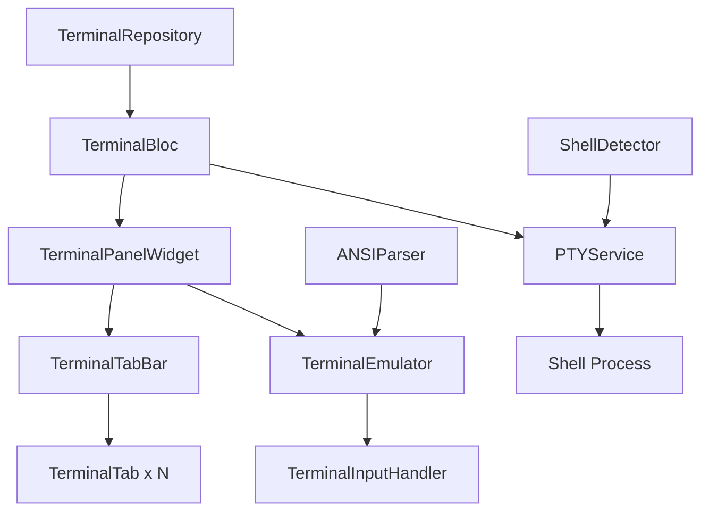

# Design Document: Advanced Terminal Management

## Overview

This document describes the design for the Advanced Terminal Management feature in Goox Editor. This feature transforms the existing dummy terminal panel into a fully functional terminal system with PTY (pseudo-terminal) integration, support for multiple terminal instances, and professional terminal emulation capabilities.

### Feature Summary

The Advanced Terminal Management feature provides:

- **Multiple Terminal Instances**: Create and manage up to 10 concurrent terminal sessions
- **PTY Integration**: Real shell process execution with proper I/O handling
- **Terminal Emulation**: ANSI escape code parsing and rendering for colors and formatting
- **Tab Management**: Visual tab interface for switching between terminals
- **Keyboard Shortcuts**: Comprehensive keyboard navigation and control
- **State Persistence**: Save and restore terminal configuration across sessions
- **Platform Support**: Automatic shell selection (bash/zsh/PowerShell) based on OS

### Design Goals

1. **Professional Experience**: Match the terminal functionality of modern IDEs like VSCode
2. **BLoC Architecture**: Maintain consistency with existing codebase patterns
3. **Performance**: Handle high-volume output efficiently with virtualized rendering
4. **Reliability**: Graceful error handling and recovery for process failures
5. **Extensibility**: Design for future enhancements (split terminals, custom shells)
6. **Platform Compatibility**: Work seamlessly on Linux, macOS, and Windows

## Architecture

### High-Level Structure


```
lib/features/terminal/
├── data/
│   ├── models/
│   │   ├── terminal_config.dart          # Existing config (extended)
│   │   ├── terminal_instance.dart        # NEW: Terminal instance model
│   │   ├── terminal_output.dart          # NEW: Output buffer model
│   │   ├── ansi_style.dart              # NEW: ANSI styling model
│   │   └── shell_config.dart            # NEW: Shell configuration
│   ├── repositories/
│   │   ├── terminal_repository.dart      # Existing (extended)
│   │   └── terminal_repository_impl.dart # Existing (extended)
│   └── services/
│       ├── pty_service.dart             # NEW: PTY management
│       ├── shell_detector.dart          # NEW: Platform shell detection
│       └── ansi_parser.dart             # NEW: ANSI escape code parser
├── presentation/
│   ├── blocs/
│   │   ├── terminal_bloc.dart           # Existing (major refactor)
│   │   ├── terminal_event.dart          # Existing (extended)
│   │   └── terminal_state.dart          # Existing (extended)
│   └── widgets/
│       ├── terminal_panel_widget.dart    # Existing (refactored)
│       ├── terminal_tab_bar.dart        # NEW: Tab bar component
│       ├── terminal_tab.dart            # NEW: Individual tab
│       ├── terminal_emulator.dart       # NEW: Terminal rendering
│       └── terminal_input_handler.dart  # NEW: Input processing
```

### Component Interaction Flow



### Layer Responsibilities

**Presentation Layer**:
- Widget rendering and user interaction
- Keyboard shortcut handling
- Tab management UI
- Terminal output display

**Business Logic Layer (BLoC)**:
- Terminal instance lifecycle management
- State coordination between multiple terminals
- Event processing and state emission
- Integration with services

**Data Layer**:
- PTY process management
- Shell detection and configuration
- ANSI parsing and styling
- Persistence of terminal preferences

## Components and Interfaces

### Data Models

#### TerminalInstance

```dart
class TerminalInstance {
  final String id;
  final String title;
  final String workingDirectory;
  final TerminalOutput output;
  final PTYProcess? ptyProcess;
  final TerminalStatus status;
  final DateTime createdAt;
  
  const TerminalInstance({
    required this.id,
    required this.title,
    required this.workingDirectory,
    required this.output,
    this.ptyProcess,
    required this.status,
    required this.createdAt,
  });
}

enum TerminalStatus {
  initializing,
  running,
  exited,
  error,
}
```

#### TerminalOutput

```dart
class TerminalOutput {
  final List<TerminalLine> lines;
  final int maxLines;
  final int scrollOffset;
  
  const TerminalOutput({
    required this.lines,
    this.maxLines = 1000,
    this.scrollOffset = 0,
  });
  
  TerminalOutput appendText(String text) {
    // Parse text, handle newlines, apply ANSI codes
    // Trim to maxLines if exceeded
  }
}

class TerminalLine {
  final String text;
  final List<ANSIStyle> styles;
  
  const TerminalLine({
    required this.text,
    required this.styles,
  });
}
```

#### ANSIStyle

```dart
class ANSIStyle {
  final int startIndex;
  final int endIndex;
  final Color? foregroundColor;
  final Color? backgroundColor;
  final bool bold;
  final bool italic;
  final bool underline;
  
  const ANSIStyle({
    required this.startIndex,
    required this.endIndex,
    this.foregroundColor,
    this.backgroundColor,
    this.bold = false,
    this.italic = false,
    this.underline = false,
  });
}
```

#### ShellConfig

```dart
class ShellConfig {
  final String executable;
  final List<String> args;
  final Map<String, String> environment;
  
  const ShellConfig({
    required this.executable,
    required this.args,
    required this.environment,
  });
  
  static ShellConfig forPlatform(Platform platform) {
    // Return appropriate shell config for platform
  }
}
```

### Services

#### PTYService

```dart
abstract class PTYService {
  /// Create a new PTY with shell process
  Future<PTYProcess> createPTY({
    required ShellConfig shellConfig,
    required String workingDirectory,
  });
  
  /// Write input to PTY
  Future<void> write(PTYProcess process, String input);
  
  /// Listen to PTY output
  Stream<String> getOutputStream(PTYProcess process);
  
  /// Terminate PTY process
  Future<void> terminate(PTYProcess process, {bool force = false});
  
  /// Resize PTY dimensions
  Future<void> resize(PTYProcess process, int cols, int rows);
}

class PTYProcess {
  final int pid;
  final Stream<String> stdout;
  final Stream<String> stderr;
  final Future<int> exitCode;
  
  // Platform-specific PTY handle
  final dynamic nativeHandle;
}
```

**Implementation Notes**:
- Use `dart:ffi` to interface with native PTY APIs
- Linux/macOS: Use `posix_openpt`, `grantpt`, `unlockpt`, `fork`, `exec`
- Windows: Use `CreatePseudoConsole` API (Windows 10+)
- Consider using existing package like `xterm_pty` or `pty` as foundation

#### ShellDetector

```dart
class ShellDetector {
  /// Detect the best available shell for current platform
  Future<ShellConfig> detectShell() async {
    if (Platform.isLinux) {
      return _detectUnixShell(['bash', 'sh']);
    } else if (Platform.isMacOS) {
      return _detectUnixShell(['zsh', 'bash', 'sh']);
    } else if (Platform.isWindows) {
      return _detectWindowsShell(['pwsh', 'powershell', 'cmd']);
    }
    throw UnsupportedError('Platform not supported');
  }
  
  Future<ShellConfig> _detectUnixShell(List<String> shells) async {
    // Check PATH for each shell, return first found
    // Add appropriate flags: -l for login shell
  }
  
  Future<ShellConfig> _detectWindowsShell(List<String> shells) async {
    // Check for PowerShell Core, PowerShell, then cmd
  }
}
```

#### ANSIParser

```dart
class ANSIParser {
  /// Parse ANSI escape codes and return styled lines
  List<TerminalLine> parse(String text) {
    // State machine to parse ANSI codes
    // Handle SGR (Select Graphic Rendition) codes
    // Support 16 colors, 256 colors, and RGB colors
    // Track current style state across lines
  }
  
  /// Parse a single ANSI escape sequence
  ANSIStyle? _parseEscapeSequence(String sequence) {
    // Parse CSI sequences: ESC [ ... m
    // Extract color and style codes
  }
}
```

**ANSI Code Support**:
- Basic 16 colors (30-37, 40-47, 90-97, 100-107)
- 256 color palette (38;5;n, 48;5;n)
- RGB colors (38;2;r;g;b, 48;2;r;g;b)
- Text styles: bold (1), italic (3), underline (4)
- Reset codes (0, 22, 23, 24, 39, 49)

### Repository Extensions

#### TerminalRepository (Extended)

```dart
abstract class TerminalRepository {
  // Existing methods
  Future<bool> loadVisibility();
  Future<void> saveVisibility({required bool isVisible});
  
  // NEW methods
  Future<double> loadHeight();
  Future<void> saveHeight(double height);
  
  Future<int> loadTerminalCount();
  Future<void> saveTerminalCount(int count);
  
  Future<List<String>> loadWorkingDirectories();
  Future<void> saveWorkingDirectories(List<String> directories);
}
```

### BLoC Layer

#### TerminalBloc (Refactored)

**Events**:
```dart
// Existing
class InitializeTerminalEvent extends TerminalEvent {}
class ToggleTerminalEvent extends TerminalEvent {}
class ResizeTerminalEvent extends TerminalEvent {
  final double newHeight;
}

// NEW
class CreateTerminalEvent extends TerminalEvent {
  final String? workingDirectory;
}

class CloseTerminalEvent extends TerminalEvent {
  final String terminalId;
}

class SwitchTerminalEvent extends TerminalEvent {
  final String terminalId;
}

class TerminalOutputEvent extends TerminalEvent {
  final String terminalId;
  final String output;
}

class TerminalInputEvent extends TerminalEvent {
  final String terminalId;
  final String input;
}

class TerminalExitedEvent extends TerminalEvent {
  final String terminalId;
  final int exitCode;
}

class RestartTerminalEvent extends TerminalEvent {
  final String terminalId;
}

class CycleTerminalEvent extends TerminalEvent {
  final bool forward; // true = next, false = previous
}
```

**State**:
```dart
class TerminalState extends Equatable {
  final bool isVisible;
  final double height;
  final List<TerminalInstance> terminals;
  final String? activeTerminalId;
  final TerminalStatus status;
  final String? errorMessage;
  
  const TerminalState({
    this.isVisible = false,
    this.height = TerminalConfig.defaultHeight,
    this.terminals = const [],
    this.activeTerminalId,
    this.status = TerminalStatus.initial,
    this.errorMessage,
  });
  
  TerminalInstance? get activeTerminal =>
      terminals.firstWhereOrNull((t) => t.id == activeTerminalId);
  
  int get terminalCount => terminals.length;
  
  bool get canCreateTerminal => terminalCount < 10;
}
```

**Business Logic**:


- **InitializeTerminalEvent**: Load saved preferences, restore terminal count and working directories, create initial terminals
- **CreateTerminalEvent**: Generate unique ID, detect shell, create PTY, add to terminals list, set as active, subscribe to output stream
- **CloseTerminalEvent**: Terminate PTY process, remove from list, activate previous terminal or create new if last one
- **SwitchTerminalEvent**: Update activeTerminalId, preserve previous terminal state
- **TerminalOutputEvent**: Append output to terminal's output buffer, emit new state
- **TerminalInputEvent**: Write input to PTY via PTYService
- **TerminalExitedEvent**: Update terminal status to exited, display exit code
- **RestartTerminalEvent**: Terminate old PTY, create new PTY with same working directory
- **CycleTerminalEvent**: Calculate next/previous terminal index with wrapping, switch to it

### Presentation Widgets

#### TerminalPanelWidget (Refactored)

```dart
class TerminalPanelWidget extends StatelessWidget {
  @override
  Widget build(BuildContext context) {
    return BlocBuilder<TerminalBloc, TerminalState>(
      builder: (context, state) {
        if (!state.isVisible) return const SizedBox.shrink();
        
        return Container(
          height: state.height,
          child: Column(
            children: [
              ResizeHandle(),
              TerminalTabBar(
                terminals: state.terminals,
                activeId: state.activeTerminalId,
                canCreate: state.canCreateTerminal,
              ),
              Expanded(
                child: state.activeTerminal != null
                    ? TerminalEmulator(terminal: state.activeTerminal!)
                    : EmptyTerminalView(),
              ),
            ],
          ),
        );
      },
    );
  }
}
```

#### TerminalTabBar

```dart
class TerminalTabBar extends StatelessWidget {
  final List<TerminalInstance> terminals;
  final String? activeId;
  final bool canCreate;
  
  @override
  Widget build(BuildContext context) {
    return Container(
      height: 35,
      decoration: BoxDecoration(
        color: theme.tabBarBackground,
        border: Border(bottom: BorderSide(color: theme.borderColor)),
      ),
      child: Row(
        children: [
          Expanded(
            child: ListView.builder(
              scrollDirection: Axis.horizontal,
              itemCount: terminals.length,
              itemBuilder: (context, index) {
                return TerminalTab(
                  terminal: terminals[index],
                  isActive: terminals[index].id == activeId,
                );
              },
            ),
          ),
          IconButton(
            icon: Icon(Icons.add),
            onPressed: canCreate
                ? () => context.read<TerminalBloc>().add(CreateTerminalEvent())
                : null,
            tooltip: 'New Terminal (Ctrl+Shift+`)',
          ),
        ],
      ),
    );
  }
}
```

#### TerminalTab

```dart
class TerminalTab extends StatefulWidget {
  final TerminalInstance terminal;
  final bool isActive;
  
  @override
  State<TerminalTab> createState() => _TerminalTabState();
}

class _TerminalTabState extends State<TerminalTab> {
  bool _isHovered = false;
  
  @override
  Widget build(BuildContext context) {
    return MouseRegion(
      onEnter: (_) => setState(() => _isHovered = true),
      onExit: (_) => setState(() => _isHovered = false),
      child: GestureDetector(
        onTap: () {
          context.read<TerminalBloc>().add(
            SwitchTerminalEvent(widget.terminal.id),
          );
        },
        child: Container(
          constraints: BoxConstraints(minWidth: 120, maxWidth: 200),
          padding: EdgeInsets.symmetric(horizontal: 12, vertical: 8),
          decoration: BoxDecoration(
            color: widget.isActive
                ? theme.activeTabBackground
                : _isHovered
                    ? theme.hoverColor
                    : theme.inactiveTabBackground,
            border: Border(
              right: BorderSide(color: theme.borderColor),
            ),
          ),
          child: Row(
            children: [
              Expanded(
                child: Text(
                  widget.terminal.title,
                  overflow: TextOverflow.ellipsis,
                  style: TextStyle(
                    color: widget.isActive
                        ? theme.textColor
                        : theme.textColorDimmed,
                    fontSize: 13,
                  ),
                ),
              ),
              if (_isHovered)
                GestureDetector(
                  onTap: () {
                    context.read<TerminalBloc>().add(
                      CloseTerminalEvent(widget.terminal.id),
                    );
                  },
                  child: Icon(
                    Icons.close,
                    size: 16,
                    color: theme.textColorDimmed,
                  ),
                ),
            ],
          ),
        ),
      ),
    );
  }
}
```

#### TerminalEmulator

```dart
class TerminalEmulator extends StatefulWidget {
  final TerminalInstance terminal;
  
  @override
  State<TerminalEmulator> createState() => _TerminalEmulatorState();
}

class _TerminalEmulatorState extends State<TerminalEmulator> {
  final ScrollController _scrollController = ScrollController();
  final FocusNode _focusNode = FocusNode();
  
  @override
  void initState() {
    super.initState();
    _focusNode.requestFocus();
    
    // Auto-scroll to bottom when new output arrives
    WidgetsBinding.instance.addPostFrameCallback((_) {
      if (_scrollController.hasClients) {
        _scrollController.jumpTo(_scrollController.position.maxScrollExtent);
      }
    });
  }
  
  @override
  Widget build(BuildContext context) {
    return Focus(
      focusNode: _focusNode,
      onKeyEvent: (node, event) => _handleKeyEvent(event),
      child: GestureDetector(
        onTap: () => _focusNode.requestFocus(),
        child: Container(
          color: theme.editorBackground,
          padding: EdgeInsets.all(8),
          child: ListView.builder(
            controller: _scrollController,
            itemCount: widget.terminal.output.lines.length,
            itemBuilder: (context, index) {
              return _buildTerminalLine(
                widget.terminal.output.lines[index],
              );
            },
          ),
        ),
      ),
    );
  }
  
  Widget _buildTerminalLine(TerminalLine line) {
    if (line.styles.isEmpty) {
      return Text(
        line.text,
        style: TextStyle(
          fontFamily: 'monospace',
          fontSize: 13,
          color: theme.textColor,
          height: 1.3,
        ),
      );
    }
    
    // Build TextSpan with ANSI styles applied
    return Text.rich(
      TextSpan(
        children: _buildStyledSpans(line),
        style: TextStyle(
          fontFamily: 'monospace',
          fontSize: 13,
          height: 1.3,
        ),
      ),
    );
  }
  
  List<TextSpan> _buildStyledSpans(TerminalLine line) {
    // Split text into spans based on style ranges
    // Apply colors and text styles from ANSIStyle objects
  }
  
  KeyEventResult _handleKeyEvent(KeyEvent event) {
    if (event is! KeyDownEvent) return KeyEventResult.ignored;
    
    // Handle special keys
    if (event.logicalKey == LogicalKeyboardKey.enter) {
      _sendInput('\n');
      return KeyEventResult.handled;
    }
    
    if (event.logicalKey == LogicalKeyboardKey.backspace) {
      _sendInput('\x7f');
      return KeyEventResult.handled;
    }
    
    // Handle Ctrl+C
    if (HardwareKeyboard.instance.isControlPressed &&
        event.logicalKey == LogicalKeyboardKey.keyC) {
      _sendInput('\x03'); // SIGINT
      return KeyEventResult.handled;
    }
    
    // Handle Ctrl+D
    if (HardwareKeyboard.instance.isControlPressed &&
        event.logicalKey == LogicalKeyboardKey.keyD) {
      _sendInput('\x04'); // EOF
      return KeyEventResult.handled;
    }
    
    // Handle regular character input
    if (event.character != null) {
      _sendInput(event.character!);
      return KeyEventResult.handled;
    }
    
    return KeyEventResult.ignored;
  }
  
  void _sendInput(String input) {
    context.read<TerminalBloc>().add(
      TerminalInputEvent(widget.terminal.id, input),
    );
  }
}
```

## Data Models

### Extended TerminalConfig

```dart
class TerminalConfig {
  // Existing fields
  final bool isVisible;
  final double height;
  
  // NEW fields
  final int maxTerminals;
  final int scrollbackLines;
  final String fontFamily;
  final double fontSize;
  final double lineHeight;
  
  const TerminalConfig({
    required this.isVisible,
    required this.height,
    this.maxTerminals = 10,
    this.scrollbackLines = 1000,
    this.fontFamily = 'monospace',
    this.fontSize = 13.0,
    this.lineHeight = 1.3,
  });
  
  static const double defaultHeight = 200;
  static const double minHeight = 100;
  static const double maxHeightRatio = 0.8;
}
```

### Persistence Models

**Storage Keys**:
- `terminal_visible`: bool
- `terminal_height`: double
- `terminal_count`: int
- `terminal_working_dirs`: List<String> (JSON encoded)

**Storage Format**:
```json
{
  "terminal_visible": true,
  "terminal_height": 250.0,
  "terminal_count": 2,
  "terminal_working_dirs": [
    "/home/user/project",
    "/home/user/project/src"
  ]
}
```

## Error Handling

### Error Scenarios and Strategies

**PTY Creation Failure**:
- Cause: Insufficient permissions, unsupported platform, missing shell
- Strategy: Display error message in terminal content area, provide "Retry" button
- Fallback: Show error details and suggest manual shell path configuration

**Shell Process Crash**:
- Cause: Shell executable not found, segmentation fault, killed by system
- Strategy: Detect exit code, display in terminal, mark terminal as "exited"
- Recovery: Provide "Restart Terminal" button to create new PTY

**PTY I/O Errors**:
- Cause: Broken pipe, process terminated unexpectedly
- Strategy: Log error, attempt to read remaining output, mark terminal as dead
- Recovery: Disable input, show error state, allow restart

**Output Buffer Overflow**:
- Cause: Extremely high output rate exceeding processing capacity
- Strategy: Drop intermediate frames, maintain scrollback limit
- Prevention: Batch output updates, render at max 60 FPS

**Invalid ANSI Sequences**:
- Cause: Malformed escape codes, unsupported sequences
- Strategy: Skip invalid sequences, continue parsing rest of output
- Logging: Log warnings for debugging but don't crash

**Platform Detection Failure**:
- Cause: Unknown platform, missing shell executables
- Strategy: Try fallback shells (sh on Unix, cmd on Windows)
- User Feedback: Display warning about using fallback shell

### Error State Management

```dart
class TerminalError {
  final TerminalErrorType type;
  final String message;
  final String? details;
  final DateTime timestamp;
  
  const TerminalError({
    required this.type,
    required this.message,
    this.details,
    required this.timestamp,
  });
}

enum TerminalErrorType {
  ptyCreationFailed,
  shellNotFound,
  processCrashed,
  ioError,
  platformUnsupported,
}
```

## Testing Strategy

### Why Property-Based Testing Does NOT Apply

This feature is **not suitable for property-based testing** because:

1. **External Process Management**: The core functionality involves managing external shell processes and PTY I/O, which are inherently stateful and side-effect heavy
2. **Platform-Specific Behavior**: Shell behavior varies significantly across platforms and cannot be meaningfully abstracted into universal properties
3. **UI Rendering Focus**: Terminal emulation is primarily about rendering and user interaction, not data transformation
4. **Non-Deterministic Output**: Shell command output is non-deterministic and depends on system state
5. **Integration-Heavy**: Most functionality requires integration with OS-level APIs (PTY, process management)

**Appropriate Testing Approaches**:
- **Unit Tests**: Test pure logic (ANSI parsing, state management, tab cycling)
- **Widget Tests**: Test UI components in isolation with mocked BLoC
- **Integration Tests**: Test end-to-end flows with real PTY processes
- **Mock-Based Tests**: Test BLoC logic with mocked PTYService

### Unit Testing Strategy

**ANSIParser Tests**:
- Parse basic 16 colors correctly (foreground and background)
- Parse 256-color palette codes
- Parse RGB color codes
- Parse text styles (bold, italic, underline)
- Handle reset codes correctly
- Skip invalid escape sequences gracefully
- Maintain style state across multiple lines
- Handle mixed styled and unstyled text

**TerminalOutput Tests**:
- Append text correctly
- Handle newlines and create new lines
- Trim to max scrollback lines
- Preserve most recent lines when trimming
- Handle empty input
- Handle very long lines

**ShellDetector Tests**:
- Detect bash on Linux
- Detect zsh on macOS
- Detect PowerShell on Windows
- Fallback to sh when preferred shell not found
- Fallback to cmd on Windows when PowerShell not found
- Return correct shell arguments for each platform

**TerminalBloc Tests** (with mocked PTYService):
- InitializeTerminalEvent creates initial terminal
- CreateTerminalEvent adds new terminal and sets as active
- CreateTerminalEvent respects max terminal limit
- CloseTerminalEvent removes terminal and activates previous
- CloseTerminalEvent creates new terminal when closing last one
- SwitchTerminalEvent updates active terminal
- CycleTerminalEvent wraps around terminal list
- TerminalOutputEvent appends to correct terminal
- TerminalInputEvent writes to PTY service
- TerminalExitedEvent updates terminal status

**Tab Cycling Logic Tests**:
- Cycle forward through terminals
- Cycle backward through terminals
- Wrap from last to first terminal
- Wrap from first to last terminal
- Handle single terminal case

### Widget Testing Strategy

**TerminalTab Tests**:
- Renders terminal title
- Shows active styling when active
- Shows inactive styling when not active
- Shows close button on hover
- Hides close button when not hovered
- Dispatches SwitchTerminalEvent on click
- Dispatches CloseTerminalEvent on close button click
- Truncates long titles with ellipsis

**TerminalTabBar Tests**:
- Renders all terminal tabs
- Renders create button
- Disables create button when at max terminals
- Dispatches CreateTerminalEvent on create button click
- Scrolls horizontally when tabs exceed width

**TerminalEmulator Tests**:
- Renders terminal lines
- Applies ANSI styles correctly
- Auto-scrolls to bottom on new output
- Handles keyboard input
- Sends Enter key as newline
- Sends Ctrl+C as SIGINT
- Sends Ctrl+D as EOF
- Focuses on tap

### Integration Testing Strategy

**Terminal Lifecycle Tests**:
- Create terminal spawns real shell process
- Terminal receives output from shell
- Terminal accepts input and sends to shell
- Close terminal terminates shell process
- Restart terminal creates new shell process

**Multi-Terminal Tests**:
- Create multiple terminals
- Switch between terminals preserves output
- Close terminal while others remain active
- Keyboard shortcuts work correctly

**Persistence Tests**:
- Terminal count persists across app restarts
- Working directories persist across app restarts
- Panel visibility persists across app restarts
- Panel height persists across app restarts

**Platform-Specific Tests**:
- Linux uses bash by default
- macOS uses zsh by default
- Windows uses PowerShell by default
- Fallback shells work when preferred not available

### Performance Testing

**Output Handling Tests**:
- Handle high-volume output (1000+ lines/second)
- Render updates at stable frame rate
- Memory usage stays within bounds with long-running terminals
- Scrollback buffer trimming works correctly

### Test Coverage Goals

- **Unit Tests**: 85%+ coverage for pure logic (parsers, models, utilities)
- **Widget Tests**: All custom widgets tested for rendering and interaction
- **Integration Tests**: Critical user flows covered (create, switch, close, input/output)
- **Platform Tests**: Each platform tested with appropriate shell

### Testing Tools

- `flutter_test`: Core testing framework
- `bloc_test`: BLoC-specific testing utilities
- `mocktail`: Mocking dependencies (PTYService, repositories)
- `integration_test`: End-to-end testing with real processes

## Implementation Notes

### PTY Integration Approach

**Option 1: Use Existing Package**
- Package: `xterm` + `flutter_pty` or similar
- Pros: Mature implementation, handles platform differences
- Cons: May have limitations, dependency on external package

**Option 2: Custom FFI Implementation**
- Use `dart:ffi` to call native PTY APIs directly
- Pros: Full control, no external dependencies
- Cons: Complex, requires platform-specific code

**Recommendation**: Start with existing package (`xterm` ecosystem), fall back to custom FFI if limitations found.

### ANSI Parsing Performance

**Optimization Strategies**:
- Parse ANSI codes incrementally as output arrives
- Cache parsed lines to avoid re-parsing on scroll
- Use efficient string operations (avoid excessive concatenation)
- Batch style applications to reduce TextSpan objects

### Keyboard Shortcut Integration

**Global Shortcuts** (handled in main app):
- Ctrl+`: Toggle terminal visibility
- Ctrl+Shift+`: Create new terminal
- Ctrl+PageUp/PageDown: Cycle terminals
- Ctrl+Shift+W: Close active terminal

**Terminal-Specific Shortcuts** (handled in TerminalEmulator):
- All other keys: Send to PTY
- Ctrl+C: Send SIGINT
- Ctrl+D: Send EOF
- Arrow keys: Send ANSI escape sequences

**Implementation**:
```dart
// In main keyboard handler
if (isTerminalFocused && !isGlobalShortcut(event)) {
  // Let terminal handle it
  return KeyEventResult.skipRemainingHandlers;
}
```

### State Management Patterns

**Terminal Instance Lifecycle**:
1. Create: Generate ID → Detect shell → Create PTY → Subscribe to output → Add to state
2. Active: Receive output → Parse ANSI → Update buffer → Emit state
3. Close: Unsubscribe output → Terminate PTY → Remove from state → Activate next

**Output Stream Handling**:
```dart
// In TerminalBloc
Future<void> _createTerminal(String workingDir) async {
  final pty = await _ptyService.createPTY(
    shellConfig: await _shellDetector.detectShell(),
    workingDirectory: workingDir,
  );
  
  final terminal = TerminalInstance(
    id: _generateId(),
    ptyProcess: pty,
    // ...
  );
  
  // Subscribe to output
  pty.stdout.listen((output) {
    add(TerminalOutputEvent(terminal.id, output));
  });
  
  emit(state.copyWith(
    terminals: [...state.terminals, terminal],
    activeTerminalId: terminal.id,
  ));
}
```

### Platform-Specific Considerations

**Linux/macOS**:
- Use `posix_openpt`, `grantpt`, `unlockpt` for PTY creation
- Fork process and exec shell
- Set TERM environment variable to `xterm-256color`
- Handle SIGCHLD for process exit detection

**Windows**:
- Use `CreatePseudoConsole` API (Windows 10 1809+)
- Use `CreateProcess` with console handle
- Handle different line endings (CRLF vs LF)
- PowerShell may require different initialization

### Memory Management

**Output Buffer Limits**:
- Max 1000 lines per terminal
- Trim oldest lines when exceeded
- Each line max 10,000 characters (truncate longer)

**Terminal Instance Limits**:
- Max 10 concurrent terminals
- Each terminal ~1-2 MB memory (output buffer + PTY)
- Total terminal memory budget: ~20 MB

**Cleanup on Close**:
- Terminate PTY process
- Cancel output stream subscriptions
- Clear output buffer
- Remove from state

### Accessibility

**Keyboard Navigation**:
- All terminal operations accessible via keyboard
- Tab key cycles through UI elements
- Screen reader announces terminal creation/closure

**Visual Indicators**:
- Clear active terminal indication
- Status icons for terminal state (running, exited, error)
- Tooltips on all interactive elements

**Color Contrast**:
- Ensure ANSI colors meet WCAG AA standards
- Provide high-contrast theme option
- Support system accessibility settings

### Future Extensibility

**Planned Enhancements**:
- Split terminal view (horizontal/vertical)
- Custom shell configuration in settings
- Terminal profiles (different shells, colors, fonts)
- Search in terminal output
- Copy/paste with formatting
- Terminal history persistence
- Link detection and click handling

**Architecture Support**:
- TerminalBloc can be extended with split terminal events
- TerminalPanelWidget can be refactored to support split layout
- PTYService interface supports multiple PTY types
- ANSIParser can be extended with more escape sequences

## Summary

This design provides a comprehensive architecture for professional terminal management in Goox Editor. The implementation follows BLoC patterns, integrates PTY for real shell execution, supports multiple terminal instances with tab management, and handles ANSI escape codes for proper terminal emulation. The design prioritizes performance, reliability, and extensibility while maintaining consistency with the existing codebase.

Key technical decisions:
- Use existing PTY packages where possible to reduce complexity
- Implement custom ANSI parser for full control over rendering
- Batch output updates and limit scrollback for performance
- Provide comprehensive error handling and recovery mechanisms
- Design for future enhancements (split terminals, profiles)

