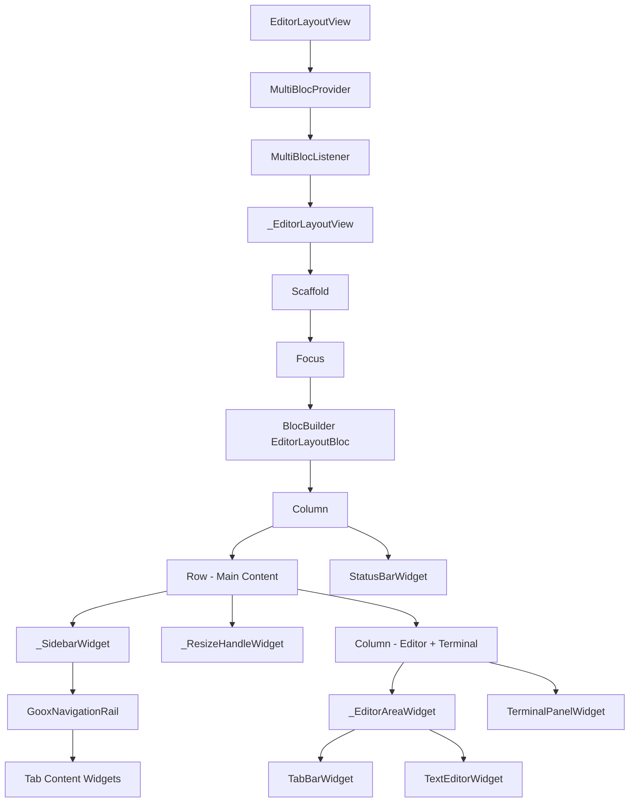
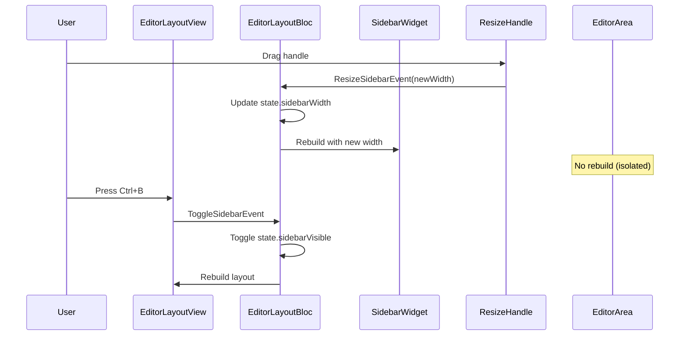

# Design Document: Editor Layout Widget Refactor

## Overview

This design addresses the refactoring of `editor_layout_views.dart`, a 450+ line file with complex nested builders and inline widget construction that causes unnecessary rebuilds and maintenance challenges. The refactoring will decompose the monolithic widget into smaller, focused components organized using Dart's `part`/`part of` mechanism.

### Goals

- Improve render performance by reducing unnecessary widget rebuilds
- Enhance code maintainability through clear separation of concerns
- Optimize theme access patterns to minimize context lookups
- Maintain 100% functional compatibility with existing behavior
- Organize code into logical, navigable file structure

### Non-Goals

- Changing the visual appearance or layout of the editor
- Modifying the BLoC architecture or state management patterns
- Adding new features or functionality
- Refactoring other files in the editor_layout feature

## Architecture

### Current Architecture Issues

The current implementation has several performance and maintainability issues:

1. **Monolithic Build Methods**: Large `_buildSidebar`, `_buildResizeHandle`, and `_buildEditorArea` methods with inline widget construction
2. **Excessive Theme Lookups**: Multiple calls to `Theme.of(context).extension<EditorThemeExtension>()` throughout the widget tree
3. **Anonymous Builder Functions**: Inline `builder: (context) => Widget()` functions prevent const optimization
4. **Coupled Concerns**: Sidebar, resize handle, editor area, and tab contents all mixed in one file
5. **Rebuild Inefficiency**: Changes to sidebar width trigger rebuilds of unrelated components

### Refactored Architecture

The refactored architecture separates concerns into focused, reusable widgets:

```
editor_layout_views.dart (main file)
├── EditorLayoutView (public, stateless)
├── _EditorLayoutView (private, stateless)
└── parts:
    ├── editor_layout_views_sidebar.dart
    │   └── _SidebarWidget
    ├── editor_layout_views_resize_handle.dart
    │   └── _ResizeHandleWidget
    ├── editor_layout_views_editor_area.dart
    │   └── _EditorAreaWidget
    └── editor_layout_views_tab_contents.dart
        ├── _ExplorerTabContent
        ├── _SearchTabContent
        ├── _SourceControlTabContent
        ├── _ExtensionsTabContent
        └── _SettingsTabContent
```

### Widget Hierarchy



### Data Flow



## Components and Interfaces

### 1. EditorLayoutView (Public Entry Point)

**Responsibility**: Provide BLoC providers and listeners for the editor layout.

**Interface**:
```dart
final class EditorLayoutView extends StatelessWidget {
  const EditorLayoutView({
    required this.workspacePath,
    super.key,
  });

  final String workspacePath;
  
  @override
  Widget build(BuildContext context);
}
```

**Key Behaviors**:
- Sets up MultiBlocProvider with all required BLoCs
- Configures MultiBlocListener for cross-BLoC communication
- Delegates rendering to `_EditorLayoutView`

### 2. _EditorLayoutView (Private Layout Container)

**Responsibility**: Orchestrate the main layout structure and keyboard shortcuts.

**Interface**:
```dart
final class _EditorLayoutView extends StatelessWidget {
  const _EditorLayoutView();
  
  @override
  Widget build(BuildContext context);
  
  KeyEventResult _handleKeyEvent(BuildContext context, KeyEvent event);
}
```

**Key Behaviors**:
- Retrieves theme once at the top level
- Handles keyboard shortcuts (Ctrl+B, Ctrl+`, Ctrl+W, Ctrl+Tab, Ctrl+Shift+Tab)
- Composes sidebar, resize handle, editor area, and status bar

### 3. _SidebarWidget

**File**: `editor_layout_views_sidebar.dart`

**Responsibility**: Render the sidebar with navigation rail and tab contents.

**Interface**:
```dart
final class _SidebarWidget extends StatelessWidget {
  const _SidebarWidget({
    required this.width,
    required this.theme,
  });

  final double width;
  final EditorThemeExtension theme;
  
  @override
  Widget build(BuildContext context);
}
```

**Key Behaviors**:
- Calculates content width (total width - activity bar width)
- Renders GooxNavigationRail with destination tabs
- Receives theme as parameter to avoid repeated lookups
- Uses const constructor for optimization

**Dependencies**:
- Tab content widgets for each destination
- EditorThemeExtension for styling
- BLoC context for event dispatching (file selection)

### 4. _ResizeHandleWidget

**File**: `editor_layout_views_resize_handle.dart`

**Responsibility**: Provide interactive resize functionality for the sidebar.

**Interface**:
```dart
final class _ResizeHandleWidget extends StatelessWidget {
  const _ResizeHandleWidget({
    required this.currentWidth,
    required this.theme,
  });

  final double currentWidth;
  final EditorThemeExtension theme;
  
  @override
  Widget build(BuildContext context);
}
```

**Key Behaviors**:
- Handles horizontal drag gestures
- Changes cursor to resize icon on hover
- Dispatches `ResizeSidebarEvent` to EditorLayoutBloc
- Uses const constructor

**Dependencies**:
- EditorLayoutBloc for dispatching resize events
- EditorThemeExtension for border color

### 5. _EditorAreaWidget

**File**: `editor_layout_views_editor_area.dart`

**Responsibility**: Render the main editor area with tabs and content.

**Interface**:
```dart
final class _EditorAreaWidget extends StatelessWidget {
  const _EditorAreaWidget({
    required this.theme,
  });

  final EditorThemeExtension theme;
  
  @override
  Widget build(BuildContext context);
}
```

**Key Behaviors**:
- Composes TabBarWidget and TextEditorWidget
- Uses theme parameter to avoid context lookup
- Uses const constructor
- Applies editor background color

**Dependencies**:
- TabBarWidget (from tab_manager feature)
- TextEditorWidget (from editor_content feature)
- EditorThemeExtension for background color

### 6. Tab Content Widgets

**File**: `editor_layout_views_tab_contents.dart`

**Responsibility**: Render content for each sidebar tab.

**Widgets**:
- `_ExplorerTabContent`: File explorer with workspace tree
- `_SearchTabContent`: Search interface (placeholder)
- `_SourceControlTabContent`: Git/source control interface (placeholder)
- `_ExtensionsTabContent`: Extensions management (placeholder)
- `_SettingsTabContent`: Settings and theme selector

**Common Interface Pattern**:
```dart
final class _ExplorerTabContent extends StatelessWidget {
  const _ExplorerTabContent({
    required this.contentWidth,
    required this.theme,
  });

  final double contentWidth;
  final EditorThemeExtension theme;
  
  @override
  Widget build(BuildContext context);
}
```

**Key Behaviors**:
- Receive dimensions and theme as parameters
- Use const constructors where possible
- Encapsulate tab-specific logic and UI
- Provide consistent styling across tabs

**Dependencies**:
- Feature-specific widgets (FileExplorerWidget, ThemeSelectorWidget)
- EditorThemeExtension for styling
- BLoC context for event dispatching

## Data Models

This refactoring does not introduce new data models. It works with existing models:

### EditorLayoutState (Existing)

```dart
final class EditorLayoutState extends Equatable {
  const EditorLayoutState({
    this.sidebarVisible = true,
    this.sidebarWidth = AppSpacing.sidebarDefaultWidth,
    this.workspacePath = '',
    this.status = LayoutStatus.initial,
  });
  
  final bool sidebarVisible;
  final double sidebarWidth;
  final String workspacePath;
  final LayoutStatus status;
}
```

**Usage in Refactored Code**:
- `sidebarVisible`: Controls conditional rendering of sidebar and resize handle
- `sidebarWidth`: Passed to `_SidebarWidget` and `_ResizeHandleWidget`
- `workspacePath`: Used for initialization (unchanged)
- `status`: Tracks layout initialization (unchanged)

### EditorThemeExtension (Existing)

```dart
final class EditorThemeExtension extends ThemeExtension<EditorThemeExtension> {
  const EditorThemeExtension({
    required this.activityBarBackground,
    required this.sidebarBackground,
    required this.editorBackground,
    required this.tabBarBackground,
    required this.statusBarBackground,
    required this.textColor,
    required this.textColorDimmed,
    required this.hoverColor,
    required this.borderColor,
    required this.selectedItemColor,
    required this.modifiedIndicator,
  });
  
  // ... color properties
}
```

**Optimization Strategy**:
- Retrieved once in `_EditorLayoutView.build()`
- Passed down to child widgets via constructor parameters
- Eliminates redundant `Theme.of(context).extension<EditorThemeExtension>()` calls
- Reduces widget tree traversals

### Constants (Existing)

From `goox_ui` package:
- `AppSpacing.activityBarWidth`: Width of the activity bar (48.0)
- `AppSpacing.sidebarMinWidth`: Minimum sidebar width (200.0)
- `AppSpacing.sidebarMaxWidth`: Maximum sidebar width (400.0)
- `AppSpacing.sidebarDefaultWidth`: Default sidebar width (250.0)
- `AppSpacing.resizeHandleWidth`: Width of resize handle (4.0)

## Error Handling

### Build-Time Errors

**Theme Not Found**:
- **Scenario**: `EditorThemeExtension` is not registered in the theme
- **Handling**: Use null-aware operator with fallback
- **Implementation**:
```dart
final editorTheme = Theme.of(context).extension<EditorThemeExtension>() 
    ?? EditorThemeExtension.dark();
```

**Missing BLoC Provider**:
- **Scenario**: Widget tries to access BLoC that wasn't provided
- **Handling**: Flutter will throw `ProviderNotFoundException` with clear message
- **Prevention**: All BLoCs are provided in `EditorLayoutView`, ensuring availability throughout the tree

### Runtime Errors

**Invalid Sidebar Width**:
- **Scenario**: User drags resize handle beyond valid bounds
- **Handling**: `EditorLayoutBloc` clamps width using `clamp(min, max)`
- **Implementation**: Already exists in `_onResizeSidebar`

**File Selection Errors**:
- **Scenario**: User selects file that cannot be opened
- **Handling**: Handled by `EditorContentBloc` and `TabManagerBloc` (out of scope)
- **Impact**: Refactoring does not change error handling behavior

### Part File Organization Errors

**Missing Part Directive**:
- **Scenario**: Forgot to add `part 'filename.dart';` in main file
- **Handling**: Dart compiler will report error at compile time
- **Prevention**: Follow checklist in implementation phase

**Incorrect Part Of Directive**:
- **Scenario**: `part of` points to wrong file
- **Handling**: Dart compiler will report error at compile time
- **Prevention**: Use consistent naming convention

## Testing Strategy

This refactoring is **not suitable for property-based testing** because:
- It's a code reorganization task, not new functionality
- The behavior is deterministic UI rendering, not algorithmic logic
- There are no universal properties to test across input spaces
- Testing focuses on visual regression and functional equivalence

### Testing Approach

**1. Widget Tests (Primary)**

Test each extracted widget in isolation:

```dart
// Test _SidebarWidget
testWidgets('_SidebarWidget renders with correct width', (tester) async {
  await tester.pumpWidget(
    MaterialApp(
      theme: ThemeData(extensions: [EditorThemeExtension.dark()]),
      home: _SidebarWidget(
        width: 250.0,
        theme: EditorThemeExtension.dark(),
      ),
    ),
  );
  
  expect(find.byType(GooxNavigationRail), findsOneWidget);
  // Verify width constraint
});

// Test _ResizeHandleWidget
testWidgets('_ResizeHandleWidget handles drag gesture', (tester) async {
  // Mock EditorLayoutBloc
  // Simulate drag gesture
  // Verify ResizeSidebarEvent dispatched
});

// Test _EditorAreaWidget
testWidgets('_EditorAreaWidget renders tab bar and editor', (tester) async {
  await tester.pumpWidget(
    MaterialApp(
      theme: ThemeData(extensions: [EditorThemeExtension.dark()]),
      home: _EditorAreaWidget(
        theme: EditorThemeExtension.dark(),
      ),
    ),
  );
  
  expect(find.byType(TabBarWidget), findsOneWidget);
  expect(find.byType(TextEditorWidget), findsOneWidget);
});

// Test each tab content widget
testWidgets('_ExplorerTabContent renders file explorer', (tester) async {
  // Test explorer tab content
});
```

**2. Integration Tests**

Verify the complete layout works as before:

```dart
testWidgets('EditorLayoutView maintains existing functionality', (tester) async {
  await tester.pumpWidget(
    MaterialApp(
      home: EditorLayoutView(workspacePath: '/test/path'),
    ),
  );
  
  // Verify sidebar visible by default
  expect(find.byType(_SidebarWidget), findsOneWidget);
  
  // Test Ctrl+B toggles sidebar
  await tester.sendKeyDownEvent(LogicalKeyboardKey.control);
  await tester.sendKeyEvent(LogicalKeyboardKey.keyB);
  await tester.pumpAndSettle();
  expect(find.byType(_SidebarWidget), findsNothing);
  
  // Test resize handle drag
  // Test keyboard shortcuts
  // Test file selection flow
});
```

**3. Visual Regression Tests**

Use golden file testing to ensure visual appearance unchanged:

```dart
testWidgets('EditorLayoutView matches golden file', (tester) async {
  await tester.pumpWidget(
    MaterialApp(
      home: EditorLayoutView(workspacePath: '/test/path'),
    ),
  );
  
  await expectLater(
    find.byType(EditorLayoutView),
    matchesGoldenFile('editor_layout_view.png'),
  );
});
```

**4. Performance Tests**

Verify rebuild optimization:

```dart
testWidgets('Sidebar resize does not rebuild editor area', (tester) async {
  int editorAreaBuildCount = 0;
  
  await tester.pumpWidget(
    // Wrap _EditorAreaWidget with build counter
  );
  
  // Trigger sidebar resize
  // Verify editorAreaBuildCount remains 1
});
```

**5. Manual Testing Checklist**

Before merging:
- [ ] All keyboard shortcuts work (Ctrl+B, Ctrl+`, Ctrl+W, Ctrl+Tab, Ctrl+Shift+Tab)
- [ ] Sidebar resize by dragging handle works smoothly
- [ ] File selection from Explorer opens file in editor
- [ ] Tab switching updates editor content
- [ ] Modified indicator syncs between editor and tabs
- [ ] Theme switching applies to all components
- [ ] Terminal toggle works correctly
- [ ] Visual appearance matches original exactly
- [ ] No console errors or warnings
- [ ] Performance feels smooth (no jank during resize)

### Test Coverage Goals

- **Unit Tests**: 100% coverage of new widget classes
- **Integration Tests**: Cover all user interactions and keyboard shortcuts
- **Visual Regression**: Golden files for light and dark themes
- **Performance**: Verify rebuild isolation between components

### Continuous Integration

- Run all tests on every commit
- Block merge if any test fails
- Generate coverage report (target: >90%)
- Run visual regression tests on UI changes
