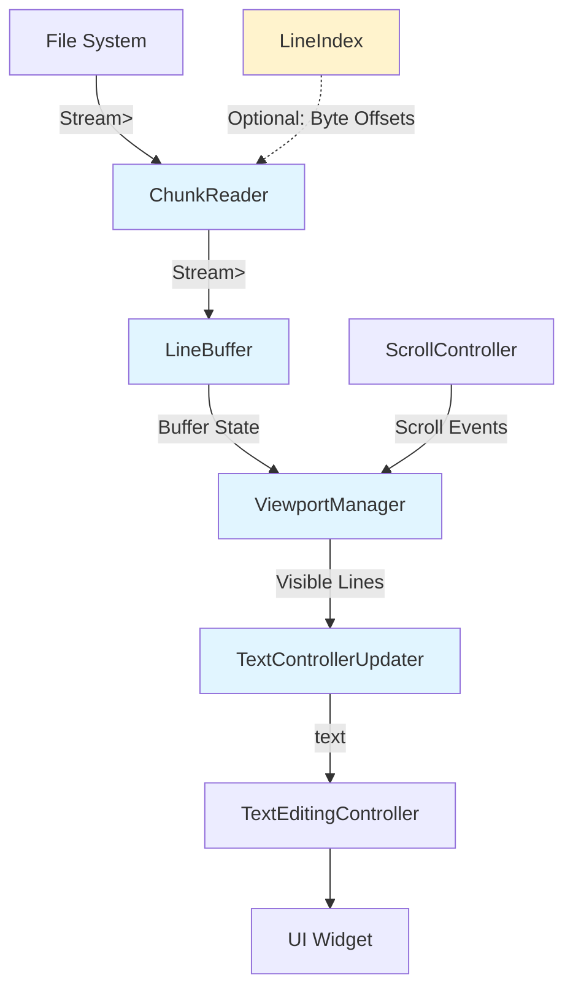

# Design Document: goox_editor - Large File Text Viewer/Editor

## Overview

The goox_editor package provides a high-performance Flutter text viewer/editor capable of handling files from 15MB to 100MB while maintaining a memory footprint under 10MB. The design uses streaming file I/O, sliding window buffering, and viewport-based rendering to achieve smooth scrolling performance.

### Core Design Principles

1. **Streaming Architecture**: Never load the entire file into memory
2. **Viewport-Centric Rendering**: Only render what the user can see
3. **Lazy Loading**: Load content on-demand as the user scrolls
4. **Memory Efficiency**: Maintain constant memory usage regardless of file size
5. **Performance First**: Target 30+ FPS during scrolling operations

### Key Constraints

- Memory footprint: < 10MB during normal operation
- File size support: 15MB - 100MB
- Initial load time: < 500ms to first visible content
- Scroll performance: 30+ FPS minimum
- Buffer size: 500-2000 lines in memory

## Architecture

### Component Overview

The architecture consists of five primary components working in a unidirectional data flow:

```
File → ChunkReader → LineBuffer → ViewportManager → TextControllerUpdater → UI
```

### Component Diagram



### Data Flow

1. **File → ChunkReader**: File.openRead() creates a byte stream
2. **ChunkReader → LineBuffer**: Decoded lines emitted in chunks of 100-300 lines
3. **LineBuffer → ViewportManager**: Buffer maintains sliding window of lines
4. **ScrollController → ViewportManager**: Scroll events trigger viewport calculations
5. **ViewportManager → TextControllerUpdater**: Visible line range determined
6. **TextControllerUpdater → UI**: Debounced updates to TextEditingController

## Components and Interfaces

### 1. ChunkReader

**Responsibility**: Stream file content in manageable chunks without loading entire file.

**Interface**:
```dart
class ChunkReader {
  /// Creates a chunk reader for the specified file
  ChunkReader(File file, {int chunkSize = 200});
  
  /// Opens the file and returns a stream of line chunks
  /// Each chunk contains 100-300 lines
  Stream<List<String>> readChunks();
  
  /// Seeks to a specific byte offset (requires LineIndex)
  Future<void> seekToOffset(int byteOffset);
  
  /// Closes the file stream
  Future<void> close();
}
```

**Implementation Details**:
- Uses `File.openRead()` to create byte stream
- Chains `utf8.decoder` for UTF-8 decoding
- Chains `LineSplitter()` to split on newlines
- Buffers lines into chunks of configurable size (default 200)
- Emits `List<String>` chunks via Stream
- **Never** uses `File.readAsString()` or loads complete file

**Key Behavior**:
- Streaming is lazy - data only read when stream is listened to
- Backpressure handling - pauses reading if downstream is slow
- Error handling for encoding issues and I/O errors

### 2. LineBuffer

**Responsibility**: Maintain a sliding window of lines in memory around the current viewport.

**Interface**:
```dart
class LineBuffer {
  /// Creates a line buffer with specified capacity
  LineBuffer({
    required int bufferSize,
    int beforeViewport = 300,
    int afterViewport = 300,
  });
  
  /// Current lines in buffer
  List<String> get lines;
  
  /// Starting line number of buffer (0-indexed)
  int get startLine;
  
  /// Ending line number of buffer (0-indexed, exclusive)
  int get endLine;
  
  /// Total number of lines in file (if known)
  int? get totalLines;
  
  /// Loads lines from chunk stream
  Future<void> loadChunks(Stream<List<String>> chunks);
  
  /// Updates buffer to center around target line
  Future<void> updateWindow(int targetLine);
  
  /// Gets lines in specified range
  List<String> getRange(int start, int end);
  
  /// Clears buffer
  void clear();
}
```

**Implementation Details**:
- Maintains circular buffer or queue of lines
- Buffer capacity: 500-2000 lines (configurable)
- Keeps ~300 lines before viewport (for upward scrolling)
- Keeps ~300 lines after viewport (for downward scrolling)
- Discards lines outside buffer window to maintain memory limit
- Tracks line numbers for each buffered line

**Buffer Management Strategy**:
```
[... discarded ...] [300 before] [VIEWPORT] [300 after] [... not loaded ...]
                    |<------- Buffer Window -------->|
```

**Memory Calculation**:
- Average line length: ~80 characters
- Buffer size: 1000 lines
- Memory per line: ~80 bytes (UTF-8) + overhead
- Total buffer memory: ~100KB - 200KB
- Well under 10MB limit

### 3. ViewportManager

**Responsibility**: Track visible line range and coordinate buffer updates based on scroll position.

**Interface**:
```dart
class ViewportManager {
  /// Creates viewport manager
  ViewportManager({
    required LineBuffer buffer,
    required ScrollController scrollController,
    required double lineHeight,
    int edgeThreshold = 100,
  });
  
  /// Current visible line range
  int get startLine;
  int get endLine;
  
  /// Number of visible lines
  int get visibleLineCount;
  
  /// Initializes scroll listener
  void initialize();
  
  /// Calculates visible line range from scroll position
  void updateViewport();
  
  /// Checks if buffer update is needed
  bool needsBufferUpdate();
  
  /// Stream of viewport changes
  Stream<ViewportChange> get viewportChanges;
  
  /// Disposes resources
  void dispose();
}

class ViewportChange {
  final int startLine;
  final int endLine;
  final bool needsBufferUpdate;
}
```

**Implementation Details**:
- Listens to ScrollController for position changes
- Calculates visible line range using:
  - `startLine = scrollOffset / lineHeight`
  - `endLine = (scrollOffset + viewportHeight) / lineHeight`
- Triggers buffer update when scroll approaches buffer edge (within 100 lines)
- Emits viewport change events for downstream components

**Edge Detection**:
```dart
bool needsBufferUpdate() {
  final distanceFromStart = startLine - buffer.startLine;
  final distanceFromEnd = buffer.endLine - endLine;
  return distanceFromStart < edgeThreshold || 
         distanceFromEnd < edgeThreshold;
}
```

### 4. TextControllerUpdater

**Responsibility**: Efficiently update TextEditingController with visible text while avoiding UI jank.

**Interface**:
```dart
class TextControllerUpdater {
  /// Creates updater with debounce configuration
  TextControllerUpdater({
    required TextEditingController controller,
    required LineBuffer buffer,
    Duration debounceDuration = const Duration(milliseconds: 30),
    Duration scrollThrottleDuration = const Duration(milliseconds: 16),
  });
  
  /// Updates controller with visible lines
  void updateVisibleText(int startLine, int endLine);
  
  /// Indicates fast scrolling in progress
  void setScrolling(bool isScrolling);
  
  /// Forces immediate update (bypasses debounce)
  void forceUpdate(int startLine, int endLine);
  
  /// Disposes resources
  void dispose();
}
```

**Implementation Details**:
- Debounces updates with 16-50ms delay to batch rapid scroll events
- Skips updates during fast scrolling (velocity threshold)
- Updates controller only when scrolling stops or slows
- Formats visible lines: `buffer.getRange(start, end).join('\n')`
- **Never** assigns complete file content to controller

**Debouncing Strategy**:
```dart
Timer? _debounceTimer;

void updateVisibleText(int startLine, int endLine) {
  _debounceTimer?.cancel();
  
  if (_isScrolling) {
    // Skip update during fast scroll
    return;
  }
  
  _debounceTimer = Timer(debounceDuration, () {
    final visibleLines = buffer.getRange(startLine, endLine);
    controller.text = visibleLines.join('\n');
  });
}
```

**Scroll Detection**:
- Monitor scroll velocity from ScrollController
- Set `_isScrolling = true` when velocity > threshold
- Set `_isScrolling = false` after 50ms of no scroll events
- Force update when scrolling stops

### 5. LineIndex (Optional)

**Responsibility**: Enable random access to arbitrary file positions for jump-to-line functionality.

**Interface**:
```dart
class LineIndex {
  /// Creates line index
  LineIndex();
  
  /// Builds index incrementally from stream
  Future<void> buildIndex(Stream<List<String>> chunks);
  
  /// Gets byte offset for line number
  int? getOffsetForLine(int lineNumber);
  
  /// Gets line number for byte offset
  int? getLineForOffset(int byteOffset);
  
  /// Total indexed lines
  int get totalLines;
  
  /// Whether index is complete
  bool get isComplete;
  
  /// Index building progress (0.0 - 1.0)
  double get progress;
}
```

**Implementation Details**:
- Stores byte offset for every Nth line (e.g., every 100 lines)
- Sparse index to minimize memory usage
- Built incrementally during initial file read
- Enables seeking to approximate position, then scanning to exact line
- Memory overhead: ~8 bytes per indexed line

**Index Structure**:
```dart
class LineIndexEntry {
  final int lineNumber;
  final int byteOffset;
}

// Example: For 100,000 line file with index every 100 lines
// Index size: 1000 entries × 16 bytes = 16KB
```

## Data Models

### FileContent

```dart
class FileContent {
  final File file;
  final int? totalLines;
  final int? totalBytes;
  final bool isIndexed;
  
  FileContent({
    required this.file,
    this.totalLines,
    this.totalBytes,
    this.isIndexed = false,
  });
}
```

### BufferState

```dart
class BufferState {
  final List<String> lines;
  final int startLine;
  final int endLine;
  final int capacity;
  
  BufferState({
    required this.lines,
    required this.startLine,
    required this.endLine,
    required this.capacity,
  });
  
  bool contains(int lineNumber) {
    return lineNumber >= startLine && lineNumber < endLine;
  }
  
  int get length => lines.length;
  
  bool get isFull => length >= capacity;
}
```

### ViewportState

```dart
class ViewportState {
  final int startLine;
  final int endLine;
  final double scrollOffset;
  final bool isScrolling;
  
  ViewportState({
    required this.startLine,
    required this.endLine,
    required this.scrollOffset,
    this.isScrolling = false,
  });
  
  int get visibleLineCount => endLine - startLine;
}
```

### EditorConfig

```dart
class EditorConfig {
  final int chunkSize;
  final int bufferSize;
  final int beforeViewportLines;
  final int afterViewportLines;
  final int edgeThreshold;
  final Duration debounceDuration;
  final double lineHeight;
  final bool enableLineIndex;
  
  const EditorConfig({
    this.chunkSize = 200,
    this.bufferSize = 1000,
    this.beforeViewportLines = 300,
    this.afterViewportLines = 300,
    this.edgeThreshold = 100,
    this.debounceDuration = const Duration(milliseconds: 30),
    this.lineHeight = 20.0,
    this.enableLineIndex = false,
  });
  
  /// Preset for small files (15-30MB)
  factory EditorConfig.small() => EditorConfig(
    bufferSize: 500,
    beforeViewportLines: 200,
    afterViewportLines: 200,
  );
  
  /// Preset for large files (50-100MB)
  factory EditorConfig.large() => EditorConfig(
    bufferSize: 2000,
    beforeViewportLines: 400,
    afterViewportLines: 400,
    enableLineIndex: true,
  );
}
```

## Correctness Properties

*A property is a characteristic or behavior that should hold true across all valid executions of a system—essentially, a formal statement about what the system should do. Properties serve as the bridge between human-readable specifications and machine-verifiable correctness guarantees.*

The following properties define the correctness criteria for the goox_editor package. Each property represents a universal behavior that must hold across all valid inputs and states.

### Property 1: Chunk Size Bounds

*For any* file read by ChunkReader, all emitted chunks SHALL contain between 100 and 300 lines (except possibly the final chunk which may be smaller).

**Validates: Requirements 1.2**

### Property 2: Buffer Size Invariant

*For any* sequence of buffer operations, the LineBuffer SHALL maintain between 500 and 2000 lines in memory at all times (or fewer if the file has fewer total lines).

**Validates: Requirements 2.1, 2.4**

### Property 3: Buffer Centering Around Viewport

*For any* viewport position, the LineBuffer SHALL maintain approximately 300 lines before the viewport start and approximately 300 lines after the viewport end (within ±50 lines tolerance, subject to file boundaries).

**Validates: Requirements 2.2, 2.3**

### Property 4: Edge Detection Triggers Update

*For any* scroll position where the viewport is within 100 lines of the buffer edge, the ViewportManager SHALL trigger a buffer update.

**Validates: Requirements 3.2**

### Property 5: Viewport Calculation Correctness

*For any* scroll offset and viewport height, the ViewportManager SHALL calculate startLine and endLine such that:
- `startLine = floor(scrollOffset / lineHeight)`
- `endLine = ceil((scrollOffset + viewportHeight) / lineHeight)`

**Validates: Requirements 3.3**

### Property 6: Visible Lines Only in Controller

*For any* TextControllerUpdater update operation, the TextEditingController.text SHALL contain exactly the lines in the visible range and no other lines, formatted as `visibleLines.join('\n')`.

**Validates: Requirements 4.1, 4.3, 9.2**

### Property 7: Skip Updates While Scrolling

*For any* update request when the scrolling flag is true, the TextControllerUpdater SHALL skip the update and leave the TextEditingController unchanged.

**Validates: Requirements 4.5**

### Property 8: Index Stores Offsets

*For any* file with LineIndex enabled, after index building completes, the index SHALL contain a byte offset entry for every Nth line (where N is the index granularity), and `getOffsetForLine(lineNumber)` SHALL return a valid offset for all indexed lines.

**Validates: Requirements 5.1**

### Property 9: Jump Updates Buffer Correctly

*For any* jump operation to target line L, after the jump completes, the LineBuffer SHALL contain lines in the range `[L - beforeViewportLines, L + afterViewportLines]` (subject to file boundaries).

**Validates: Requirements 5.3**

### Property 10: Skip Updates During Fast Scroll

*For any* scroll event where velocity exceeds the configured threshold, the TextControllerUpdater SHALL defer text rendering updates until velocity drops below threshold or scrolling stops.

**Validates: Requirements 7.2, 7.3**

## Error Handling

### Error Categories

1. **File I/O Errors**
   - File not found
   - Permission denied
   - File deleted during reading
   
2. **Encoding Errors**
   - Invalid UTF-8 sequences
   - Unsupported encodings
   
3. **Memory Errors**
   - Buffer overflow
   - Out of memory
   
4. **State Errors**
   - Invalid line range requests
   - Buffer not initialized

### Error Handling Strategy

```dart
class EditorException implements Exception {
  final String message;
  final EditorErrorType type;
  final dynamic originalError;
  
  EditorException(this.message, this.type, [this.originalError]);
}

enum EditorErrorType {
  fileNotFound,
  permissionDenied,
  encodingError,
  memoryError,
  stateError,
  ioError,
}
```

### Error Recovery

**ChunkReader Errors**:
- Catch I/O exceptions and emit error event on stream
- Allow retry with exponential backoff
- Provide fallback to read-only mode if write fails

**Encoding Errors**:
- Replace invalid UTF-8 sequences with replacement character (�)
- Log encoding issues for debugging
- Continue processing remaining content

**Buffer Errors**:
- If buffer overflow detected, force garbage collection
- Reduce buffer size dynamically if memory pressure detected
- Emit warning events for monitoring

**UI Errors**:
- Catch TextEditingController exceptions
- Fallback to displaying error message in viewport
- Prevent app crash from rendering issues

## Testing Strategy

### Dual Testing Approach

The goox_editor package uses a comprehensive testing strategy combining property-based tests and example-based unit tests:

- **Property-based tests**: Verify universal properties across randomized inputs (100+ iterations per property)
- **Unit tests**: Verify specific examples, edge cases, and error conditions
- **Integration tests**: Verify component interactions, performance, and memory usage

This dual approach ensures both general correctness (via properties) and specific behavior validation (via examples).

### Property-Based Testing

**Framework**: Use the `test` package with custom property test helpers, or consider `fast_check` for Dart if available.

**Configuration**:
- Minimum 100 iterations per property test
- Each property test must reference its design document property
- Tag format: `@Tags(['property', 'feature:large-file-editor', 'property:N'])`

**Property Test Implementation**:

Each correctness property from the design document must be implemented as a property-based test:

1. **Property 1 - Chunk Size Bounds**: Generate random files, verify all chunks have 100-300 lines
2. **Property 2 - Buffer Size Invariant**: Generate random buffer operation sequences, verify size stays 500-2000
3. **Property 3 - Buffer Centering**: Generate random viewport positions, verify buffer centering
4. **Property 4 - Edge Detection**: Generate random scroll positions near edges, verify update triggered
5. **Property 5 - Viewport Calculations**: Generate random scroll offsets, verify calculation formulas
6. **Property 6 - Visible Lines Only**: Generate random visible ranges, verify controller text matches exactly
7. **Property 7 - Skip While Scrolling**: Generate random updates with scrolling=true, verify skipped
8. **Property 8 - Index Offsets**: Generate random files, build index, verify all offsets retrievable
9. **Property 9 - Jump Buffer Update**: Generate random jump targets, verify buffer contains correct range
10. **Property 10 - Fast Scroll Skip**: Generate random high-velocity scrolls, verify updates deferred

**Example Property Test Structure**:
```dart
@Tags(['property', 'feature:large-file-editor', 'property:2'])
test('Property 2: Buffer Size Invariant', () async {
  // Feature: large-file-editor-package, Property 2: Buffer size invariant
  for (int i = 0; i < 100; i++) {
    final buffer = LineBuffer(bufferSize: 1000);
    final operations = generateRandomBufferOperations();
    
    for (final op in operations) {
      await buffer.performOperation(op);
      expect(buffer.length, inInclusiveRange(500, 2000));
    }
  }
});
```

### Unit Tests

**ChunkReader Tests**:
- Verify streaming behavior with test files
- Test chunk size boundaries (specific examples: 100, 200, 300 lines)
- Test UTF-8 decoding with various encodings (UTF-8, UTF-8 BOM, invalid sequences)
- Test error handling for missing files
- Test seeking with LineIndex
- Test empty file handling
- Test single-line file handling

**LineBuffer Tests**:
- Test sliding window behavior with specific scenarios
- Test buffer capacity limits (edge cases: exactly 500, exactly 2000)
- Test line range retrieval (boundary cases)
- Test buffer updates when scrolling (forward, backward, jump)
- Test empty buffer initialization
- Test buffer with file smaller than capacity

**ViewportManager Tests**:
- Test viewport calculation from scroll position (specific scroll values)
- Test edge detection logic (exactly at threshold, just before, just after)
- Test viewport change events (verify event emission)
- Test scroll velocity detection (slow, medium, fast)
- Test viewport at file start and end

**TextControllerUpdater Tests**:
- Test debouncing behavior (verify timing with specific delays)
- Test scroll throttling (verify update skipping)
- Test visible text formatting (verify join with newlines)
- Test update skipping during fast scroll
- Test force update bypasses debounce
- Test empty visible range

### Integration Tests

**End-to-End File Loading**:
- Load 15MB, 50MB, 100MB test files
- Verify initial display within 500ms
- Verify memory stays under 10MB
- Verify smooth scrolling performance

**Scroll Performance Tests**:
- Measure FPS during continuous scrolling
- Test fast scroll (fling gestures)
- Test slow scroll (drag)
- Test jump-to-line with LineIndex

**Memory Tests**:
- Monitor memory usage during file operations
- Test memory stability over extended use
- Test buffer cleanup and garbage collection

### Performance Benchmarks

**Target Metrics**:
- Initial load: < 500ms to first visible content
- Scroll FPS: > 30 FPS (target 60 FPS)
- Memory: < 10MB during normal operation
- Buffer update latency: < 100ms

**Test Scenarios**:
1. Open 50MB file and scroll to end
2. Rapid scroll up and down
3. Jump to middle of file
4. Extended editing session (30 minutes)

## Implementation Approach

### Phase 1: Core Streaming (Week 1)

1. Implement ChunkReader with File.openRead()
2. Implement LineBuffer with basic sliding window
3. Create unit tests for streaming and buffering
4. Verify memory usage with test files

### Phase 2: Viewport Management (Week 1-2)

1. Implement ViewportManager with scroll tracking
2. Integrate ViewportManager with LineBuffer
3. Implement edge detection and buffer updates
4. Test viewport calculations

### Phase 3: UI Integration (Week 2)

1. Implement TextControllerUpdater with debouncing
2. Create GooxEditor widget
3. Integrate all components
4. Test basic scrolling functionality

### Phase 4: Optimization (Week 3)

1. Implement scroll velocity detection
2. Add update throttling during fast scroll
3. Optimize buffer management
4. Performance testing and tuning

### Phase 5: Advanced Features (Week 3-4)

1. Implement LineIndex for random access
2. Add jump-to-line functionality
3. Add line number display
4. Polish UI and error handling

### Phase 6: Testing & Documentation (Week 4)

1. Comprehensive integration tests
2. Performance benchmarks
3. API documentation
4. Example applications
5. Package publication

## Package Structure

```
packages/goox_editor/
├── lib/
│   ├── goox_editor.dart              # Public API
│   ├── src/
│   │   ├── core/
│   │   │   ├── chunk_reader.dart     # File streaming
│   │   │   ├── line_buffer.dart      # Buffer management
│   │   │   ├── line_index.dart       # Optional indexing
│   │   │   └── editor_config.dart    # Configuration
│   │   ├── viewport/
│   │   │   ├── viewport_manager.dart # Scroll tracking
│   │   │   └── viewport_state.dart   # State models
│   │   ├── controller/
│   │   │   └── text_controller_updater.dart # UI updates
│   │   ├── widgets/
│   │   │   ├── goox_editor.dart      # Main widget
│   │   │   └── line_number_column.dart # Line numbers
│   │   ├── models/
│   │   │   ├── file_content.dart
│   │   │   ├── buffer_state.dart
│   │   │   └── editor_exception.dart
│   │   └── utils/
│   │       ├── debouncer.dart
│   │       └── memory_monitor.dart
├── test/
│   ├── unit/
│   │   ├── chunk_reader_test.dart
│   │   ├── line_buffer_test.dart
│   │   ├── viewport_manager_test.dart
│   │   └── text_controller_updater_test.dart
│   ├── integration/
│   │   ├── file_loading_test.dart
│   │   ├── scroll_performance_test.dart
│   │   └── memory_test.dart
│   └── fixtures/
│       ├── small_file.txt (1MB)
│       ├── medium_file.txt (15MB)
│       └── large_file.txt (50MB)
├── example/
│   ├── lib/
│   │   └── main.dart                 # Demo app
│   └── test_files/
│       └── sample_large_file.txt
├── pubspec.yaml
└── README.md
```

### Public API

```dart
// lib/goox_editor.dart

export 'src/widgets/goox_editor.dart';
export 'src/core/editor_config.dart';
export 'src/models/file_content.dart';
export 'src/models/editor_exception.dart';
```

### Main Widget

```dart
// lib/src/widgets/goox_editor.dart

class GooxEditor extends StatefulWidget {
  final File file;
  final EditorConfig config;
  final TextStyle? textStyle;
  final bool showLineNumbers;
  final VoidCallback? onLoadComplete;
  final void Function(EditorException)? onError;
  
  const GooxEditor({
    Key? key,
    required this.file,
    this.config = const EditorConfig(),
    this.textStyle,
    this.showLineNumbers = true,
    this.onLoadComplete,
    this.onError,
  }) : super(key: key);
  
  @override
  State<GooxEditor> createState() => _GooxEditorState();
}

class _GooxEditorState extends State<GooxEditor> {
  late ChunkReader _chunkReader;
  late LineBuffer _lineBuffer;
  late ViewportManager _viewportManager;
  late TextControllerUpdater _textControllerUpdater;
  late TextEditingController _textController;
  late ScrollController _scrollController;
  
  @override
  void initState() {
    super.initState();
    _initializeComponents();
    _loadFile();
  }
  
  void _initializeComponents() {
    _textController = TextEditingController();
    _scrollController = ScrollController();
    
    _chunkReader = ChunkReader(
      widget.file,
      chunkSize: widget.config.chunkSize,
    );
    
    _lineBuffer = LineBuffer(
      bufferSize: widget.config.bufferSize,
      beforeViewport: widget.config.beforeViewportLines,
      afterViewport: widget.config.afterViewportLines,
    );
    
    _viewportManager = ViewportManager(
      buffer: _lineBuffer,
      scrollController: _scrollController,
      lineHeight: widget.config.lineHeight,
      edgeThreshold: widget.config.edgeThreshold,
    );
    
    _textControllerUpdater = TextControllerUpdater(
      controller: _textController,
      buffer: _lineBuffer,
      debounceDuration: widget.config.debounceDuration,
    );
    
    _viewportManager.viewportChanges.listen(_onViewportChange);
  }
  
  Future<void> _loadFile() async {
    try {
      final chunks = _chunkReader.readChunks();
      await _lineBuffer.loadChunks(chunks);
      _viewportManager.initialize();
      widget.onLoadComplete?.call();
    } catch (e) {
      widget.onError?.call(EditorException(
        'Failed to load file',
        EditorErrorType.ioError,
        e,
      ));
    }
  }
  
  void _onViewportChange(ViewportChange change) {
    if (change.needsBufferUpdate) {
      _lineBuffer.updateWindow(change.startLine);
    }
    _textControllerUpdater.updateVisibleText(
      change.startLine,
      change.endLine,
    );
  }
  
  @override
  Widget build(BuildContext context) {
    return Row(
      children: [
        if (widget.showLineNumbers)
          LineNumberColumn(
            scrollController: _scrollController,
            lineHeight: widget.config.lineHeight,
            totalLines: _lineBuffer.totalLines,
          ),
        Expanded(
          child: TextField(
            controller: _textController,
            scrollController: _scrollController,
            maxLines: null,
            readOnly: true,
            style: widget.textStyle ?? const TextStyle(
              fontFamily: 'monospace',
              fontSize: 14,
            ),
            decoration: const InputDecoration(
              border: InputBorder.none,
              contentPadding: EdgeInsets.all(8),
            ),
          ),
        ),
      ],
    );
  }
  
  @override
  void dispose() {
    _chunkReader.close();
    _viewportManager.dispose();
    _textControllerUpdater.dispose();
    _textController.dispose();
    _scrollController.dispose();
    super.dispose();
  }
}
```

### Example Usage

```dart
// example/lib/main.dart

import 'dart:io';
import 'package:flutter/material.dart';
import 'package:goox_editor/goox_editor.dart';

void main() {
  runApp(const MyApp());
}

class MyApp extends StatelessWidget {
  const MyApp({Key? key}) : super(key: key);
  
  @override
  Widget build(BuildContext context) {
    return MaterialApp(
      title: 'Goox Editor Demo',
      theme: ThemeData(primarySwatch: Colors.blue),
      home: const EditorDemo(),
    );
  }
}

class EditorDemo extends StatefulWidget {
  const EditorDemo({Key? key}) : super(key: key);
  
  @override
  State<EditorDemo> createState() => _EditorDemoState();
}

class _EditorDemoState extends State<EditorDemo> {
  File? _selectedFile;
  bool _isLoading = false;
  
  Future<void> _pickFile() async {
    // File picker implementation
    // For demo, use a test file
    setState(() {
      _selectedFile = File('test_files/large_file.txt');
      _isLoading = true;
    });
  }
  
  @override
  Widget build(BuildContext context) {
    return Scaffold(
      appBar: AppBar(
        title: const Text('Goox Editor Demo'),
        actions: [
          IconButton(
            icon: const Icon(Icons.folder_open),
            onPressed: _pickFile,
          ),
        ],
      ),
      body: _selectedFile == null
          ? const Center(child: Text('Select a file to open'))
          : GooxEditor(
              file: _selectedFile!,
              config: EditorConfig.large(),
              showLineNumbers: true,
              onLoadComplete: () {
                setState(() => _isLoading = false);
              },
              onError: (error) {
                ScaffoldMessenger.of(context).showSnackBar(
                  SnackBar(content: Text('Error: ${error.message}')),
                );
              },
            ),
      floatingActionButton: _isLoading
          ? const CircularProgressIndicator()
          : null,
    );
  }
}
```

## Alternative Rendering Approach: ListView.builder

As an alternative to TextField with partial text, the package could use ListView.builder for rendering:

### ListView.builder Approach

**Advantages**:
- Better control over individual line rendering
- Fixed line height optimization
- Easier to implement line numbers
- More efficient for very large files

**Implementation**:
```dart
class GooxEditorListView extends StatelessWidget {
  final LineBuffer buffer;
  final ScrollController scrollController;
  final double lineHeight;
  
  @override
  Widget build(BuildContext context) {
    return ListView.builder(
      controller: scrollController,
      itemExtent: lineHeight, // Fixed height optimization
      itemCount: buffer.totalLines,
      itemBuilder: (context, index) {
        if (!buffer.contains(index)) {
          return SizedBox(height: lineHeight); // Placeholder
        }
        final line = buffer.getLine(index);
        return Text(
          line,
          style: const TextStyle(fontFamily: 'monospace'),
        );
      },
    );
  }
}
```

**Trade-offs**:
- ListView.builder: Better for read-only viewing, harder to add editing
- TextField: Easier to add editing features, more memory for large visible ranges

**Recommendation**: Start with TextField approach for MVP, consider ListView.builder if editing is not required.

## Performance Considerations

### Memory Optimization

1. **String Interning**: Consider interning common strings (whitespace, keywords)
2. **Lazy Line Parsing**: Parse syntax highlighting only for visible lines
3. **Buffer Tuning**: Adjust buffer size based on available memory
4. **Garbage Collection**: Explicitly clear old buffer contents

### Scroll Optimization

1. **Debouncing**: 16-50ms debounce on controller updates
2. **Throttling**: Skip updates during fast scroll (velocity > threshold)
3. **Fixed Heights**: Use fixed line height to avoid layout calculations
4. **Batch Updates**: Update controller once per frame maximum

### I/O Optimization

1. **Read-Ahead**: Pre-load next chunks during idle time
2. **Caching**: Cache recently accessed chunks
3. **Compression**: Consider LZ4 compression for in-memory lines
4. **Isolates**: Use isolates for heavy parsing (syntax highlighting)

## Future Enhancements

### Phase 2 Features

1. **Editing Support**: Allow text modifications with efficient diff tracking
2. **Syntax Highlighting**: Pluggable syntax highlighter using isolates
3. **Search**: Incremental search with result highlighting
4. **Line Wrapping**: Soft wrap support with adjusted viewport calculations
5. **Horizontal Scrolling**: Support for long lines
6. **Multiple Cursors**: Advanced editing features
7. **Undo/Redo**: Efficient undo stack for large files

### Performance Enhancements

1. **Virtual Scrolling**: More sophisticated viewport management
2. **Web Workers**: Use web workers for web platform
3. **Native Plugins**: Platform-specific optimizations
4. **Memory Mapping**: Use memory-mapped files for very large files (100MB+)

## Conclusion

This design provides a solid foundation for handling large files in Flutter while maintaining excellent performance and low memory usage. The streaming architecture, sliding window buffer, and viewport-based rendering work together to ensure smooth scrolling and responsive UI even with 100MB files.

The modular component design allows for future enhancements while keeping the core functionality simple and maintainable. The package will be a valuable addition to the goox editor ecosystem, enabling users to view and eventually edit large files with confidence.
