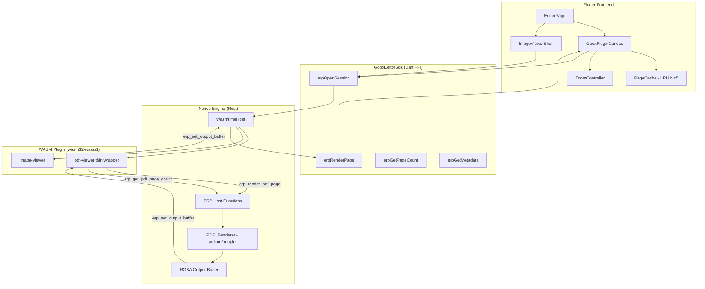
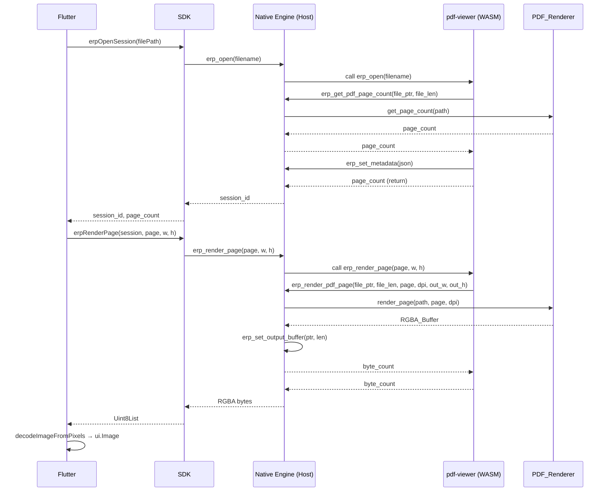

# Design Document: PDF & Image Viewer Upgrade

## Overview

Nâng cấp extension pdf-viewer trong Goox Desktop (Flutter + Rust/WASM) theo kiến trúc hybrid **Hướng A**:

- **WASM plugin** (`pdf-viewer`) là thin wrapper — không tự render PDF mà ủy quyền cho Native_Engine qua host functions mới trong ERP protocol.
- **Native_Engine** (wasmtime host) thực hiện PDF rendering thực sự bằng `pdfium-render` hoặc `poppler-rs`, vì các thư viện này là C++ và không thể compile sang `wasm32-wasip1`.
- **Image viewer** giữ nguyên plugin `image-viewer` hiện có (dùng `image` crate), chỉ nâng cấp Flutter frontend.
- **Flutter GooxPluginCanvas** được nâng cấp với zoom mượt mà, lazy loading, và LRU page cache.

Quyết định kiến trúc cốt lõi: PDF rendering xảy ra ở **native side** (wasmtime host), không phải trong WASM sandbox. WASM plugin chỉ là thin wrapper để duy trì tính nhất quán của extension system.

---

## Architecture



### Luồng render PDF (Hướng A)



---

## Components and Interfaces

### 1. ERP Protocol Extensions (Native Engine — Rust)

Hai host functions mới được thêm vào module `"env"` mà WASM plugin import:

```rust
// Host function 1: Render một PDF page thành RGBA buffer
// Trả về số bytes của RGBA buffer nếu thành công, -1 nếu thất bại
fn erp_render_pdf_page(
    file_ptr: i32,   // pointer đến UTF-8 filename trong WASM memory
    file_len: i32,   // độ dài filename
    page_index: i32, // 0-based page index
    dpi: i32,        // render DPI, clamp về [72, 600]
    out_width_ptr: i32,  // pointer để ghi output width (i32) vào WASM memory
    out_height_ptr: i32, // pointer để ghi output height (i32) vào WASM memory
) -> i32;

// Host function 2: Lấy số trang của PDF
// Trả về page count nếu thành công, -1 nếu thất bại
fn erp_get_pdf_page_count(
    file_ptr: i32,
    file_len: i32,
) -> i32;
```

Các host functions hiện có (`erp_set_output_buffer`, `erp_set_metadata`, `erp_report_error`) **không thay đổi** — backward compatibility được đảm bảo.

### 2. PDF_Renderer (Native Engine — Rust)

Component mới trong Native Engine, sử dụng `pdfium-render` (preferred) hoặc `poppler-rs` làm backend:

```rust
pub struct PdfRenderer {
    // Backend-specific state (pdfium document cache, etc.)
}

impl PdfRenderer {
    pub fn get_page_count(&self, file_path: &str) -> Result<u32, PdfError>;
    
    pub fn render_page(
        &self,
        file_path: &str,
        page_index: u32,
        dpi: u32,           // clamped to [72, 600]
    ) -> Result<RgbaPage, PdfError>;
}

pub struct RgbaPage {
    pub data: Vec<u8>,  // RGBA bytes, len == width * height * 4
    pub width: u32,
    pub height: u32,
}

pub enum PdfError {
    FileNotFound(String),
    PageOutOfRange { page: u32, total: u32 },
    PasswordProtected,
    Corrupt(String),
    RenderFailed(String),
}
```

**Backend selection**: `pdfium-render` được ưu tiên vì chất lượng rendering cao hơn và hỗ trợ embedded fonts tốt hơn. `poppler-rs` là fallback nếu pdfium không khả dụng trên platform.

### 3. WASM Plugin pdf-viewer (Thin Wrapper)

Plugin mới thay thế implementation hiện tại (dùng `lopdf`). Không còn tự render — chỉ delegate sang host:

```rust
// State lưu trong WASM
struct PdfState {
    filename: String,
    page_count: i32,
}

// Host imports (từ module "env")
extern "C" {
    fn erp_render_pdf_page(file_ptr: i32, file_len: i32, page_index: i32, dpi: i32,
                           out_width_ptr: i32, out_height_ptr: i32) -> i32;
    fn erp_get_pdf_page_count(file_ptr: i32, file_len: i32) -> i32;
    fn erp_set_output_buffer(ptr: *const u8, len: usize);
    fn erp_set_metadata(ptr: *const u8, len: usize);
    fn erp_report_error(ptr: *const u8, len: usize);
}

// ERP exports
pub extern "C" fn erp_open(file_ptr: *const u8, file_len: usize) -> i32;
pub extern "C" fn erp_page_count() -> i32;
pub extern "C" fn erp_render_page(page_index: i32, width: i32, height: i32) -> i32;
pub extern "C" fn erp_close();
```

Logic trong `erp_render_page`: tính DPI từ `width` và kích thước page gốc (points), sau đó gọi `erp_render_pdf_page`. DPI = `(width / page_width_in_points) * 72`.

### 4. Flutter GooxPluginCanvas (Nâng cấp)

Widget hiện tại được nâng cấp để hỗ trợ multi-page PDF với lazy loading và zoom:

```dart
class GooxPluginCanvas extends StatefulWidget {
  const GooxPluginCanvas({
    super.key,
    required this.sessionId,
    required this.pageCount,
    required this.onRenderPage,
  });

  final int sessionId;
  final int pageCount;
  final Future<Uint8List> Function(int pageIndex, int width, int height) onRenderPage;
}
```

**Zoom handling**: `InteractiveViewer` với `minScale: 0.25`, `maxScale: 8.0`. Scroll wheel + Ctrl/Cmd zoom 10% mỗi tick. Double-tap toggle fit-to-viewport / 100%.

**Re-render threshold**: Khi scale thay đổi > 20% so với lần render cuối, trigger re-render ở DPI tương ứng. Trong khi chờ, hiển thị scaled version của buffer cũ.

**Lazy loading**: Chỉ render pages trong viewport ± 1 page (pre-fetch). Dùng `ScrollController` để track viewport position.

### 5. Page Cache (LRU)

```dart
class PageCache {
  final int maxSize;  // default: 5
  final _cache = LinkedHashMap<int, ui.Image>();

  ui.Image? get(int pageIndex);
  void put(int pageIndex, ui.Image image);
  void evictFarthestFrom(int currentPage);
  void clear();  // gọi khi session đóng
}
```

Eviction policy: khi cache đầy, dispose `ui.Image` của page có index xa nhất so với current viewport page.

---

## Data Models

### RGBA Buffer Contract

```
Buffer layout: [R0, G0, B0, A0, R1, G1, B1, A1, ...]
Size: width * height * 4 bytes
Byte order: RGBA (Red first, Alpha last)
Compatible with: Flutter's ui.decodeImageFromPixels(PixelFormat.rgba8888)
```

### ERP Metadata JSON

PDF:
```json
{
  "name": "document.pdf",
  "extension": "pdf",
  "page_count": 42,
  "size_bytes": 1048576
}
```

Image:
```json
{
  "name": "photo.png",
  "format": "png",
  "width": 1920,
  "height": 1080,
  "size_bytes": 524288
}
```

### DPI Calculation

```
page_width_pts: float  // PDF page width in points (1 point = 1/72 inch)
render_width_px: int   // desired pixel width

dpi = (render_width_px / page_width_pts) * 72
dpi = clamp(dpi, 72, 600)
```

### Plugin Config

`dummy_extensions/pdf-viewer/config.json` (không thay đổi):
```json
{
  "name": "pdf-viewer",
  "entry": "plugin.wasm",
  "filetypes": ["pdf"],
  "rendering": true,
  "logo": "logo.svg"
}
```

---

## Correctness Properties

*A property is a characteristic or behavior that should hold true across all valid executions of a system — essentially, a formal statement about what the system should do. Properties serve as the bridge between human-readable specifications and machine-verifiable correctness guarantees.*

### Property 1: erp_render_pdf_page success invariant

*For any* valid PDF file and valid page index, calling `erp_render_pdf_page` must write a non-empty RGBA buffer via `erp_set_output_buffer` and return a value >= 0 equal to the buffer's byte count.

**Validates: Requirements 1.2, 1.3**

---

### Property 2: erp_render_pdf_page and erp_get_pdf_page_count error handling

*For any* invalid input (non-existent file path, page index out of range, or malformed filename), both `erp_render_pdf_page` and `erp_get_pdf_page_count` must return -1 and must have called `erp_report_error` with a non-empty message.

**Validates: Requirements 1.4, 1.6**

---

### Property 3: RGBA buffer size invariant

*For any* PDF page rendered at any valid DPI, the length of the returned RGBA buffer must equal exactly `width * height * 4` bytes, where `width` and `height` are the values written to the output pointers.

**Validates: Requirements 2.6, 8.1**

---

### Property 4: DPI clamping

*For any* DPI value outside the range [72, 600], the render result must be identical to rendering at the nearest boundary value (72 or 600). The system must not return an error for out-of-range DPI.

**Validates: Requirements 2.3**

---

### Property 5: PDF error handling — no crash

*For any* corrupt, truncated, or password-protected PDF file, `PDF_Renderer` must return a `PdfError` variant and must not panic or produce undefined behavior.

**Validates: Requirements 2.8**

---

### Property 6: Plugin lifecycle round-trip

*For any* valid PDF file, after `erp_open` returns 0, `erp_page_count()` must return the correct page count (> 0). After `erp_close()` is called, `erp_page_count()` must return -1, indicating state has been cleared.

**Validates: Requirements 3.2, 3.4**

---

### Property 7: Image error handling

*For any* corrupt or unsupported image file, `erp_open` in the image-viewer plugin must return -1 and must have called `erp_report_error` with a descriptive message.

**Validates: Requirements 4.5**

---

### Property 8: Scale factor clamping

*For any* sequence of zoom operations that would result in a scale factor outside [0.25, 8.0], the actual scale factor stored in `GooxPluginCanvas` state must always be clamped to the nearest boundary value.

**Validates: Requirements 5.7**

---

### Property 9: Re-render threshold

*For any* scale change where `|new_scale - last_render_scale| / last_render_scale > 0.20`, a new render request must be triggered. For scale changes below this threshold, no new render request should be issued.

**Validates: Requirements 5.3**

---

### Property 10: Page cache size invariant with LRU eviction

*For any* sequence of page renders with cache max size N, the number of entries in `PageCache` must never exceed N. When the N+1-th unique page is added, the page with the greatest distance from the current viewport page must be evicted.

**Validates: Requirements 6.2, 6.3**

---

### Property 11: Session close clears cache

*For any* active ERP session with pages in the cache, after `erp_close` is called and the session is disposed, the `PageCache` for that session must be empty (all `ui.Image` objects disposed).

**Validates: Requirements 6.4**

---

### Property 12: Metadata completeness

*For any* successfully opened PDF file, the metadata JSON passed to `erp_set_metadata` must contain all four required fields: `name`, `extension`, `page_count`, and `size_bytes`. For any successfully opened image file, the metadata JSON must contain: `name`, `format`, `width`, `height`, and `size_bytes`.

**Validates: Requirements 7.1, 7.2**

---

### Property 13: RGBA byte order

*For any* rendered page, the first byte of each pixel in the RGBA buffer must be the Red channel and the fourth byte must be the Alpha channel, consistent with `ui.PixelFormat.rgba8888`.

**Validates: Requirements 8.4**

---

### Property 14: Buffer size validation — no crash

*For any* RGBA buffer whose length does not equal `width * height * 4`, `GooxPluginCanvas` must not throw an unhandled exception or crash. It must log the error and display an error placeholder widget instead.

**Validates: Requirements 8.2, 8.3**

---

### Property 15: Metamorphic DPI scaling

*For any* valid PDF page and DPI value D in [144, 600], rendering at DPI D and then downscaling the result by 50% must produce a pixel buffer that differs from rendering at DPI D/2 by no more than 5% average pixel difference (allowing for anti-aliasing variation).

**Validates: Requirements 8.5**

---

## Error Handling

### Native Engine (Rust)

| Lỗi | Hành động |
|-----|-----------|
| File không tồn tại | Gọi `erp_report_error`, trả về -1 |
| Page index ngoài range | Gọi `erp_report_error` với `"page N out of range (total: M)"`, trả về -1 |
| PDF corrupt | Gọi `erp_report_error` với mô tả lỗi từ backend, trả về -1 |
| PDF password-protected | Gọi `erp_report_error` với `"password-protected PDF"`, trả về -1 |
| DPI ngoài [72, 600] | Clamp về boundary, tiếp tục render (không báo lỗi) |
| WASM memory access lỗi | Gọi `erp_report_error`, trả về -1 |

### WASM Plugin (Rust)

| Lỗi | Hành động |
|-----|-----------|
| Filename rỗng/null | Gọi `erp_report_error("pdf-viewer: empty filename")`, trả về -1 |
| UTF-8 invalid | Gọi `erp_report_error("pdf-viewer: invalid filename utf8")`, trả về -1 |
| Host function trả về -1 | Propagate lỗi, trả về -1 từ ERP export |
| State chưa được init | Gọi `erp_report_error`, trả về -1 |

### Flutter (Dart)

| Lỗi | Hành động |
|-----|-----------|
| Buffer size mismatch | Log error, hiển thị error placeholder widget |
| Render future throws | Hiển thị error message trong page slot |
| Session ID invalid | Hiển thị `_UnsupportedFileView` với message |
| Cache dispose lỗi | Log và continue (không crash) |

---

## Testing Strategy

### Dual Testing Approach

Cả unit tests và property-based tests đều cần thiết và bổ sung cho nhau:
- **Unit tests**: Kiểm tra các ví dụ cụ thể, edge cases, và integration points
- **Property tests**: Kiểm tra các invariants phổ quát trên nhiều inputs ngẫu nhiên

### Property-Based Testing

**Library**: `proptest` (Rust) cho Native Engine và WASM plugin; `fast_check` hoặc `dart_test` với custom generators cho Flutter.

**Cấu hình**: Mỗi property test chạy tối thiểu **100 iterations**.

**Tag format**: `// Feature: pdf-image-viewer-upgrade, Property {N}: {property_text}`

Mapping từ Correctness Properties sang tests:

| Property | Test | Library |
|----------|------|---------|
| P1: erp_render_pdf_page success | `proptest` với random valid PDF pages | proptest (Rust) |
| P2: Error handling returns -1 | `proptest` với invalid inputs | proptest (Rust) |
| P3: Buffer size == w*h*4 | `proptest` với random DPI và pages | proptest (Rust) |
| P4: DPI clamping | `proptest` với DPI outside [72,600] | proptest (Rust) |
| P5: No crash on corrupt PDF | `proptest` với random corrupt bytes | proptest (Rust) |
| P6: Plugin lifecycle round-trip | `proptest` với random PDF files | proptest (Rust) |
| P7: Image error handling | `proptest` với corrupt image bytes | proptest (Rust) |
| P8: Scale clamping | `proptest` với random zoom deltas | dart test |
| P9: Re-render threshold | `proptest` với random scale sequences | dart test |
| P10: Cache LRU invariant | `proptest` với random page access sequences | dart test |
| P11: Session close clears cache | `proptest` với random sessions | dart test |
| P12: Metadata completeness | `proptest` với random valid files | proptest (Rust) |
| P13: RGBA byte order | `proptest` với known-color pages | proptest (Rust) |
| P14: Buffer validation no crash | `proptest` với random malformed buffers | dart test |
| P15: Metamorphic DPI scaling | `proptest` với random pages và DPI | proptest (Rust) |

### Unit Tests

**Native Engine (Rust)**:
- `test_render_page_returns_correct_size()` — render một page cụ thể, kiểm tra buffer size
- `test_get_page_count_known_pdf()` — PDF có 5 trang, kiểm tra trả về 5
- `test_corrupt_pdf_returns_error()` — file bytes ngẫu nhiên, kiểm tra PdfError
- `test_dpi_clamp_72()` và `test_dpi_clamp_600()` — DPI boundary values

**WASM Plugin (Rust)**:
- `test_erp_open_empty_filename()` — kiểm tra trả về -1
- `test_erp_close_clears_state()` — open rồi close, kiểm tra page_count = -1
- `test_compile_target_wasm32()` — build check (CI)

**Flutter (Dart)**:
- `test_page_cache_eviction()` — thêm N+1 pages, kiểm tra LRU eviction
- `test_scale_clamp_lower_bound()` và `test_scale_clamp_upper_bound()`
- `test_buffer_size_mismatch_shows_placeholder()` — truyền buffer sai size
- `test_metadata_parsing_pdf()` và `test_metadata_parsing_image()`
- `test_image_viewer_shell_renders_rgba()` — integration test với mock onRenderPage

### Integration Tests

- End-to-end: mở PDF thật → render page 0 → kiểm tra buffer size và byte order
- End-to-end: mở PNG thật → render → kiểm tra metadata fields
- Session lifecycle: open → render multiple pages → close → kiểm tra cache cleared
