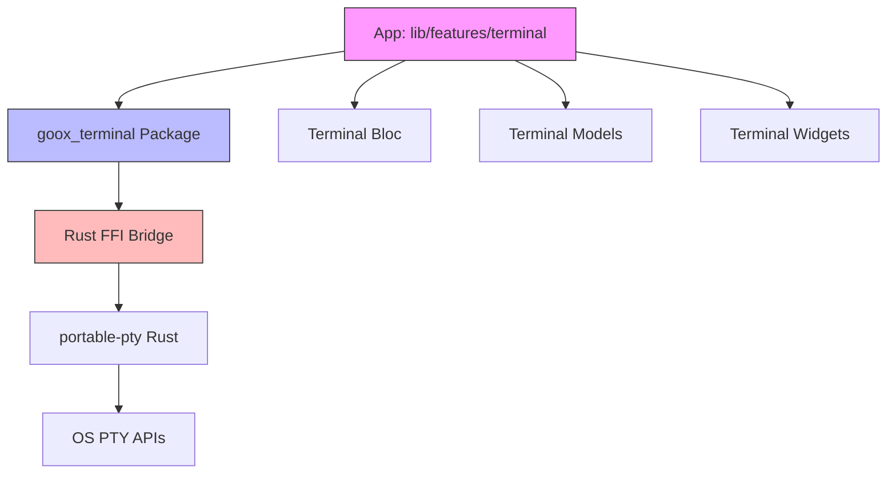
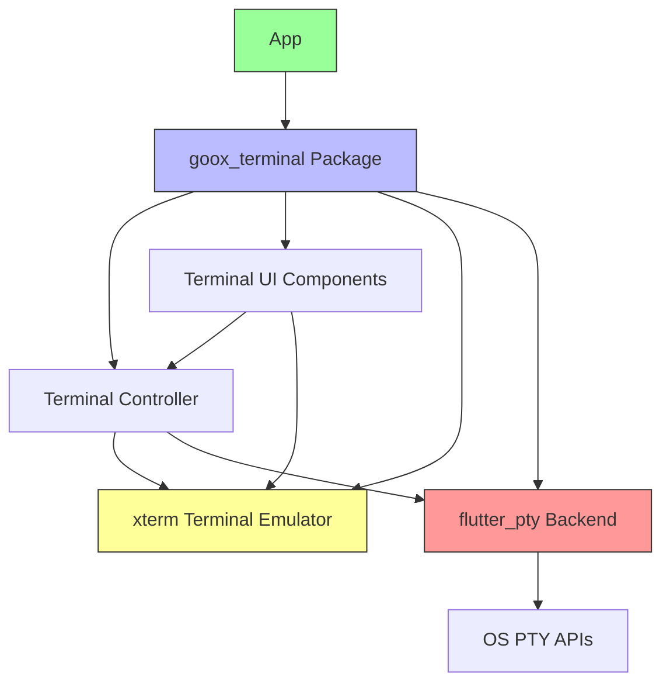
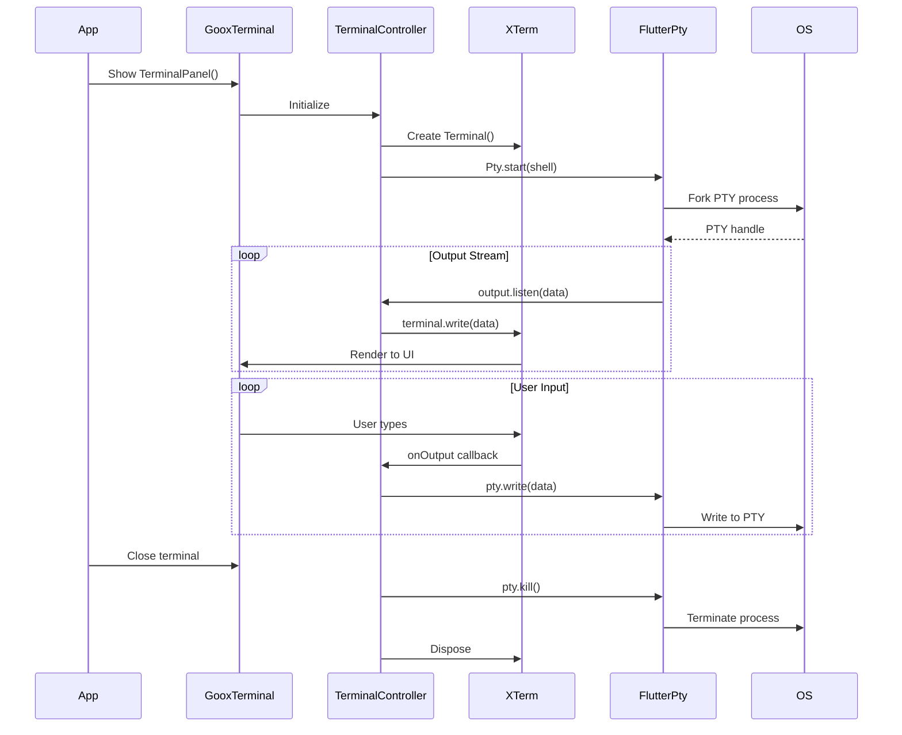

# Design Document: Terminal XTerm Refactor

## Overview

This design outlines the refactoring of the terminal module from a Rust FFI-based architecture to a pure Dart implementation using `xterm` (terminal emulator) and `flutter_pty` (PTY backend). The refactor consolidates all terminal functionality into the `goox_terminal` package, making it a self-contained, reusable component with its own UI, state management, and PTY lifecycle handling. The main application's `lib/features/terminal` directory will be completely removed, and the app will simply import and use widgets from `goox_terminal`.

**Key Goals:**
- Replace Rust FFI backend with `flutter_pty ^0.4.2`
- Replace custom terminal emulator with `xterm ^4.0.0`
- Consolidate all terminal logic into `goox_terminal` package
- Remove `lib/features/terminal` from main app
- Maintain or improve current functionality and performance
- Provide clean migration path

## Architecture

### Current Architecture (Before Refactor)



### New Architecture (After Refactor)



## Main Algorithm/Workflow

### Terminal Session Lifecycle



## Components and Interfaces

### Component 1: TerminalController

**Purpose**: Manages the lifecycle of a single terminal session, connecting xterm with flutter_pty

**Interface**:
```dart
class TerminalController {
  TerminalController({
    required String id,
    required ShellConfig shellConfig,
    required PtySize initialSize,
  });
  
  // Core properties
  String get id;
  Terminal get terminal;
  TerminalStatus get status;
  String get title;
  int? get pid;
  int? get exitCode;
  
  // Lifecycle
  Future<void> initialize();
  Future<void> dispose();
  Future<void> restart();
  
  // PTY operations
  Future<void> resize(int rows, int cols);
  Future<void> kill([PtySignal signal = PtySignal.sigterm]);
  
  // State notifications
  Stream<TerminalStatus> get statusStream;
  ValueListenable<String> get titleNotifier;
}
```

**Responsibilities**:
- Create and manage xterm Terminal instance
- Create and manage flutter_pty Pty instance
- Connect PTY output to xterm input
- Connect xterm output to PTY input
- Handle terminal resize events
- Track terminal status (running, exited, error)
- Manage terminal title updates
- Clean up resources on disposal

### Component 2: TerminalSessionManager

**Purpose**: Manages multiple terminal sessions and provides session registry

**Interface**:
```dart
class TerminalSessionManager extends ChangeNotifier {
  static TerminalSessionManager get instance;
  
  // Session management
  Future<TerminalController> createSession({
    ShellConfig? shellConfig,
    PtySize? initialSize,
  });
  
  TerminalController? getSession(String id);
  List<TerminalController> get allSessions;
  int get sessionCount;
  
  Future<void> closeSession(String id);
  Future<void> closeAllSessions();
  
  // Active session tracking
  String? get activeSessionId;
  set activeSessionId(String? id);
  TerminalController? get activeSession;
  
  // Configuration
  int get maxSessions;
  bool get canCreateSession;
}
```

**Responsibilities**:
- Create new terminal sessions
- Track all active sessions
- Manage active session selection
- Enforce session limits (max 10)
- Provide session lookup
- Clean up closed sessions
- Notify listeners of session changes

### Component 3: TerminalPanel

**Purpose**: Main UI widget that displays terminal tabs and active terminal

**Interface**:
```dart
class TerminalPanel extends StatefulWidget {
  const TerminalPanel({
    TerminalSessionManager? sessionManager,
    TerminalTheme? theme,
    double? initialHeight,
    bool? visible,
    Key? key,
  });
  
  @override
  State<TerminalPanel> createState() => _TerminalPanelState;
}
```

**Responsibilities**:
- Display terminal tab bar
- Display active terminal emulator
- Handle panel resize
- Handle panel visibility
- Provide keyboard shortcuts
- Apply terminal theme

### Component 4: TerminalTabBar

**Purpose**: Displays tabs for all terminal sessions with create/close actions

**Interface**:
```dart
class TerminalTabBar extends StatelessWidget {
  const TerminalTabBar({
    required TerminalSessionManager sessionManager,
    TerminalTheme? theme,
    Key? key,
  });
}
```

**Responsibilities**:
- Display tab for each session
- Show active tab indicator
- Handle tab selection
- Handle tab close button
- Handle create new terminal button
- Show terminal status indicators

### Component 5: TerminalView

**Purpose**: Renders xterm terminal with keyboard/mouse input handling

**Interface**:
```dart
class TerminalView extends StatefulWidget {
  const TerminalView({
    required TerminalController controller,
    TerminalTheme? theme,
    Key? key,
  });
  
  @override
  State<TerminalView> createState() => _TerminalViewState;
}
```

**Responsibilities**:
- Render xterm TerminalView widget
- Handle keyboard input
- Handle mouse input
- Apply terminal theme
- Auto-scroll on output
- Handle focus management

### Component 6: ShellDetector

**Purpose**: Detects available shells on the system

**Interface**:
```dart
class ShellDetector {
  static Future<ShellConfig> detectDefaultShell();
  static Future<List<ShellConfig>> detectAvailableShells();
  static bool isShellAvailable(String shellPath);
}
```

**Responsibilities**:
- Detect default shell from environment
- Find available shells on system
- Validate shell paths
- Provide platform-specific defaults

## Data Models

### Model 1: TerminalStatus

```dart
enum TerminalStatus {
  initializing,
  running,
  exited,
  error;
  
  bool get isActive => this == running;
  bool get canSendInput => this == running;
}
```

**Validation Rules**:
- Status transitions must be valid (initializing → running → exited/error)
- Cannot transition from exited/error back to running (must restart)

### Model 2: ShellConfig

```dart
class ShellConfig {
  const ShellConfig({
    required this.shellPath,
    this.arguments = const [],
    this.environment = const {},
    this.workingDirectory,
  });
  
  final String shellPath;
  final List<String> arguments;
  final Map<String, String> environment;
  final String? workingDirectory;
  
  factory ShellConfig.bash();
  factory ShellConfig.zsh();
  factory ShellConfig.fish();
  factory ShellConfig.powershell();
  factory ShellConfig.cmd();
}
```

**Validation Rules**:
- shellPath must not be empty
- shellPath must be absolute path
- workingDirectory must exist if provided
- environment keys/values must not be empty

### Model 3: PtySize

```dart
class PtySize {
  const PtySize({
    required this.rows,
    required this.cols,
  });
  
  final int rows;
  final int cols;
  
  static const PtySize defaultSize = PtySize(rows: 24, cols: 80);
}
```

**Validation Rules**:
- rows must be >= 1 and <= 1000
- cols must be >= 1 and <= 1000

### Model 4: TerminalTheme

```dart
class TerminalTheme {
  const TerminalTheme({
    required this.background,
    required this.foreground,
    required this.cursor,
    required this.selection,
    required this.black,
    required this.red,
    required this.green,
    required this.yellow,
    required this.blue,
    required this.magenta,
    required this.cyan,
    required this.white,
    required this.brightBlack,
    required this.brightRed,
    required this.brightGreen,
    required this.brightYellow,
    required this.brightBlue,
    required this.brightMagenta,
    required this.brightCyan,
    required this.brightWhite,
  });
  
  final Color background;
  final Color foreground;
  final Color cursor;
  final Color selection;
  // ANSI colors
  final Color black;
  final Color red;
  final Color green;
  final Color yellow;
  final Color blue;
  final Color magenta;
  final Color cyan;
  final Color white;
  // Bright ANSI colors
  final Color brightBlack;
  final Color brightRed;
  final Color brightGreen;
  final Color brightYellow;
  final Color brightBlue;
  final Color brightMagenta;
  final Color brightCyan;
  final Color brightWhite;
  
  factory TerminalTheme.dark();
  factory TerminalTheme.light();
  
  TerminalThemeData toXTermTheme();
}
```

**Validation Rules**:
- All colors must be non-null
- Colors should have sufficient contrast for readability

## Algorithmic Pseudocode

### Main Processing Algorithm: Terminal Session Initialization

```pascal
ALGORITHM initializeTerminalSession(shellConfig, initialSize)
INPUT: shellConfig of type ShellConfig, initialSize of type PtySize
OUTPUT: controller of type TerminalController

BEGIN
  ASSERT shellConfig.isValid() = true
  ASSERT initialSize.isValid() = true
  
  // Step 1: Create xterm terminal instance
  terminal ← Terminal(maxLines: 1000)
  
  // Step 2: Start PTY process
  pty ← Pty.start(
    shellConfig.shellPath,
    arguments: shellConfig.arguments,
    environment: shellConfig.environment,
    workingDirectory: shellConfig.workingDirectory,
    columns: initialSize.cols,
    rows: initialSize.rows
  )
  
  ASSERT pty ≠ null
  
  // Step 3: Connect PTY output to terminal input
  outputSubscription ← pty.output.listen((data) => BEGIN
    terminal.write(utf8.decode(data, allowMalformed: true))
  END)
  
  // Step 4: Connect terminal output to PTY input
  terminal.onOutput ← (output) => BEGIN
    pty.write(utf8.encode(output))
  END
  
  // Step 5: Create controller
  controller ← TerminalController(
    id: generateUuid(),
    terminal: terminal,
    pty: pty,
    status: TerminalStatus.running
  )
  
  ASSERT controller.status = TerminalStatus.running
  
  RETURN controller
END
```

**Preconditions:**
- shellConfig is validated and shell exists
- initialSize has valid dimensions
- System has available PTY resources

**Postconditions:**
- controller.status is TerminalStatus.running
- PTY process is started
- Output stream is connected
- Input handler is registered

**Loop Invariants:**
- Output subscription remains active while status is running
- Terminal and PTY remain synchronized

### Validation Algorithm: Shell Configuration

```pascal
ALGORITHM validateShellConfig(config)
INPUT: config of type ShellConfig
OUTPUT: isValid of type boolean

BEGIN
  // Check shell path
  IF config.shellPath = empty OR config.shellPath = null THEN
    RETURN false
  END IF
  
  IF NOT isAbsolutePath(config.shellPath) THEN
    RETURN false
  END IF
  
  IF NOT fileExists(config.shellPath) THEN
    RETURN false
  END IF
  
  // Check working directory if provided
  IF config.workingDirectory ≠ null THEN
    IF NOT directoryExists(config.workingDirectory) THEN
      RETURN false
    END IF
  END IF
  
  // Check environment variables
  FOR each (key, value) IN config.environment DO
    IF key = empty OR value = empty THEN
      RETURN false
    END IF
  END FOR
  
  // All validations passed
  RETURN true
END
```

**Preconditions:**
- config parameter is provided (may be invalid)

**Postconditions:**
- Returns true if and only if config is valid
- No side effects on config parameter

**Loop Invariants:**
- All previously checked environment variables were valid

### Resize Algorithm

```pascal
ALGORITHM resizeTerminal(controller, rows, cols)
INPUT: controller of type TerminalController, rows of type int, cols of type int
OUTPUT: success of type boolean

BEGIN
  ASSERT controller.status = TerminalStatus.running
  ASSERT rows >= 1 AND rows <= 1000
  ASSERT cols >= 1 AND cols <= 1000
  
  // Step 1: Resize PTY
  TRY
    controller.pty.resize(rows, cols)
  CATCH error
    RETURN false
  END TRY
  
  // Step 2: Update terminal size
  controller.terminal.viewWidth ← cols
  controller.terminal.viewHeight ← rows
  
  // Step 3: Update stored size
  controller.size ← PtySize(rows: rows, cols: cols)
  
  ASSERT controller.size.rows = rows
  ASSERT controller.size.cols = cols
  
  RETURN true
END
```

**Preconditions:**
- controller is in running status
- rows and cols are within valid range
- PTY is responsive

**Postconditions:**
- PTY is resized to new dimensions
- Terminal view is updated
- controller.size reflects new dimensions

**Loop Invariants:** N/A (no loops)

### Session Cleanup Algorithm

```pascal
ALGORITHM cleanupTerminalSession(controller)
INPUT: controller of type TerminalController
OUTPUT: void

BEGIN
  // Step 1: Cancel output subscription
  IF controller.outputSubscription ≠ null THEN
    controller.outputSubscription.cancel()
    controller.outputSubscription ← null
  END IF
  
  // Step 2: Kill PTY process
  IF controller.pty ≠ null THEN
    TRY
      controller.pty.kill()
    CATCH error
      // Log error but continue cleanup
    END TRY
  END IF
  
  // Step 3: Dispose terminal
  IF controller.terminal ≠ null THEN
    controller.terminal.dispose()
  END IF
  
  // Step 4: Update status
  controller.status ← TerminalStatus.exited
  
  ASSERT controller.outputSubscription = null
  ASSERT controller.status = TerminalStatus.exited
END
```

**Preconditions:**
- controller exists (may be in any status)

**Postconditions:**
- All resources are released
- Status is set to exited
- No memory leaks

**Loop Invariants:** N/A (no loops)

## Key Functions with Formal Specifications

### Function 1: createSession()

```dart
Future<TerminalController> createSession({
  ShellConfig? shellConfig,
  PtySize? initialSize,
})
```

**Preconditions:**
- sessionCount < maxSessions
- shellConfig is valid if provided
- initialSize is valid if provided

**Postconditions:**
- Returns valid TerminalController
- controller.status == TerminalStatus.running
- Session is added to session registry
- sessionCount is incremented by 1

**Loop Invariants:** N/A

### Function 2: closeSession()

```dart
Future<void> closeSession(String id)
```

**Preconditions:**
- Session with id exists in registry
- id is non-empty string

**Postconditions:**
- Session is removed from registry
- Session resources are cleaned up
- sessionCount is decremented by 1
- If closed session was active, activeSessionId is updated

**Loop Invariants:** N/A

### Function 3: resize()

```dart
Future<void> resize(int rows, int cols)
```

**Preconditions:**
- controller.status == TerminalStatus.running
- rows >= 1 && rows <= 1000
- cols >= 1 && cols <= 1000

**Postconditions:**
- PTY is resized to (rows, cols)
- Terminal view is updated
- controller.size == PtySize(rows: rows, cols: cols)

**Loop Invariants:** N/A

### Function 4: write()

```dart
Future<void> write(String data)
```

**Preconditions:**
- controller.status == TerminalStatus.running
- data is non-null (may be empty)

**Postconditions:**
- data is written to PTY input
- No exceptions thrown if successful
- PTY receives encoded UTF-8 bytes

**Loop Invariants:** N/A

## Example Usage

```dart
// Example 1: Basic terminal panel usage in app
import 'package:goox_terminal/goox_terminal.dart';

class MyApp extends StatelessWidget {
  @override
  Widget build(BuildContext context) {
    return MaterialApp(
      home: Scaffold(
        body: Column(
          children: [
            Expanded(child: EditorArea()),
            TerminalPanel(
              initialHeight: 300,
              visible: true,
            ),
          ],
        ),
      ),
    );
  }
}

// Example 2: Manual session management
final sessionManager = TerminalSessionManager.instance;

// Create a new terminal session
final controller = await sessionManager.createSession(
  shellConfig: ShellConfig.bash(),
  initialSize: PtySize(rows: 24, cols: 80),
);

// Write to terminal
await controller.terminal.write('echo "Hello World"\n');

// Listen to status changes
controller.statusStream.listen((status) {
  print('Terminal status: $status');
});

// Resize terminal
await controller.resize(30, 100);

// Close session
await sessionManager.closeSession(controller.id);

// Example 3: Custom terminal view
class CustomTerminalView extends StatelessWidget {
  @override
  Widget build(BuildContext context) {
    final controller = TerminalSessionManager.instance.activeSession;
    
    if (controller == null) {
      return Center(child: Text('No active terminal'));
    }
    
    return TerminalView(
      controller: controller,
      theme: TerminalTheme.dark(),
    );
  }
}

// Example 4: Detecting shells
final defaultShell = await ShellDetector.detectDefaultShell();
print('Default shell: ${defaultShell.shellPath}');

final availableShells = await ShellDetector.detectAvailableShells();
for (final shell in availableShells) {
  print('Available: ${shell.shellPath}');
}
```

## Correctness Properties

*A property is a characteristic or behavior that should hold true across all valid executions of a system—essentially, a formal statement about what the system should do. Properties serve as the bridge between human-readable specifications and machine-verifiable correctness guarantees.*

### Property 1: Session Initialization

*For any* valid shell configuration, creating a terminal session SHALL result in a Terminal_Controller with initialized xterm terminal instance, started PTY process, and running status.

**Validates: Requirements 1.1**

### Property 2: PTY Output to Terminal

*For any* data output by the PTY process, the Terminal_Controller SHALL write that data to the xterm terminal for rendering.

**Validates: Requirements 1.2**

### Property 3: Terminal Input to PTY

*For any* user input in the terminal, the Terminal_Controller SHALL encode it as UTF-8 and write it to the PTY process.

**Validates: Requirements 1.3, 7.4**

### Property 4: Session Cleanup

*For any* terminal session, when closed, the Terminal_Controller SHALL cancel output subscription, kill PTY process, and dispose xterm terminal instance.

**Validates: Requirements 1.4, 8.1, 8.2, 8.3**

### Property 5: Exit Status Capture

*For any* PTY process exit, the Terminal_Controller SHALL update status to exited and capture the exit code.

**Validates: Requirements 1.5, 17.3**

### Property 6: Session Registry Addition

*For any* new session creation request, the Session_Manager SHALL create a Terminal_Controller, add it to the session registry, and increment session count.

**Validates: Requirements 2.1**

### Property 7: Session Registry Removal

*For any* session in the registry, when closed, the Session_Manager SHALL remove it from registry, clean up resources, and decrement session count.

**Validates: Requirements 2.3, 8.5**

### Property 8: Active Session Switching

*For any* valid session ID, when set as active, the Session_Manager SHALL update activeSessionId and notify listeners.

**Validates: Requirements 2.4**

### Property 9: Session Limit Enforcement

*For any* sequence of create and close operations, the Session_Manager SHALL maintain sessionCount ≤ 10.

**Validates: Requirements 2.5, 20.4**

### Property 10: Terminal Resize

*For any* valid dimensions (rows and cols between 1 and 1000), resizing SHALL update both PTY size and xterm view dimensions to match.

**Validates: Requirements 3.1**

### Property 11: Invalid Resize Rejection

*For any* dimensions outside valid range (rows or cols < 1 or > 1000), resize SHALL throw ArgumentError.

**Validates: Requirements 3.2, 9.4**

### Property 12: Dimension Validation

*For any* PtySize, rows and columns SHALL be validated to be between 1 and 1000 inclusive.

**Validates: Requirements 3.4, 3.5**

### Property 13: Shell Path Validation

*For any* ShellConfig, validation SHALL verify that shell path exists and is an absolute path.

**Validates: Requirements 4.3**

### Property 14: Working Directory Validation

*For any* ShellConfig with specified working directory, validation SHALL verify the directory exists.

**Validates: Requirements 4.4**

### Property 15: Environment Variable Validation

*For any* ShellConfig with environment variables, validation SHALL verify all keys and values are non-empty.

**Validates: Requirements 4.5, 20.2**

### Property 16: New Terminal Creation

*For any* Terminal_Panel with session count below limit, clicking new terminal button SHALL create a new session.

**Validates: Requirements 5.2**

### Property 17: Tab Close Action

*For any* terminal tab, clicking the close button SHALL close the corresponding session.

**Validates: Requirements 5.3**

### Property 18: Tab Selection

*For any* terminal tab, clicking on it SHALL switch that session to active.

**Validates: Requirements 5.4**

### Property 19: Status Visual Updates

*For any* terminal status change, the Terminal_Panel SHALL update visual indicators in the corresponding tab.

**Validates: Requirements 5.5**

### Property 20: Theme Color Application

*For any* TerminalTheme, applying it SHALL update background, foreground, cursor, and all 16 ANSI colors in the Terminal_View.

**Validates: Requirements 6.1, 6.2**

### Property 21: Theme Conversion

*For any* TerminalTheme, converting to xterm format SHALL produce valid TerminalThemeData.

**Validates: Requirements 6.5**

### Property 22: Input Acceptance When Running

*For any* user input when terminal status is running, the Terminal_Controller SHALL accept and process the input.

**Validates: Requirements 7.1**

### Property 23: Input Rejection When Not Running

*For any* user input when terminal status is not running, the Terminal_Controller SHALL reject the input with StateError.

**Validates: Requirements 7.2, 9.5**

### Property 24: UTF-8 Decoding

*For any* byte sequence output by PTY (including malformed UTF-8), the Terminal_Controller SHALL decode it without crashing, using malformed character handling.

**Validates: Requirements 7.3**

### Property 25: Stream Error Handling

*For any* error emitted by PTY output stream, the Terminal_Controller SHALL update status to error and notify listeners.

**Validates: Requirements 7.5, 9.2**

### Property 26: Complete Session Cleanup

*For any* set of sessions, when all are closed, the Session_Manager SHALL have zero sessions in registry and session count of 0.

**Validates: Requirements 8.4**

### Property 27: Running Status Invariant

*For any* Terminal_Controller with status running, the PTY and terminal instances SHALL be non-null.

**Validates: Requirements 10.1**

### Property 28: Exited Status Invariant

*For any* Terminal_Controller with status exited, the output subscription SHALL be null.

**Validates: Requirements 10.2**

### Property 29: Active Session Validity

*For any* active session ID set in Session_Manager, that session SHALL exist in the registry.

**Validates: Requirements 10.3**

### Property 30: Session ID Uniqueness

*For any* sessions in the Session_Manager registry, all session IDs SHALL be unique.

**Validates: Requirements 10.4**

### Property 31: Session Count Consistency

*For any* time, the Session_Manager session count SHALL equal the size of the session registry.

**Validates: Requirements 10.5**

### Property 32: Character Input Forwarding

*For any* character typed by user, the Terminal_View SHALL send it to the terminal controller.

**Validates: Requirements 11.1**

### Property 33: Title Update

*For any* title escape sequence from PTY, the Terminal_Controller SHALL update the title property.

**Validates: Requirements 16.1**

### Property 34: Title Notification

*For any* title change, the Terminal_Controller SHALL notify title listeners.

**Validates: Requirements 16.2**

### Property 35: Title Display

*For any* terminal with a title, the Terminal_Tab_Bar SHALL display that title in the corresponding tab.

**Validates: Requirements 16.3**

### Property 36: PID Capture

*For any* started PTY process, the Terminal_Controller SHALL capture and expose the process ID.

**Validates: Requirements 17.1, 17.2**

### Property 37: Exit Code Exposure

*For any* exited PTY process, the Terminal_Controller SHALL expose the exit code via getter.

**Validates: Requirements 17.4**

### Property 38: Null PID When Not Running

*For any* Terminal_Controller with non-running status, the PID SHALL be null.

**Validates: Requirements 17.5**

### Property 39: Restart Cleanup

*For any* terminal restart, the Terminal_Controller SHALL dispose current PTY and terminal before creating new instances.

**Validates: Requirements 18.1**

### Property 40: Restart Configuration Preservation

*For any* terminal restart, the new PTY SHALL be created with the same ShellConfig as the original.

**Validates: Requirements 18.2**

### Property 41: Restart Success Status

*For any* successful terminal restart, the Terminal_Controller SHALL update status to running.

**Validates: Requirements 18.4**

### Property 42: Restart Failure Status

*For any* failed terminal restart, the Terminal_Controller SHALL update status to error.

**Validates: Requirements 18.5**

### Property 43: Status Stream Emission

*For any* terminal status change, the Terminal_Controller SHALL emit the new status on the status stream.

**Validates: Requirements 19.1, 19.3, 19.4**

### Property 44: Status Stream Initial Value

*For any* listener subscribing to status stream, the listener SHALL receive the current status immediately.

**Validates: Requirements 19.2**

### Property 45: Shell Arguments as List

*For any* shell arguments provided in ShellConfig, the Terminal_Controller SHALL pass them to PTY.start as a list, not a concatenated string.

**Validates: Requirements 20.1**

### Property 46: Working Directory Permissions

*For any* working directory specified in ShellConfig, validation SHALL verify the user has read permission.

**Validates: Requirements 20.3**

## Error Handling

### Error Scenario 1: PTY Creation Failure

**Condition**: flutter_pty fails to start shell process (shell not found, permission denied, resource exhaustion)
**Response**: Throw PtyCreationException with descriptive message
**Recovery**: 
- Show error message to user
- Suggest checking shell path
- Offer to try default shell
- Do not add session to registry

### Error Scenario 2: PTY Output Stream Error

**Condition**: PTY output stream emits error (process crashed, pipe broken)
**Response**: 
- Set controller.status to TerminalStatus.error
- Display error indicator in terminal tab
- Show "Restart Terminal" button
**Recovery**:
- User can restart terminal (creates new session)
- User can close terminal tab
- Cleanup resources automatically

### Error Scenario 3: Session Limit Reached

**Condition**: User attempts to create session when sessionCount >= maxSessions
**Response**: 
- Disable "New Terminal" button
- Show tooltip: "Maximum 10 terminals reached"
- Do not create session
**Recovery**:
- User must close existing terminal
- Button re-enables when sessionCount < maxSessions

### Error Scenario 4: Invalid Resize Dimensions

**Condition**: resize() called with rows or cols outside valid range
**Response**: Throw ArgumentError with message
**Recovery**:
- Clamp dimensions to valid range
- Log warning
- Continue with clamped values

### Error Scenario 5: Write to Closed Terminal

**Condition**: write() called when status != TerminalStatus.running
**Response**: Throw StateError with message
**Recovery**:
- Check status before writing
- Ignore input if terminal is closed
- Show visual indicator that terminal is inactive

### Error Scenario 6: Shell Detection Failure

**Condition**: ShellDetector cannot find any valid shell
**Response**: 
- Return platform-specific fallback (bash on Unix, cmd on Windows)
- Log warning
**Recovery**:
- Use fallback shell
- Allow user to manually specify shell path

## Testing Strategy

### Unit Testing Approach

**Test Coverage Goals**: 80%+ code coverage

**Key Test Cases**:

1. **TerminalController Tests**
   - Initialize with valid config
   - Initialize with invalid config (should throw)
   - Write data to running terminal
   - Write to closed terminal (should throw)
   - Resize with valid dimensions
   - Resize with invalid dimensions (should throw)
   - Dispose cleans up resources
   - Status transitions correctly

2. **TerminalSessionManager Tests**
   - Create session adds to registry
   - Create session increments count
   - Create session when at limit (should throw)
   - Close session removes from registry
   - Close session decrements count
   - Close active session updates activeSessionId
   - Get session returns correct controller
   - Get non-existent session returns null

3. **ShellConfig Tests**
   - Validate with valid config
   - Validate with empty shell path (should fail)
   - Validate with non-existent shell (should fail)
   - Validate with invalid working directory (should fail)
   - Factory methods create correct configs

4. **PtySize Tests**
   - Validate with valid dimensions
   - Validate with rows < 1 (should fail)
   - Validate with cols > 1000 (should fail)
   - Default size is 24x80

5. **ShellDetector Tests**
   - Detect default shell on each platform
   - Detect available shells
   - Check shell availability

### Property-Based Testing Approach

**Property Test Library**: fast-check (for Dart via package:test)

**Properties to Test**:

1. **Session ID Uniqueness**
   - Property: All created sessions have unique IDs
   - Generator: Create N sessions (N ∈ [1, 10])
   - Assertion: Set(sessions.map(s => s.id)).length == sessions.length

2. **Session Count Invariant**
   - Property: Session count never exceeds maxSessions
   - Generator: Random sequence of create/close operations
   - Assertion: After each operation, sessionCount <= maxSessions

3. **Resize Idempotence**
   - Property: Resizing to same dimensions multiple times has same effect as once
   - Generator: Random valid (rows, cols)
   - Assertion: resize(r, c); resize(r, c) ≡ resize(r, c)

4. **Write Concatenation**
   - Property: Writing "AB" is equivalent to writing "A" then "B"
   - Generator: Random strings
   - Assertion: write("AB") ≡ write("A"); write("B")

5. **Status Transition Validity**
   - Property: Status transitions follow valid state machine
   - Generator: Random sequence of operations
   - Assertion: No invalid transitions (e.g., exited → running without restart)

### Integration Testing Approach

**Integration Test Scenarios**:

1. **End-to-End Terminal Session**
   - Create session
   - Write command
   - Verify output appears
   - Resize terminal
   - Close session
   - Verify cleanup

2. **Multiple Sessions**
   - Create 3 sessions
   - Switch between sessions
   - Write to each session
   - Verify output isolation
   - Close all sessions

3. **Terminal Panel UI**
   - Render TerminalPanel
   - Create new terminal via button
   - Switch tabs
   - Close tab via close button
   - Verify UI updates

4. **Keyboard Shortcuts**
   - Ctrl+Shift+` creates terminal
   - Ctrl+C sends SIGINT
   - Ctrl+D sends EOF
   - Enter sends newline
   - Backspace sends delete

5. **Theme Application**
   - Apply dark theme
   - Apply light theme
   - Verify colors update
   - Verify ANSI colors render correctly

## Performance Considerations

### Terminal Rendering Performance

- **Target**: 60 FPS rendering for terminal output
- **Strategy**: xterm library handles rendering optimization
- **Monitoring**: Use Flutter DevTools to profile frame rendering
- **Optimization**: Limit terminal buffer to 1000 lines (configurable)

### Memory Management

- **Concern**: Multiple terminals can consume significant memory
- **Strategy**: 
  - Limit to 10 concurrent sessions
  - Dispose resources immediately on close
  - Use weak references where appropriate
- **Monitoring**: Track memory usage in DevTools

### PTY Output Streaming

- **Concern**: High-frequency output can overwhelm UI
- **Strategy**:
  - flutter_pty uses native code (non-blocking)
  - xterm buffers and batches updates
  - Stream backpressure handled by Dart streams
- **Monitoring**: Measure latency from PTY to UI

### Startup Time

- **Target**: < 100ms to create new terminal session
- **Strategy**:
  - Lazy initialization of xterm
  - Pre-detect default shell on app startup
  - Avoid synchronous I/O in initialization
- **Monitoring**: Add timing logs to createSession()

## Security Considerations

### Shell Injection Prevention

- **Threat**: Malicious input could execute unintended commands
- **Mitigation**:
  - Do not construct shell commands from user input
  - Pass arguments as list, not concatenated string
  - Validate shell paths before execution

### Environment Variable Sanitization

- **Threat**: Malicious environment variables could affect shell behavior
- **Mitigation**:
  - Validate environment variable keys/values
  - Whitelist allowed environment variables
  - Inherit safe environment from parent process

### Working Directory Validation

- **Threat**: Invalid working directory could expose sensitive paths
- **Mitigation**:
  - Validate working directory exists
  - Ensure user has read permission
  - Reject paths outside allowed directories (if applicable)

### PTY Resource Limits

- **Threat**: Resource exhaustion from too many PTY processes
- **Mitigation**:
  - Enforce maximum 10 concurrent sessions
  - Set timeout for idle sessions (optional)
  - Monitor system resource usage

### Output Sanitization

- **Threat**: Malicious ANSI escape sequences could exploit terminal emulator
- **Mitigation**:
  - xterm library handles ANSI parsing safely
  - Limit terminal buffer size
  - Disable dangerous escape sequences (if xterm supports)

## Dependencies

### Core Dependencies

1. **xterm: ^4.0.0**
   - Purpose: Terminal emulator widget
   - Features: Fast rendering, wide character support, ANSI colors
   - Platform: All (Flutter)

2. **flutter_pty: ^0.4.2**
   - Purpose: PTY backend
   - Features: Native PTY support, cross-platform
   - Platform: Linux, macOS, Windows, Android

3. **flutter: sdk**
   - Purpose: Flutter framework
   - Version: >=3.0.0

### Development Dependencies

1. **flutter_test: sdk**
   - Purpose: Unit and widget testing

2. **mocktail: ^1.0.0**
   - Purpose: Mocking for tests

3. **flutter_lints: ^4.0.0**
   - Purpose: Linting rules

### Removed Dependencies

1. **flutter_rust_bridge: 2.11.1** (REMOVED)
   - Replaced by: flutter_pty

2. **ffi: ^2.1.0** (REMOVED)
   - No longer needed without Rust FFI

### Migration Notes

- Remove `rust/` directory from goox_terminal package
- Remove `flutter_rust_bridge.yaml` config
- Remove generated Rust bindings from `lib/src/rust/`
- Update CI/CD to remove Rust build steps
- Update documentation to reflect new architecture
