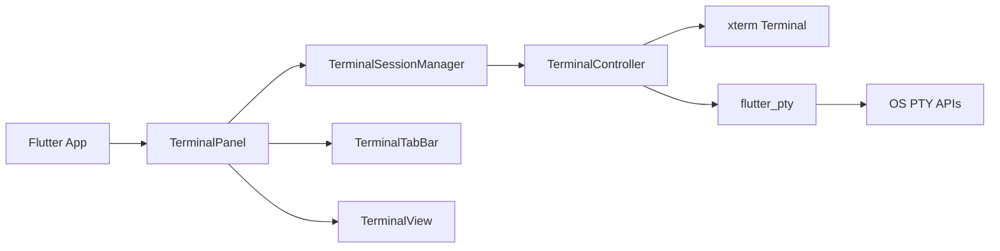

# Goox Terminal

`goox_terminal` is a Flutter desktop package for managing multiple terminal sessions using pure Dart implementation with `xterm` (terminal emulator) and `flutter_pty` (PTY backend).

## What It Exposes

- `TerminalPanel` - Complete terminal UI widget with tabs and session management
- `TerminalSessionManager` - Singleton for managing multiple terminal sessions
- `TerminalController` - Controller for individual terminal session lifecycle
- `TerminalView` - Widget for rendering a single terminal with xterm
- `TerminalTabBar` - Tab bar widget for switching between terminal sessions
- `ShellDetector` - Service for detecting available shells on the system
- Models: `TerminalStatus`, `ShellConfig`, `PtySize`, `TerminalTheme`

## Quick Start

### Using TerminalPanel (Recommended)

The easiest way to add terminal functionality to your app:

```dart
import 'package:flutter/material.dart';
import 'package:goox_terminal/goox_terminal.dart';

class MyApp extends StatelessWidget {
  @override
  Widget build(BuildContext context) {
    return MaterialApp(
      home: Scaffold(
        body: Column(
          children: [
            Expanded(child: YourEditorArea()),
            TerminalPanel(
              initialHeight: 300,
              visible: true,
              theme: TerminalTheme.dark(),
            ),
          ],
        ),
      ),
    );
  }
}
```

### Manual Session Management

For more control over terminal sessions:

```dart
import 'package:goox_terminal/goox_terminal.dart';

Future<void> runTerminal() async {
  final sessionManager = TerminalSessionManager.instance;

  // Create a new terminal session
  final controller = await sessionManager.createSession(
    shellConfig: ShellConfig.bash(),
    initialSize: PtySize(rows: 24, cols: 80),
  );

  // Listen to status changes
  controller.statusStream.listen((status) {
    print('Terminal status: $status');
  });

  // Listen to title changes
  controller.titleNotifier.addListener(() {
    print('Terminal title: ${controller.title}');
  });

  // Write input to terminal
  await controller.write('echo "Hello from Goox Terminal"\n');

  // Resize terminal
  await controller.resize(30, 100);

  // Close session
  await sessionManager.closeSession(controller.id);
}
```

### Shell Detection

Automatically detect available shells:

```dart
import 'package:goox_terminal/goox_terminal.dart';

Future<void> detectShells() async {
  // Get default shell for the platform
  final defaultShell = await ShellDetector.detectDefaultShell();
  print('Default shell: ${defaultShell.shellPath}');

  // Get all available shells
  final availableShells = await ShellDetector.detectAvailableShells();
  for (final shell in availableShells) {
    print('Available: ${shell.shellPath}');
  }
}
```

## Example App

The desktop example is in [`example/`](example/). It demonstrates:

- Creating multiple terminal sessions
- Switching between terminals using tabs
- Sending shell input and viewing output
- Resizing terminal sessions
- Closing individual sessions or all sessions
- Custom terminal themes

Run it from the package directory:

```bash
cd packages/goox_terminal/example
flutter run -d linux
```

Use `-d macos` or `-d windows` on the matching desktop platform.

## Architecture



### Key Components

- **TerminalPanel**: Main UI widget that combines tab bar and terminal view
- **TerminalSessionManager**: Manages multiple terminal sessions (max 10)
- **TerminalController**: Manages lifecycle of a single terminal session
- **TerminalView**: Renders xterm terminal with keyboard/mouse input
- **TerminalTabBar**: Displays tabs for all sessions with create/close actions
- **ShellDetector**: Detects available shells on the system

## Features

- ✅ Pure Dart implementation (no native code required)
- ✅ Multiple terminal sessions (up to 10 concurrent)
- ✅ Full xterm terminal emulation
- ✅ Keyboard and mouse input support
- ✅ Terminal resize handling
- ✅ Custom themes (dark/light)
- ✅ Automatic shell detection
- ✅ Process ID and exit code tracking
- ✅ Terminal restart capability
- ✅ UTF-8 encoding/decoding with malformed character handling
- ✅ Auto-scroll behavior
- ✅ Terminal title management

## Tests

The package includes comprehensive unit tests for all components:

```bash
cd packages/goox_terminal
flutter test
```

Test coverage includes:
- Terminal controller lifecycle
- Session manager operations
- Shell configuration validation
- PTY size validation
- Terminal status transitions
- UI widget rendering

## Dependencies

This package uses:
- [`xterm ^4.0.0`](https://pub.dev/packages/xterm) - Terminal emulator
- [`flutter_pty ^0.4.2`](https://pub.dev/packages/flutter_pty) - PTY backend

No native code or build configuration required!

## Supported Platforms

- macOS
- Linux
- Windows

This package is intended for desktop terminals, not mobile or web.
