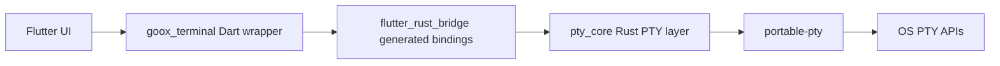

# Goox Terminal

`goox_terminal` is a Flutter desktop package for managing multiple terminal sessions through a Rust PTY backend exposed with `flutter_rust_bridge`.

## What It Exposes

- `initializeGooxTerminal()` and `disposeGooxTerminal()` for lifecycle setup and cleanup
- `PtyManager` for `create`, `open`, `list`, `resize`, `close`, and multi-session management
- `PtySession` for output streaming, transcript capture, input, resize, signal delivery, and shutdown
- `PtyConfig`, `PtySize`, `TerminalStatus`, and related session metadata models

## Quick Start

```dart
import 'dart:convert';

import 'package:goox_terminal/goox_terminal.dart';

Future<void> runTerminal() async {
  await initializeGooxTerminal();

  final session = await PtyManager.instance.createSessionHandle(
    PtyConfig.defaultShell(size: const PtySize(rows: 24, cols: 80)),
  );

  session.outputStream.listen((data) {
    final text = utf8.decode(data, allowMalformed: true);
    print(text);
  });

  await session.write('echo hello from Goox Terminal\n');
  await session.resize(40, 120);
  await session.close();

  await disposeGooxTerminal();
}
```

## Example App

The desktop example is in [`example/`](example/). It demonstrates:

- creating multiple terminals
- toggling the visibility of each terminal panel
- sending shell input
- resizing sessions
- closing a single session or all sessions

Run it from the package directory:

```bash
cd packages/goox_terminal/example
flutter run -d linux
```

Use `-d macos` or `-d windows` on the matching desktop platform.

## Architecture



The detailed lifecycle and runtime flow are documented in [`docs/flow.md`](docs/flow.md).

## Tests

The package includes fake-backend tests for lifecycle, output, resize, open/attach, and cleanup flows.

```bash
cd packages/goox_terminal
flutter test
```

## Bridge Files

- FRB config: [`flutter_rust_bridge.yaml`](flutter_rust_bridge.yaml)
- Generated Dart bindings: [`lib/src/rust/`](lib/src/rust/)
- Generated Rust glue: [`rust/pty_core/src/frb_generated.rs`](rust/pty_core/src/frb_generated.rs)

## Supported Platforms

- macOS
- Linux
- Windows

This package is intended for desktop terminals, not mobile or web.
