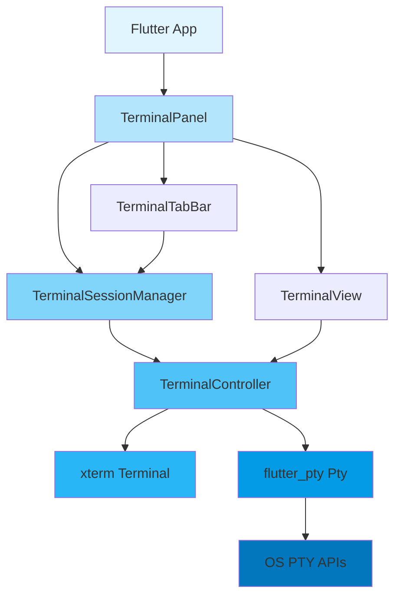
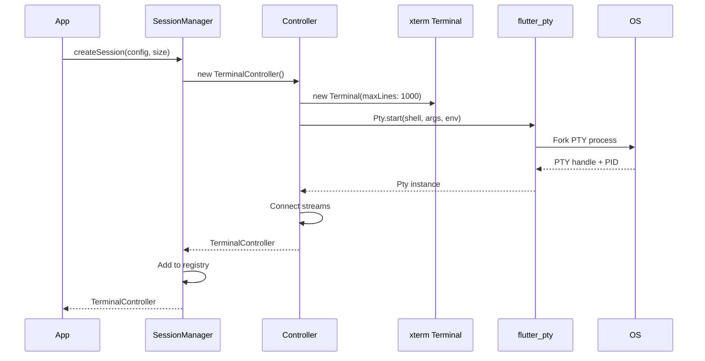
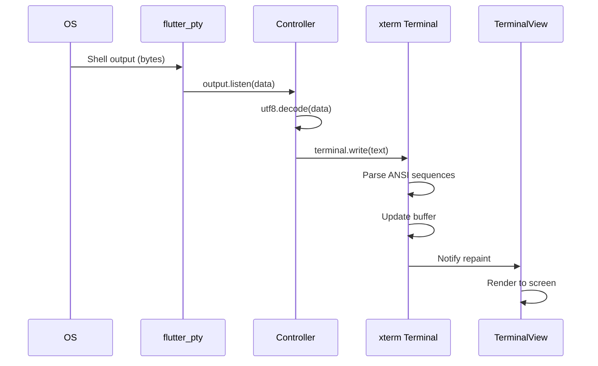
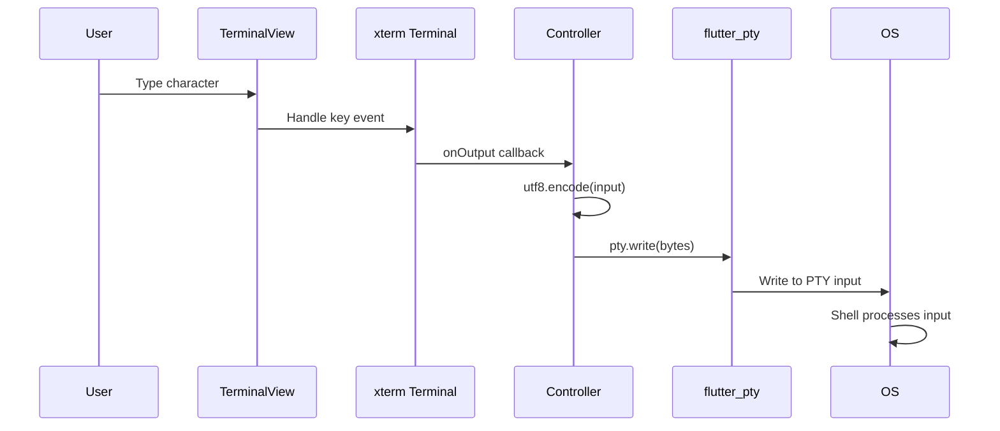
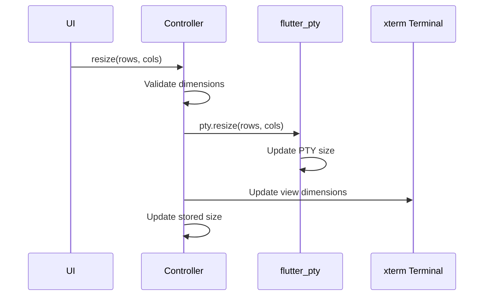
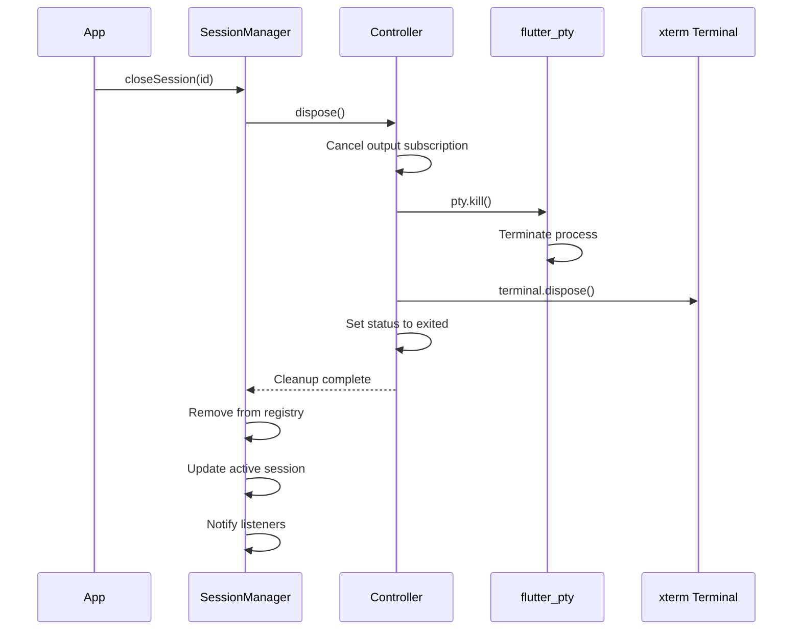

# Goox Terminal Architecture

This document describes the architecture and data flow of the `goox_terminal` package.

## Overview

`goox_terminal` is a pure Dart implementation that provides terminal emulation and PTY management for Flutter desktop applications. It uses:

- **xterm** (^4.0.0) - Terminal emulator with full VT100/xterm support
- **flutter_pty** (^0.4.2) - PTY backend for spawning and managing shell processes

## Architecture Diagram



## Component Layers

### 1. UI Layer

**TerminalPanel** - Main widget that provides complete terminal UI
- Displays terminal tab bar and active terminal view
- Handles panel resize and visibility
- Provides keyboard shortcuts (Ctrl+Shift+` for new terminal)
- Integrates with TerminalSessionManager

**TerminalTabBar** - Tab bar for switching between terminals
- Shows tab for each session with title and status
- Handles tab selection, close, and new terminal creation
- Displays visual indicators for terminal status (running, exited, error)

**TerminalView** - Widget that renders a single terminal
- Uses xterm's TerminalView for rendering
- Handles keyboard input (characters, special keys, escape sequences)
- Handles mouse input (clicks, scrolling)
- Manages focus and auto-scroll behavior
- Applies terminal theme

### 2. State Management Layer

**TerminalSessionManager** - Singleton that manages all terminal sessions
- Creates and tracks terminal sessions (max 10)
- Maintains session registry with unique IDs
- Manages active session selection
- Provides session lookup and lifecycle operations
- Extends ChangeNotifier for reactive UI updates

**TerminalController** - Controls a single terminal session
- Manages xterm Terminal instance
- Manages flutter_pty Pty instance
- Connects PTY output to terminal input
- Connects terminal output to PTY input
- Tracks terminal status (initializing, running, exited, error)
- Handles resize, restart, and cleanup operations
- Provides status stream and title notifier

### 3. Service Layer

**ShellDetector** - Detects available shells on the system
- Detects default shell from environment variables
- Finds available shells on the system
- Validates shell paths
- Provides platform-specific defaults

### 4. Model Layer

**TerminalStatus** - Enum for terminal lifecycle states
- initializing, running, exited, error
- Helper methods: isActive, canSendInput

**ShellConfig** - Configuration for shell process
- Shell path, arguments, environment, working directory
- Validation methods
- Factory methods: bash(), zsh(), fish(), powershell(), cmd()

**PtySize** - Terminal dimensions
- Rows and columns (1-1000 range)
- Validation and default size (24x80)

**TerminalTheme** - Terminal color scheme
- Background, foreground, cursor, selection colors
- 16 ANSI colors (8 normal + 8 bright)
- Factory methods: dark(), light()
- Conversion to xterm TerminalThemeData

## Data Flow

### Terminal Session Creation



### Output Flow (PTY → Terminal)



### Input Flow (User → PTY)



### Terminal Resize



### Session Cleanup



## Key Design Decisions

### 1. Pure Dart Implementation

**Why:** Eliminates need for Rust toolchain, simplifies build process, improves maintainability

**Trade-offs:** Relies on flutter_pty for PTY operations (which uses Dart FFI internally)

### 2. Singleton Session Manager

**Why:** Centralized session management, easy access from anywhere in the app

**Trade-offs:** Global state, but appropriate for terminal sessions

### 3. Stream-Based Output

**Why:** Efficient handling of continuous terminal output, natural fit for async data

**Trade-offs:** Requires proper subscription management to avoid memory leaks

### 4. xterm for Emulation

**Why:** Mature, well-tested terminal emulator with full VT100/xterm support

**Trade-offs:** Dependency on external package, but saves significant development effort

### 5. ChangeNotifier for UI Updates

**Why:** Simple reactive pattern, integrates well with Flutter widgets

**Trade-offs:** Not as powerful as BLoC or Riverpod, but sufficient for this use case

## File Structure

```
lib/
├── goox_terminal.dart              # Public API exports
└── src/
    ├── controllers/
    │   ├── terminal_controller.dart       # Single session controller
    │   └── terminal_session_manager.dart  # Multi-session manager
    ├── models/
    │   ├── terminal_status.dart           # Status enum
    │   ├── shell_config.dart              # Shell configuration
    │   ├── pty_size.dart                  # Terminal dimensions
    │   └── terminal_theme.dart            # Color scheme (if implemented)
    ├── services/
    │   └── shell_detector.dart            # Shell detection
    └── ui/
        ├── terminal_panel.dart            # Main terminal widget
        ├── terminal_tab_bar.dart          # Tab bar widget
        └── terminal_view.dart             # Single terminal view
```

## Error Handling

### PTY Creation Failure
- Throws PtyCreationException with descriptive message
- UI shows error and suggests checking shell path

### PTY Output Stream Error
- Sets controller status to error
- Shows error indicator in tab
- Provides restart button

### Session Limit Reached
- Disables new terminal button
- Shows tooltip explaining limit

### Invalid Resize Dimensions
- Throws ArgumentError
- Clamps to valid range (1-1000)

### Write to Closed Terminal
- Throws StateError
- UI checks status before writing

## Testing Strategy

### Unit Tests
- Terminal controller lifecycle
- Session manager operations
- Shell configuration validation
- PTY size validation
- Status transitions

### Widget Tests
- TerminalPanel rendering
- Tab bar interactions
- Terminal view input handling
- Theme application

### Integration Tests
- End-to-end session lifecycle
- Multiple session management
- Keyboard shortcuts
- Resource cleanup

## Performance Considerations

### Buffer Management
- xterm limits buffer to 1000 lines
- Automatic removal of oldest lines
- Efficient memory usage

### Stream Handling
- Output subscription uses listen() with proper cancellation
- UTF-8 decoding with allowMalformed: true
- No buffering in controller (xterm handles it)

### UI Updates
- ChangeNotifier for coarse-grained updates
- xterm handles fine-grained terminal rendering
- Auto-scroll only when at bottom

## Future Enhancements

Potential improvements:
- Configurable buffer size
- Terminal search functionality
- Copy/paste improvements
- Split terminal views
- Terminal profiles
- Custom key bindings
- Session persistence
- Remote terminal support
