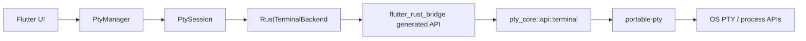
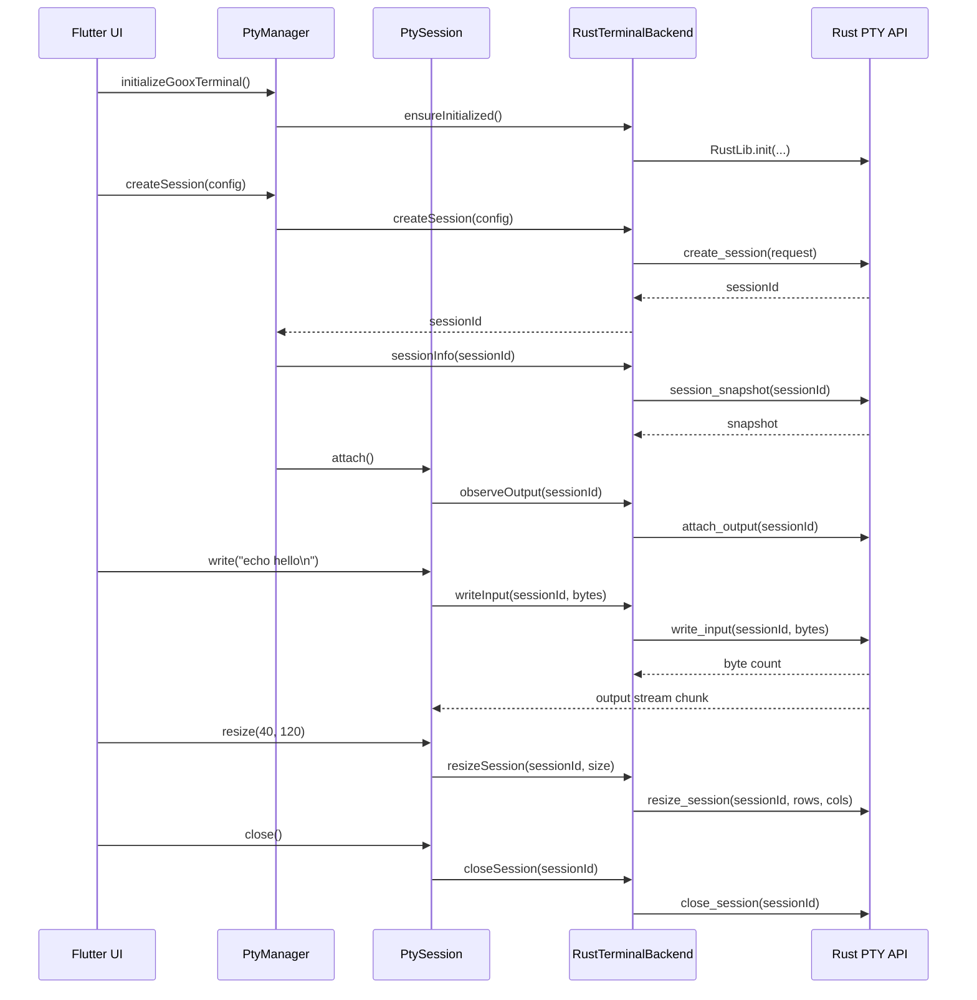

# Goox Terminal Flow

This document describes how `goox_terminal` moves data between Flutter and Rust, and how the package manages a terminal session from creation to cleanup.

## Architecture Overview

`goox_terminal` is split into two layers:

- Dart/Flutter provides the public wrapper API, session registry, and UI-friendly lifecycle objects.
- Rust owns the PTY process, native I/O, resize logic, and cleanup.

The important files are:

- `lib/goox_terminal.dart`
- `lib/src/pty_manager.dart`
- `lib/src/pty_session.dart`
- `lib/src/backend/rust_terminal_backend.dart`
- `rust/pty_core/src/api/terminal.rs`
- `flutter_rust_bridge.yaml`

## Terminal Lifecycle

The lifecycle has six stages:

1. Initialize the bridge.
2. Create a terminal session.
3. Attach to output.
4. Send input and receive output.
5. Resize as the UI changes.
6. Close and release resources.

## Initialization

`initializeGooxTerminal()` prepares the Rust backend once per process.

Recommended order in Flutter apps:

1. Call `WidgetsFlutterBinding.ensureInitialized()`.
2. Await `initializeGooxTerminal()` before creating sessions.
3. On shutdown, close sessions first, then dispose the bridge with `disposeGooxTerminal()`.

This keeps the Rust side ready before any PTY is spawned and avoids late initialization races.

## Session Creation

`PtyManager.createSessionHandle()` is the most practical entry point for UI code.

It performs these steps:

1. Validate the `PtyConfig`.
2. Ask Rust to create a PTY session.
3. Fetch an initial snapshot.
4. Build a `PtySession` wrapper.
5. Attach the output stream.

The wrapper keeps a local `TerminalSessionInfo` snapshot so UI code can read:

- `status`
- `pid`
- `size`
- `attached`
- timestamps
- the resolved shell and args

## Input / Output Flow

### Output

Rust reads from the PTY master and forwards chunks into a FRB `StreamSink<Vec<u8>>`.

In Dart:

- `RustTerminalBackend.observeOutput()` exposes that stream as `Stream<Uint8List>`.
- `PtySession` subscribes immediately after creation or when opening an existing session.
- `PtySession` also stores a transcript string for UI rendering.

### Input

`PtySession.write()` converts text to UTF-8 bytes and forwards them to the backend.

`PtySession.writeBytes()` and the Rust `write_input()` function update activity timestamps so the session metadata stays current.

## Resize Flow

Resize is explicit and idempotent:

1. UI asks `PtySession.resize(rows, cols)`.
2. Dart validates the request at the wrapper layer.
3. Rust converts the dimensions into the native PTY size.
4. `portable-pty` resizes the master side of the terminal.
5. The wrapper updates its cached `TerminalSessionInfo.size`.

This is the right hook to call from a Flutter layout observer or a window-resize handler.

## Close And Cleanup

Closing a session should always release three things:

- the Dart output subscription
- the Rust PTY child process
- the native master/slave handles

The package handles cleanup in both layers:

- `PtySession.close()` cancels the Dart-side stream subscription and then closes the backend session.
- Rust kills or waits for the child process, joins the output thread, and releases the PTY handles.
- `PtyManager.closeAllSessions()` walks the current registry and closes each session best effort.
- `disposeGooxTerminal()` closes all managed sessions and then tears down the Rust bridge.

## Multiple Sessions

`PtyManager` stores a local map of `sessionId -> PtySession`.

This makes multi-window or multi-panel terminal UIs straightforward:

- create one session per visible terminal panel
- keep the wrapper objects in your UI state
- hide or show the panel without detaching the PTY
- close individual sessions when the user removes a terminal

The backend also keeps a Rust-side registry, so the Dart wrapper and the Rust runtime stay aligned by session ID.

## flutter_rust_bridge Integration

`flutter_rust_bridge` is responsible for:

- generating Dart bindings in `lib/src/rust/`
- generating Rust glue in `rust/pty_core/src/frb_generated.rs`
- translating Rust `Result<T>` into Dart `Future<T>`
- translating Rust streams into Dart `Stream<Uint8List>`

The current FRB API is intentionally small:

- `create_session`
- `session_snapshot`
- `list_sessions`
- `attach_output`
- `write_input`
- `resize_session`
- `send_signal`
- `wait_for_exit`
- `close_session`

That surface is enough to keep the public Dart API stable while leaving room for future expansion in Rust.

## Practical UI Pattern

For Flutter UI code, the recommended pattern is:

1. Initialize once at app start.
2. Use `PtyManager.createSessionHandle()` for new terminals.
3. Keep each `PtySession` in your widget state or state manager.
4. Render `session.transcript` or subscribe to `session.outputStream`.
5. Call `session.resize()` from your layout logic.
6. Call `session.close()` when the terminal is removed.

This keeps the UI simple and avoids over-coupling widgets to the bridge layer.
